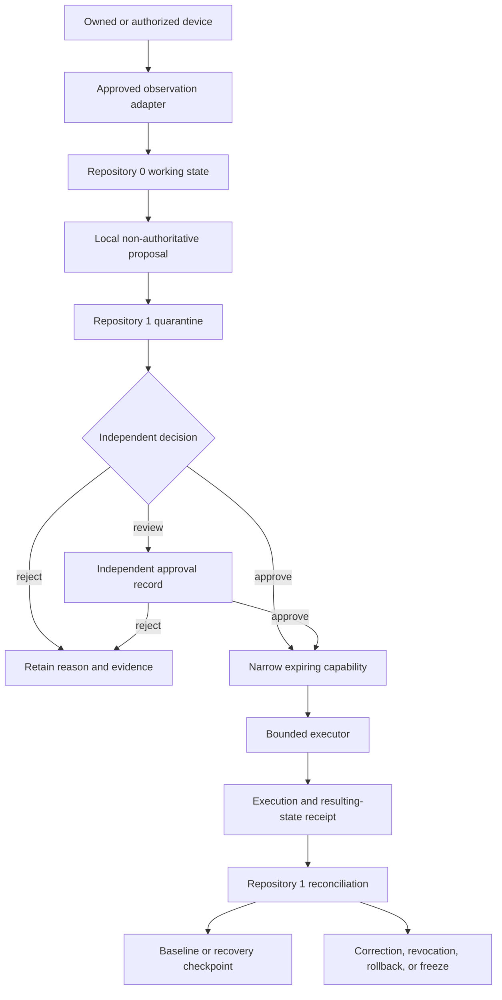

# Architecture

## Architectural position

Alistaire is proposed as a **constitutional composition, policy, and integration layer**, not a replacement for the repositories that supply portable device trust, runtime primitives, declarative genomes, collaboration, sanitized evidence, temporal interpretation, transport, review surfaces, payments, or conformance fixtures.

The charter must remain dependency-light and fail closed whenever an upstream contract is missing, ambiguous, incompatible, unverified, expired, revoked, or owned by the component whose authority it would create.

## Constitutional dependency order

The portfolio must resolve these decisions before promoting downstream implementation:

1. canonical charter and repository identity;
2. neutral non-operational contract steward;
3. canonical bytes and identity primitives;
4. independent authority and recovery roots;
5. portfolio incident, freeze, rollback, and claim-withdrawal command.

A downstream workflow, successful execution, UI interaction, signature, or repository dependency cannot retroactively make an upstream decision accepted.

## Proposed subsystem composition

| Subsystem | Responsibility | Primary owner candidate | Inputs | Outputs | Failure posture |
|---|---|---|---|---|---|
| Constitutional charter | Mission, repository roles, authority hierarchy, evidence vocabulary, release gates | `ALISTAIRE-` | accepted governance decisions | versioned charter and responsibility map | freeze promotion on competing identity or unresolved authority |
| Neutral contracts | Common IDs, envelopes, canonicalization, reason codes, compatibility, migration, deprecation, fixtures | unassigned neutral steward | accepted charter and owner decisions | non-operational schemas and witnesses | cannot issue operational authority or canonical state |
| Portable bootstrap | Host detection, read-only observation orchestration, local proposals, bounded execution, verification | Repository `0` | approved adapters, baseline references, capabilities | proposals, execution and resulting-state receipts | no self-approval, self-issued capability, or hidden remediation |
| Device trust and recovery | Device identity, baseline, quarantine, capability, revocation, reconciliation, checkpoint, recovery | Repository `1` or successor | proposal/evidence envelopes, independent approvals | disposition, narrow capability, canonical receipt, checkpoint | fail closed on identity, replay, authority, custody, or recovery ambiguity |
| Host observation | General OS/package/network evidence and specialist hardware/firmware/kernel evidence | JusticeForMe; PhantomBlock candidate split | owned-device scope and approved observation profile | inert observations and artifacts | `UNKNOWN` for inaccessible state; no privileged collection or remediation |
| Identity and persona | Stable declarative identity, lineage, presentation, immutable policy, compatibility | `QSO-GENOMES` | accepted genome and policy profile | identity projection and provenance | freeze on identity conflict or unverifiable migration |
| Goals and commitments | Bounded objectives, protected commitments, priorities, and stop conditions | charter + `QSO-GENOMES` | approved task, policy, current state | ranked proposals, refusal, escalation | refuse objectives outside scope, consent, or authority |
| Runtime and memory | Working state, lifecycle, messages, bounded memory references, local evidence | `QuantumStateObjects` | accepted genome, task/capability, records | local state, receipt, uncertainty, rollback evidence | no silent persistence or canonical-state claim |
| Beliefs and uncertainty | Evidence-linked hypotheses, confidence, contradiction, correction, supersession | runtime + evidence pipeline | attributed records and interpretations | belief state and unresolved contradiction | never promote unverified input to fact |
| Planning and collaboration | Reversible plans, participant composition, dissent, experiment evidence | `QSO-FABRIC` | approved objective, runtime states, budgets | candidate plan, negotiated result, audit evidence | preserve refusal; no canonical or release authority |
| Source acquisition | Retrieval, sanitization, attribution, source lineage, inert records | `QSO-SEEKER` | approved source capability | source observation and provenance | reject executable content, unsupported provenance, or broken artifacts |
| Temporal interpretation | Subject identity, clocks, freshness, replay, ordering, supersession | `datarepo-temporal-invariants` candidate | source observations | temporal assessment and lineage | ambiguity remains explicit; no canonical disposition |
| Domain interpretation | Non-executing interpretation and policy projections | `QSO-DIGITALIS` candidate | source and temporal profiles | inert derived interpretation | projection cannot become capability or canonical state |
| Transport and evidence profile | Versioned delivery, transformation declaration, receipt, domain publication boundary | `Bridge` candidate | accepted envelope and capability | delivery receipt and transformed evidence | transport success does not create acceptance |
| Human review | Inspection, annotation, dissent, correction, and review bundles | `QSO-STUDIO` | accepted read-only records | review record and rationale | interface interaction is not approval |
| Host interface | Optional shell for accepted review contracts and runtime modes | `AionUi` | review profile and public/private mode | rendered review experience | sessions, cache, clicks, exports, and annotations are not authority |
| Economic intent | Payment intent, policy, simulation, quote, finality, reconciliation | `QSO-PAYMENTS` | approved resource proposal | economic-intent record and reconciliation | financial authority remains independent |
| Engineering adapter | Optional delegated engineering execution and evidence | `grok-build-alistaire` candidate | Repository `0` task and Repository `1` capability | execution evidence and receipt | cannot authorize merge, release, signing, or deployment |
| Conformance kernel | Small deterministic reference semantics, fixture replay, compatibility evidence | `qsio-kernel` candidate | neutral semantic profile | conformance results | must not duplicate runtime or authority ownership |
| Public documentation | Evidence-qualified status, registry, sequencing, navigation | `qso-field.github.io` | reviewed public records | static documentation | no secrets, live registry, operational control, or authority |

These are candidate responsibilities. They become authoritative only after D1–D5, immutable owner decisions, versioned contracts, and required gluing witnesses are accepted.

## Portable security lifecycle

`Repository 0 proposal → Repository 1 quarantine` is the canonical cross-repository boundary candidate. Local staging is not authority, and execution success is not canonical acceptance.

## Composed QSO lifecycle

A minimal local simulation should use explicit states:

1. **Created** — identity, policy, dependency, and contract manifests are loaded and validated.
2. **Dormant** — no task, network, tool, credential, write, or persistence authority is active.
3. **Proposed** — a bounded objective, provenance, resource envelope, and required review class are present.
4. **Quarantined** — Repository `1` or successor evaluates identity, freshness, replay, scope, and policy.
5. **Authorized** — a narrow, expiring capability is issued by an independent authority.
6. **Observing** — only validated inert evidence is accepted.
7. **Deliberating** — QSOs generate hypotheses, alternatives, uncertainty, contradiction, and dissent.
8. **Awaiting review** — consequential proposals are frozen pending an independent approval record.
9. **Executing simulation** — only local, reversible, pre-authorized simulation steps occur.
10. **Reconciling** — receipts and resulting state are compared with expected state; success is not assumed canonical.
11. **Frozen** — policy, integrity, consent, authority, dependency, resource, or evidence failure halts work.
12. **Recovering** — restore an accepted checkpoint, preserve evidence, reconcile corrections, and restart with least authority.
13. **Retired** — revoke authority and apply retention, correction, deletion, and claim-withdrawal rules.

No lifecycle state implies standing permission for network access, credentials, external writes, deployment, publication, payment, or self-modification.

## Contract and message envelope

A future cross-repository message should minimally bind:

- contract family, schema version, compatibility profile, and canonical encoding;
- sender, recipient, subject, device/environment, and authority identifiers;
- objective, proposal, capability, execution, receipt, and correlation identifiers as applicable;
- message type, declared authority, and required independent approval;
- canonical payload digest and artifact bindings;
- source, transformation, and evidence lineage;
- result status using explicit `PASS`, `FAIL`, `UNKNOWN`, and `NOT_APPLICABLE` or an accepted successor vocabulary;
- uncertainty, contradiction, correction, and supersession references;
- policy, consent, ownership, privacy, retention, and redaction context;
- resource budget, expiry, allowed destinations, and rollback conditions;
- timestamp, clock source, sequence, freshness, replay domain, and idempotency key;
- signature or attestation references only after identity, key-custody, and canonical-byte contracts exist.

Consumers must reject unknown required fields, unsupported versions, lossy mappings, malformed digests, expired or excessive authority, wrong-device or wrong-environment identity, replayed messages, missing provenance, and attempts to embed executable authority in data.

## Required gluing witnesses

Pairwise compatibility is insufficient for a distributed portfolio. Required triple-overlap witnesses include:

1. **device observation → Repository `0` → Repository `1`**;
2. **Repository `0` → Repository `1` → bounded executor**;
3. **QSO-GENOMES → QuantumStateObjects → QSO-FABRIC**;
4. **QuantumStateObjects → QSO-FABRIC → Repository `1`**;
5. **QSO-SEEKER → temporal profile → QSO-DIGITALIS**;
6. **temporal/Digitalis → Bridge → Repository `1`**;
7. **Repository `1` → QSO-STUDIO → AionUi and independent approval**;
8. **QSO-PAYMENTS → financial approver → Repository `1` technical capability**;
9. **freeze → revocation → evidence preservation and bounded recovery**;
10. **correction → cache invalidation → publication claim withdrawal**.

Every witness must cover positive, negative, unsupported-version, stale, replayed, corrected, revoked, partial, privacy-restricted, rollback, and failed-rollback cases where applicable.

## Conflict resolution

QSO and repository disagreement is a first-class output. Resolution order is:

1. law, platform policy, safety, consent, privacy, and ownership constraints;
2. immutable charter and accepted governance decisions;
3. explicit human instruction within approved authority;
4. accepted contracts, canonical bytes, and identity rules;
5. accepted evidence and provenance integrity;
6. protected commitments and identity continuity;
7. resource, reversibility, and recovery limits;
8. weighted hypotheses and preferences;
9. unresolved dissent preserved for independent review.

No component may overwrite another component's protected state, collapse `UNKNOWN` into success, or convert data, display, transport, execution, or dependency into authority.

## Bounded learning

At the charter stage, learning means **reviewed state revision**, not unrestricted training or self-modification. A permitted revision must identify source, license, consent, exact affected state, prior and proposed values, evidence, uncertainty, deterministic validation, limits, reviewer, approval record, correction lineage, rollback checkpoint, and expiry.

Private device inventories, credentials, biometric data, legal or medical records, payment details, intimate relational data, and recovery material require separately approved policies and must never enter public artifacts.

## Freeze, shutdown, and recovery

Freeze is mandatory for:

- identity, contract, canonical-byte, or expected-head mismatch;
- missing, withdrawn, excessive, expired, or revoked authority;
- missing consent or ownership scope;
- untrusted raw input, artifact mismatch, or provenance loss;
- privilege, credential, network, write, payment, merge, release, or deployment escalation;
- stale or replayed records, wrong-device observations, or clock ambiguity beyond policy;
- nondeterministic replay, unbounded spawning, or resource exhaustion;
- failed rollback, unavailable recovery root, or inability to restore accepted state;
- conflict between local implementation and accepted constitutional governance.

Shutdown must revoke pending capabilities, stop adapters and executors, preserve non-sensitive evidence, identify the last accepted checkpoint, invalidate affected caches and claims, and require explicit bounded-restart approval. Emergency controls must not depend on the component being stopped.

## First executable slice

The first Builder-ready implementation remains a local, no-network simulation that:

- loads fixed identities, contracts, capabilities, observation records, and receipts;
- processes deterministic portable-trust and QSO scenarios;
- records evidence, uncertainty, contradiction, dissent, review, and disposition;
- cannot access real credentials, external devices, filesystem locations outside a temporary workspace, external tools, payment systems, or network services;
- enforces step, time, memory, output-size, adapter, and QSO-count limits;
- supports quarantine, expiry, revocation, freeze, checkpoint, replay, correction, rollback, and recovery;
- passes pairwise and triple-overlap positive, negative, adversarial, privacy, stale, replay, wrong-identity, partial-failure, and failed-rollback fixtures.

That slice remains blocked until D1–D5, the canonical repository, governance charter, neutral contract substrate, and independent authority are approved.
