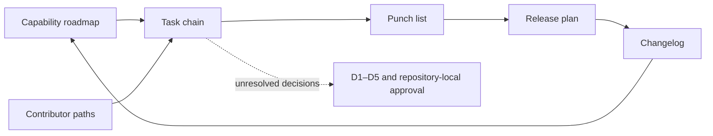

# Capability and contributor lifecycle coherence

## Status and authority boundary

Status: `CAPABILITY_AND_CONTRIBUTOR_ROUTES_SYNCHRONIZED_BINDINGS_UNACCEPTED`

Authority effect: `NONE`

This review repairs a documentation-route divergence in the non-default A.L.I.S.T.A.I.R.E. charter candidate. The capability roadmap and contributor-path guides had been added to the Pages navigation, README, and changelog, but their controlled statuses and release consequences were not carried through `taskchain.md`, `punchlist.md`, and `release.md`.

The repair synchronizes documentation state only. It does not accept a capability, appoint a maintainer, choose a canonical repository, create a contract owner, authorize implementation, publish Pages, promote a release, grant credentials, activate a runtime, execute a payment, deploy infrastructure, or widen privileged scope.

## Exact source generation

The coherence review is based on the non-default charter candidate:

- repository: `aevespers2/ALISTAIRE-`;
- branch: `docs/consolidation-charter-20260720`;
- exact source head: `2953ef6ba8ee86eafdddcf56222c91cbb296bcb7`;
- source state: open, draft, mergeable, and unmerged into `main` at the time of review.

This source tuple is historical input to the focused repair. The resulting descendant must retain its own exact-head validation rather than represent the source head as its identity.

## Controlled status set

| Surface | Controlled status | Meaning |
|---|---|---|
| Public name | `NAME_EXPANSION_DOCUMENTED_CANONICAL_REPOSITORY_UNSELECTED` | The acronym is documented; D1 remains unresolved. |
| Capability roadmap | `DOCUMENTED_CAPABILITY_ROADMAP_UNACCEPTED` | Forty capabilities are documented and sequenced but are not implemented or accepted. |
| Feature-lineage reconciliation | `RECONCILED_INTO_EXISTING_ROADMAP_PRESERVE_SOURCE_BRANCH` | The competing flat feature registry remains historical evidence rather than a parallel authority source. |
| Contributor paths | `PORTFOLIO_CONTRIBUTOR_PATHS_DOCUMENTED_OWNERSHIP_UNASSIGNED` | Bounded documentation routes exist; no maintainer or owner is appointed. |
| Lifecycle coherence | `CAPABILITY_AND_CONTRIBUTOR_ROUTES_SYNCHRONIZED_BINDINGS_UNACCEPTED` | Task, punch-list, release, and changelog routes now describe the same controlled state. |

## Route graph

### Prose equivalent

The capability roadmap and contributor-path guides define candidate work and explicit stop conditions. The task chain orders that work without making it ready. The punch list distinguishes completed documentation from unresolved approvals. The release plan prevents documented capabilities or contribution routes from being represented as a release. The changelog records the documentation generation. Any transition from documentation to implementation remains blocked by D1–D5 and repository-local approval.

## Repaired gluing failure

Before this review, a reader following the README or Pages navigation encountered the roadmap and contributor-path statuses, while a reader following the task chain, punch list, or release plan encountered only the earlier runtime/Fabric planning-route state. The documents were individually valid but did not form one path-independent lifecycle description.

The repaired invariant is:

> Every controlled lifecycle route must expose the same capability-roadmap status, feature-lineage disposition, contributor-path status, authority effect, unresolved decisions, correction trigger, and rollback rule.

This is a documentation-level gluing repair. It does not resolve the architectural gluing failures inside the runtime route.

## Remaining material obstructions

1. **Constitutional identity:** D1 has not selected the canonical repository or package identity.
2. **Contract custody:** D2 has not assigned a neutral, non-operational contract steward.
3. **Canonical representation:** D3 has not accepted bytes, identities, namespaces, reason codes, or cross-language fixtures.
4. **Independent authority:** D4 has not chartered issuance, revocation, quarantine, checkpoint, or recovery roots.
5. **Incident command:** D5 has not assigned freeze, evidence, restart, rollback, invalidation, or claim-withdrawal roles.
6. **Runtime composition:** `qsio-kernel → QuantumStateObjects → QSO-FABRIC → Repository 1` remains unsupported because record classes, owners, projection losses, correction, revocation, migration, rollback, and restored-state evidence are unaccepted.
7. **Publication custody:** Pages authority, public/private partitioning, accessibility certification, correction timing, and withdrawal responsibility remain unapproved.

A synchronized roadmap cannot be used to route around any of these obstructions.

## Contributor and reviewer onboarding

1. Read the [capability roadmap](capability-roadmap.md) and [portfolio contributor paths](portfolio-contributor-paths.md).
2. Confirm the exact candidate head and repository-local controls.
3. Select one bounded documentation task and record the FYSA-120 skills actually used.
4. Stop when the work would choose architecture, appoint ownership, activate policy, expand collection, use credentials, approve a release, publish, deploy, execute a payment, or mutate a device.
5. Update all controlled lifecycle routes when roadmap status, contributor status, source lineage, stop conditions, or authority boundaries change.
6. Run the focused coherence validator and the complete strict documentation build.
7. Preserve focused and resulting-head evidence and provide a rollback route.

## Change control and rollback

Rebind or withdraw this coherence generation when any of the following changes:

- roadmap status, feature count, family identifiers, stages, or source reconciliation;
- contributor-path status, repository set, bounded first tasks, or stop conditions;
- D1–D5 disposition;
- repository responsibility, owner vacancy, publication boundary, or safety boundary;
- task, punch-list, release, changelog, README, Pages navigation, or machine-readable profile.

Rollback must restore the last validated documentation generation, preserve the failed or superseded generation, propagate correction or withdrawal to derived claims, revalidate every controlled route, and prohibit destructive history rewriting.

## FYSA-120 mapping

Applied capabilities:

- `011-B`, `011-E` — accessible lifecycle diagramming and prose equivalence;
- `012-A`, `012-B`, `012-D`, `012-E` — information architecture, decision writing, terminology consistency, documentation testing, and lifecycle synchronization;
- `013-C`, `013-D`, `013-E` — cross-document graphing, contradiction detection, and incremental currentness updates;
- `017-C`, `017-D`, `017-E` — source lineage, version-substitution resistance, preservation, and correction propagation;
- `018-B`, `018-D`, `018-E` — responsibility mapping, reviewer onboarding, and contested-history preservation;
- `019-B`, `019-C`, `019-D` — plain language, accessible alternatives, and uncertainty-aware risk communication;
- `031-A`, `031-D`, `031-E` — invariants, hostile validation, regression prevention, and assurance maintenance;
- `032-A`, `032-D` — route-state modeling, failure handling, and composition review;
- `040-A`, `040-B`, `040-E` — system archaeology, migration-risk analysis, rollback, and continuity assurance.

Proposed non-authoritative refinement:

**`012-U — Capability and contributor lifecycle-route synchronization, anti-divergence validation, and non-authorizing status propagation`**

Skill mapping establishes neither competence, appointment, ownership, approval, certification, nor authority.
