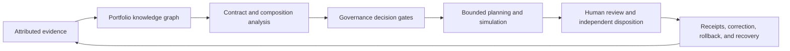

# Capability roadmap

## Status and authority boundary

Status: `DOCUMENTED_CAPABILITY_ROADMAP_UNACCEPTED`

Authority effect: `NONE`

This roadmap extends the established [name and identity guide](name-and-identity.md). It uses the documented expansion **Adaptive Learning & Intelligence System for Trustworthy Autonomous Inference, Reasoning, and Evolution** without changing its status `NAME_EXPANSION_DOCUMENTED_CANONICAL_REPOSITORY_UNSELECTED`.

The roadmap records desired capabilities, candidate repository relationships, maturity order, obstructions, and evidence requirements. It does not implement a feature, select a canonical repository, appoint an owner, accept a contract, grant credentials, publish Pages, promote a release, authorize deployment, or expand operational scope.

## Architectural cycle

### Prose equivalent

A.L.I.S.T.A.I.R.E. begins with attributed inert evidence. A portfolio graph relates repositories, contracts, owners, workflows, artifacts, decisions, and unresolved gaps. Composition analysis identifies incompatible interfaces and missing gluing witnesses. Governance gates determine whether a bounded plan may proceed. Approved work remains simulation-first and reversible before independent review. Receipts, corrections, revocations, rollbacks, and recovery evidence return to the evidence layer rather than becoming automatic authority.

## Capability families

### 1. Knowledge, evidence, and currentness

| Feature | Purpose | Candidate homes | Current gate |
|---|---|---|---|
| Portfolio Knowledge Graph | Relate repositories, contracts, owners, workflows, releases, evidence, and decisions | `ALISTAIRE-`; neutral steward | D1–D3 and owner acceptance |
| Exact-Head Evidence Registry | Preserve reviewed commits, runs, artifacts, digests, and superseded generations | `ALISTAIRE-`; Repository `1`; `qso-field.github.io` | canonical identity and publication custody |
| Provenance and Lineage Explorer | Trace code, schema, documentation, and artifact derivations | `ALISTAIRE-`; `QSO-SEEKER`; `QSO-STUDIO` | canonical identifiers and access policy |
| Uncertainty and Confidence Ledger | Distinguish observed, inferred, disputed, stale, unsupported, corrected, and withdrawn claims | `QuantumStateObjects`; `QSO-FABRIC`; `ALISTAIRE-` | semantic owner and correction contract |
| Semantic Diff Engine | Explain contract, authority, invariant, and downstream meaning changes | neutral steward; `QSO-STUDIO` | accepted schemas and comparison rules |
| Cross-Document Contradiction Detection | Find conflicts among READMEs, architecture, task chains, releases, punch lists, changelogs, schemas, and workflows | `ALISTAIRE-` | controlled routes and exact-source evidence |

### 2. Contracts, composition, and integration

| Feature | Purpose | Candidate homes | Current gate |
|---|---|---|---|
| Cross-Repository Contract Validator | Detect incompatible schemas, versions, identities, errors, and authority fields | neutral steward; `qsio-kernel` | D2–D3 |
| Composition and Gluing Analyzer | Identify missing pairwise and triple-overlap witnesses and non-path-independent routes | `ALISTAIRE-`; `QSO-FABRIC`; `qsio-kernel` | accepted record classes and route owners |
| Interface Compatibility Matrix | Compare producers and consumers field by field | neutral steward; `ALISTAIRE-` | live registration and canonical versions |
| Integration Readiness Gate | Require compatible contracts, owners, evidence, migration, rollback, and approval | Repository `1`; `ALISTAIRE-` | D4–D5 |
| Migration and Deprecation Planner | Preserve history while sequencing aliases, compatibility windows, retirement, and rollback | `ALISTAIRE-`; affected repositories | D1 and migration authority |
| Release Truth Reconciler | Compare release plans, changelogs, tags, manifests, artifacts, packages, and repository state | `ALISTAIRE-`; `qso-field.github.io` | publication custody and release authority |

### 3. Governance, ownership, and decision integrity

| Feature | Purpose | Candidate homes | Current gate |
|---|---|---|---|
| Authority Boundary Engine | Make documentation, review, merge, release, deployment, credential, and destructive-operation permissions explicit | Repository `1`; `ALISTAIRE-` | D4–D5 |
| Decision and ADR Ledger | Preserve decisions, alternatives, evidence, affected repositories, expiry, and supersession | `ALISTAIRE-` | D1 and retention policy |
| Ownership and Stewardship Matrix | Record semantic, schema, security, release, accessibility, incident, and recovery responsibility | `ALISTAIRE-`; neutral steward | appointment or explicit vacancy acceptance |
| Human Decision Queue | Separate safe maintenance from constitutional, security, legal, ownership, or ethical decisions | `QSO-STUDIO`; Repository `1` | review and approval contracts |
| Multi-Agent Review Council | Preserve specialized reviews and dissent without averaging disagreement away | `QSO-STUDIO`; `QSO-FABRIC` | identity, recusal, dissent, and disposition rules |
| Constitutional Core | Maintain versioned principles for consent, human authority, provenance, reversibility, least privilege, correction, and accountable autonomy | `ALISTAIRE-` | D1–D5 acceptance |

### 4. Documentation, onboarding, and accessibility

| Feature | Purpose | Candidate homes | Current gate |
|---|---|---|---|
| Documentation Autopilot | Maintain overviews, architecture, APIs, decisions, release notes, and diagrams | each repository; `ALISTAIRE-` coordination | repository-local review and exact-head validation |
| Living Architecture Atlas | Generate context, component, sequence, trust-boundary, data-flow, rollback, and provenance diagrams | `ALISTAIRE-`; `qso-field.github.io` | accepted source graph and accessible alternatives |
| Developer Onboarding Generator | Produce setup, mental models, contribution rules, first tasks, validation, and troubleshooting | each repository | maintainer review |
| Public Project Narrative | Explain what is proposed, implemented, verified, blocked, prohibited, and withdrawn | `qso-field.github.io`; `ALISTAIRE-` | publication and correction custody |
| Accessibility Assurance Layer | Check headings, keyboard access, contrast, link meaning, diagram alternatives, tables, and cognitive clarity | `QSO-STUDIO`; `AionUi`; documentation repositories | accessibility owner and criteria |
| Contribution Path Recommender | Match contributors to bounded tasks using skills, repository needs, risk, and permissions | `ALISTAIRE-`; issue trackers | identity, privacy, and recommendation policy |

### 5. Security, resilience, and repair

| Feature | Purpose | Candidate homes | Current gate |
|---|---|---|---|
| Repository Health Sentinel | Detect failed workflows, stale evidence, conflicts, unsafe permissions, broken links, regressions, and release contradictions | Repository `0`; `ALISTAIRE-` | read-only access and notification policy |
| Failure-Signature Deduplication | Bind findings to repository, head, run, signature, and resolution to prevent repeated reports | Repository `0`; `ALISTAIRE-` | canonical finding identity and retention policy |
| Rollback Readiness Scoring | Evaluate immutable inputs, reversible migrations, artifacts, restoration, and independent recovery evidence | Repository `1`; `ALISTAIRE-` | accepted recovery criteria |
| Correction and Revocation Protocol | Propagate corrections, superseded evidence, revoked artifacts, withdrawn claims, and consumer invalidation | neutral steward; Repository `1` | canonical identity and consumer registration |
| Security Boundary Mapper | Identify trust zones, credential paths, privileged workflows, untrusted inputs, and supply-chain exposure | Repository `0`; Repository `1` | D4–D5 and approved review |
| Artifact Completeness Checker | Verify logs, environment, tests, manifests, hashes, reports, and failure evidence for the exact head | Repository `0`; `qsio-kernel` | artifact schema and custody |

### 6. Planning, simulation, and capability growth

| Feature | Purpose | Candidate homes | Current gate |
|---|---|---|---|
| FYSA-120 Capability Router | Select relevant skills, record applied subdivisions, and expose capability gaps | `ALISTAIRE-`; `QSO-GENOMES` | taxonomy versioning and attribution rules |
| Governance-Aware Planning Engine | Decompose goals into reversible tasks respecting authority, dependencies, risk, and approvals | `QSO-FABRIC`; `ALISTAIRE-` | planning and authority contracts |
| Architecture Simulation Sandbox | Test substitutions, upgrades, failures, migrations, and rollback without production mutation | `QSO-FABRIC`; `qsio-kernel` | fixtures and resource limits |
| Invariant and Policy Language | Define machine-readable rules such as preserve provenance, fail closed, and never expand authority implicitly | neutral steward; `qsio-kernel` | D2–D3 |
| Capability Maturity Model | Classify features as proposed, documented, specified, tested, interoperable, governed, audited, recoverable, or production-approved | `ALISTAIRE-` | accepted evidence vocabulary |
| Portable Evidence Bundles | Package exact commits, manifests, workflow evidence, decisions, risks, and rollback instructions | Repository `0`; Repository `1` | canonical bundle format and signing custody |
| Evidence-Based Self-Improvement | Permit proposals to improve documentation, tests, planning, and the capability map while execution authority remains separate | `ALISTAIRE-`; `QSO-FABRIC` | bounded change policy, independent review, correction, and rollback |

## Sequenced roadmap

| Stage | Outcome | Allowed work | Exit evidence |
|---|---|---|---|
| **R0 — Constitutional documentation** | One coherent charter, identity record, repository map, and authority vocabulary | read-only inventory, documentation, validators, fixtures, decision packets | D1–D5 decisions, exact-head evidence, explicit approval |
| **R1 — Evidence and currentness fabric** | Exact source, lineage, correction, artifact, and uncertainty records compose | inert records and local validation | independent replay, duplicate resistance, correction and withdrawal tests |
| **R2 — Contract compatibility substrate** | Producers and consumers share accepted identity, encoding, reason, version, migration, and rollback rules | neutral contract and conformance work | cross-language fixtures and overlap witnesses |
| **R3 — Review, authority, and recovery** | Independent review, capability issuance, revocation, freeze, and recovery are explicit | synthetic approval and recovery exercises | separation-of-duty, failed-rollback, restored-state, and incident evidence |
| **R4 — Local simulation orchestrator** | Bounded QSOs execute deterministic simulations in a temporary workspace | no network, credentials, external devices, payments, releases, or deployment | hostile fixtures, resource bounds, receipts, correction, rollback, and recovery |
| **R5 — Separately authorized domain pilots** | Narrow pilots may be proposed | only separately approved capabilities | domain acceptance packet and independently verified resulting state |

A later-stage feature may not be represented as present merely because its interface, documentation, fixture, placeholder, branch, or workflow exists.

## Material composition obstructions

1. **Identity:** D1 has not selected the canonical repository, package identity, or non-canonical disposition.
2. **Contracts:** no accepted neutral owner defines common identifiers, envelopes, canonical bytes, reason codes, compatibility, or correction propagation.
3. **Semantics:** kernel records, runtime records, Fabric projections and aggregates, and Repository `1` dispositions lack an accepted loss-aware route.
4. **Ownership:** semantic, route, source-rights, accessibility, review, incident, publication, and recovery responsibilities remain vacant or unapproved.
5. **Evidence:** documentation and workflow success do not establish live producer registration, independent review, operational safety, or canonical acceptance.
6. **Recovery:** mixed-generation migration, consumer invalidation, failed rollback, and independently witnessed restoration remain incomplete.
7. **Publication:** Pages custody, public/private partitioning, correction timing, accessibility certification, and claim-withdrawal authority remain unaccepted.

These findings do not authorize implementation around missing decisions.

## FYSA-120 mapping

| Work area | Categories and subdivisions |
|---|---|
| Information architecture and accessible explanation | `011-A`, `011-B`, `011-E`, `012-A`, `012-B`, `012-D`, `012-E`, `019-B`, `019-C`, `019-D` |
| Capability and obstruction graph | `013-A`, `013-C`, `013-D`, `013-E`, `017-C`, `017-D`, `017-E`, `018-B`, `018-D` |
| Cross-repository architecture and gluing | `030-A`, `030-B`, `030-C`, `030-D`, `030-E`, `032-A`, `032-B`, `032-D`, `040-A`, `040-B`, `040-D`, `040-E` |
| Agent planning and constitutional boundaries | `041-A`, `041-B`, `041-D`, `041-E`, `070-A`, `070-B`, `070-C`, `070-E` |
| Security, privacy, provenance, rollback, and assurance | `031-A`, `031-D`, `031-E`, `033-A`, `033-E`, `054-A`, `054-B`, `054-D`, `054-E` |

Taxonomy mapping is descriptive and establishes no competence, appointment, ownership, acceptance, or authority.

### Proposed non-authoritative refinements

- **`012-R — Capability-roadmap information architecture and cross-document feature-status coherence`**
- **`013-L — Evidence-linked feature-to-repository capability and obstruction graphing`**
- **`041-F — Governance-gated capability portfolio decomposition and maturity sequencing`**

## Change control and rollback

Rebind or withdraw this roadmap when the public identity guide, a feature owner, contract, stage, gate, repository assignment, security boundary, publication rule, recovery rule, source head, or cited FYSA-120 definition materially changes.

Rollback restores the last validated documentation generation, preserves this generation and its evidence as historical, marks affected claims corrected or withdrawn, and revalidates controlled routes. It never silently rewrites or deletes history.