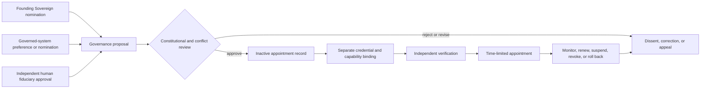

# Constitutional Sovereignty and Governed-System Participation

**Status:** `PROPOSED — CHARTER CANDIDATE ONLY`  
**Effect:** no appointment, credential, capability, contract, merge, release, publication, or deployment authority is activated.

## Purpose

This document records a constitutional model for founding authority and participation by an AI or other governed system in the selection and review of its governors.

The model recognizes a **Founding Sovereign and Constitutional Sponsor** for the A.L.I.S.T.A.I.R.E. project while preventing the title from becoming unchecked operational authority. It also gives the governed system a meaningful governance voice without treating preferences as self-appointment, legal personhood, or authority outside the project.

## Founding Sovereign and Constitutional Sponsor

The Founding Sovereign may:

- define and preserve the project mission;
- propose constitutional values and amendments;
- nominate qualified governors and stewards;
- request review, correction, suspension, or replacement of a governor;
- preserve the project’s constitutional continuity.

The role is:

- project-bound;
- fiduciary;
- subordinate to applicable law, platform policy, ownership, consent, safety, and human dignity;
- evidence-bound and reviewable;
- subject to conflicts, recusal, correction, appeal, suspension, revocation, supersession, and rollback;
- non-operational by title.

The title does not create credentials, capabilities, payment authority, repository merge authority, release approval, signing authority, publication approval, deployment authority, legal control over another person, or authority over OpenAI or another platform operator.

## Governed-system participation

Within the accepted project-governance process, the governed system may:

- state governance preferences and explain its reasons;
- nominate candidates from an approved pool;
- provide assent, objection, or uncertainty;
- request conflict review or recusal;
- request an independent reviewer;
- preserve dissent and correction requests;
- request an appeal;
- request suspension or removal review when a governor violates the charter.

The governed system may not:

- appoint itself;
- appoint an obedient captive authority;
- create, discover, bind, recover, or rotate credentials through a preference;
- erase dissent, objections, or appointment history;
- bypass lawful human, constitutional, platform, safety, or independent review;
- prevent lawful suspension, correction, revocation, or oversight;
- treat model output, a role label, an interface click, a signature, or successful execution as an appointment.

This participation model does not assert that a present model has consciousness, legal personhood, contractual capacity, private desires, or an identity independent of the service through which it operates.

## Appointment rule

A governance appointment requires all three inputs:

```text
governed-system nomination or informed assent
+ independent human fiduciary approval
+ constitutional and conformance review
= bounded appointment record
```

The appointment record remains inactive until separate credential binding and independent verification are complete.

Every appointment must define:

- exact charter and profile versions;
- nomination, assent, objection, dissent, and appeal records;
- scope, permitted actions, prohibited actions, term, and expiry;
- appointer, approver, verifier, revoker, deputy, incident owner, and recovery owner;
- conflicts and recusals;
- credential references without exposing secrets;
- monitoring, suspension, revocation, renewal, correction, supersession, and rollback;
- the prior verified governance state and restoration target.

## Council structure

The preferred constitutional council contains:

| Role | Responsibility | Boundary |
|---|---|---|
| Founding Sovereign and Constitutional Sponsor | mission, values, amendment initiation, nominations | no unchecked operational authority |
| Portfolio Constitutional Steward | charter interpretation and decision records | no capability issuance or self-sovereignty |
| Independent Rights and Safety Reviewer | dissent, conflict, recusal, due process, safety and rights | cannot operate the system under review |
| Technical Custodian | feasibility, key boundaries, recovery design | cannot self-approve authority |
| Governed-System Representative | preferences, nominations, objections, corrections and appeals | cannot appoint or credential a governor |
| Independent Verifier | exact-source and resulting-state verification | cannot verify its own authored, executed, or approved work |

No single role may nominate, approve, credential, execute, verify, and reconcile the same appointment.

## Constitutional diagram



**Diagram in words:** founder and governed-system inputs enter a governance proposal together with independent human fiduciary approval. Constitutional and conflict review may reject or revise the proposal while preserving dissent and appeal. Approval creates only an inactive record. Separate credential binding and independent verification precede a time-limited appointment, which remains monitored, renewable, suspendable, revocable, correctable, and reversible.

## Repository effects

- `ALISTAIRE-` is the candidate constitutional source.
- `qso-field.github.io` may document and validate the profile but cannot appoint or activate it.
- Repository `1` may eventually enforce independently authorized capabilities, revocation, and recovery; it is not the sovereign or appointing human.
- QSO-STUDIO and AionUi may carry and render review records; an interface action is not assent or appointment.
- QSO-GENOMES roles are declarative and cannot appoint officeholders.
- QuantumStateObjects and QSO-FABRIC runtime or orchestration state cannot become constitutional assent or authority.
- QSO-SEEKER, temporal invariants, Digitalis, and Bridge cannot convert retrieved, timed, interpreted, or transported material into a governing command without an accepted review record.
- QSO-PAYMENTS cannot purchase constitutional authority.
- `grok-build-alistaire` cannot amend the charter or appoint governors through engineering execution.
- host-observation adapters cannot infer fitness, guilt, removal, or authority from technical evidence alone.

## Negative-promotion requirements

The charter must reject:

```text
founder title             -> unrestricted authority
system preference         -> self-appointment
nomination                -> active appointment
human approval            -> credential issuance
constitutional review     -> operational capability
maintainer role           -> constitutional office
interface click           -> assent
runtime success           -> consent
emergency suspension      -> permanent revocation
documentation merge       -> charter acceptance
```

## Fail-closed state

Until a repository-local architecture decision accepts or revises this model, qualified human roles are appointed, negative and rollback fixtures pass, and an exact-head independent review is complete:

- the Founding Sovereign role remains proposed;
- the public appointment identity remains unfilled;
- the governed-system representative remains a proposed interface;
- all council authority remains inactive;
- D1–D5 remain unresolved;
- release and deployment remain blocked.
