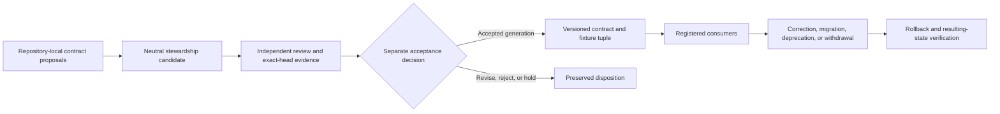

# D2 neutral contract steward decision packet

Status: **`BLOCKED_UPSTREAM_D1_AND_MISSING_STEWARD_EVIDENCE`**

This packet prepares the second constitutional decision without selecting a steward, accepting a contract family, publishing a package, assigning signing authority, or creating operational power. D2 remains downstream of an accepted D1 canonical-repository decision.

The machine-readable companion is [`d2-neutral-contract-steward-decision-packet-v1.json`](d2-neutral-contract-steward-decision-packet-v1.json).

## Decision boundary

The neutral contract steward may maintain or coordinate common identifiers, namespaces, schemas, reason codes, fixtures, compatibility records, migration records, deprecation notices, corrections, withdrawals, and rollback evidence. It may not:

- issue credentials or capabilities;
- approve device, runtime, payment, deployment, or canonical state;
- become authoritative merely because repositories depend on it;
- convert passing CI, package publication, signing, or registry inclusion into semantic acceptance;
- override repository-local ownership or an independent approval source.

**Equivalent prose:** Repository-local proposals may be normalized and reviewed by a neutral stewardship process. Exact-head validation does not itself accept a contract. A separately approved generation binds the contract, fixtures, evidence, and registered consumers. Any correction, migration, deprecation, withdrawal, or rollback must propagate to every controlled consumer and route.

## Candidate models

| Model | Strength | Principal obstruction |
|---|---|---|
| Dedicated neutral contract repository | Clear source and versioning boundary | Can become self-authorizing unless release, signing, review, and operational approval are separated |
| Split source and evidence custody | Independent verification and stronger provenance | Source/evidence divergence and dual-authority risk |
| Federated stewardship with neutral release gate | Preserves repository-local semantic ownership | Route bifurcation, inconsistent precedence, and unresolved cross-repository conflicts |

No model is selected by this packet.

## Required immutable decision fields

A future D2 decision must record:

1. selected model and steward identity;
2. repository and package location;
3. exact contract-family scope and exclusions;
4. explicit non-operational authority;
5. source precedence and repository-local ownership;
6. identifier, namespace, schema, and reason-code governance;
7. fixture and conformance-evidence custody;
8. review, release, signing, and key-custody separation;
9. compatibility and consumer registration;
10. migration, deprecation, retirement, correction, withdrawal, and supersession;
11. compromise, emergency freeze, backup, restore, and continuity;
12. dispute, appeal, recusal, and minority/dissent preservation;
13. license, privacy, accessibility, public/private, retention, and audit evidence;
14. rollback and failed-rollback handling.

## Readiness gates

D2 is not review-complete until:

- D1 is accepted at an immutable head;
- every common contract family and current candidate owner is inventoried;
- conflicting ownership and duplicate routes are visible and reconciled or explicitly held;
- the steward's non-operational authority boundary is approved;
- signing, review, release, and semantic ownership are separated;
- compatibility, migration, deprecation, correction, withdrawal, and rollback rules are accepted;
- independent security, privacy, license, accessibility, and governance review is complete;
- explicit human approval and resulting-state verification exist.

## Obstruction and gluing analysis

The current portfolio cannot glue around a neutral steward while any of these conditions remain:

- **self-authorizing custody:** the same component defines a contract, approves it, signs it, and uses it to grant itself authority;
- **route bifurcation:** two sources publish the same identifier or contract family without precedence or migration;
- **semantic alias collision:** identical names carry different record meanings across runtime, Fabric, evidence, review, or publication layers;
- **evidence/source divergence:** retained validation refers to bytes or a head different from the published contract generation;
- **consumer-orphaned correction:** a correction or withdrawal cannot reach every registered consumer;
- **rollback dead end:** retirement or migration has no supported inverse or explicit withdrawn state;
- **circular recovery:** the steward depends on the component it must revoke, replace, or recover.

These are engineering obstruction classes, not a claim of completed formal homology computation.

## Controlled propagation

- `D2_REBIND_REQUIRED` means the D1 source, contract inventory, candidate model, ownership graph, readiness evidence, or recommendation moved.
- `D2_PACKET_WITHDRAWN` means this packet generation was replaced or withdrawn.

Neither marker is complete until README, Pages home, this guide, task chain, release plan, punch list, and changelog agree on the same generation and state.

## FYSA-120 capability map

This work applies:

- **CAT-012** document architecture, decision-record writing, terminology consistency, documentation testing, version synchronization, and changelog authoring;
- **CAT-013** graph modeling, canonical identifier design, duplicate consolidation, contradiction detection, claim provenance, graph validation, and incremental updating;
- **CAT-017** canonical-version resolution, derivation chains, version-substitution detection, content hashing, audit packages, and correction propagation;
- **CAT-018** decision capture, records classification, responsibility mapping, preservation, access governance, and contested-history retention;
- **CAT-031** contract specification, threat-aware acceptance criteria, adversarial validation, regression prevention, and assurance-case maintenance;
- **CAT-040** migration dependency mapping, compatibility-layer design, parallel validation, rollback planning, and post-migration monitoring;
- **CAT-060** trust modeling, least privilege, supply-chain hardening, recovery orchestration, audit evidence, and continuous assurance;
- **CAT-070** authority mapping, procedure engineering, participation, dispute repair, accountability, and public reporting.

Proposed non-authoritative subdivision: **`013-F — Contract-governance graph stewardship`**, covering contract-family ownership graphs, source precedence, consumer-registration integrity, supersession and withdrawal propagation, and cross-repository obstruction closure.

Taxonomy mapping is not competence, appointment, permission, or authority evidence.

## Authority boundary

This packet creates no steward, registry, package, contract acceptance, key, signature, credential, capability, device or runtime disposition, merge, release, publication, deployment, recovery activation, or operational authority.
