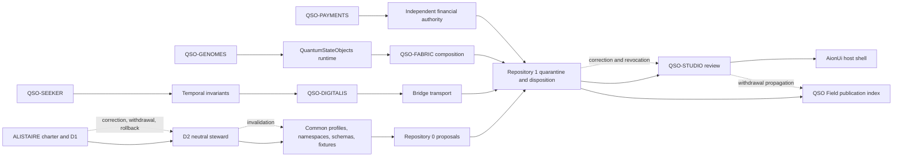

# D2A Common-Contract Ownership and Consumer Graph

Status: **review-ready observed graph; ownership unresolved; no authority effect**

This document provides the exact-head portfolio inventory required to review D2 neutral contract stewardship. It records current default-branch heads, active documentation candidates, candidate contract families, producer/consumer edges, triple-overlap obligations, and material gluing obstructions across all nineteen owned repositories.

It does **not** accept a contract owner, select a steward, approve a namespace or schema, establish canonical bytes, register a consumer, authorize signing, admit a runtime, approve payment, merge a branch, publish Pages, release software, or deploy infrastructure.

The machine-readable companion is [`d2a-common-contract-ownership-graph-v1.json`](d2a-common-contract-ownership-graph-v1.json).

## Why this graph exists

D2 cannot be decided responsibly from repository names alone. The portfolio contains local proposals for identity, observations, time, interpretation, transport, runtime, composition, review, payments, engineering, publication, correction, and recovery. Several repositories can be locally coherent while still disagreeing on the combined meaning of a record or edge.

The graph therefore distinguishes:

- **observed repository scope** from accepted semantic ownership;
- **default-branch evidence** from active candidate-branch evidence;
- **producer responsibility** from steward, reviewer, approver, signer, revoker, or operator authority;
- **pairwise compatibility** from triple-overlap consistency;
- **delivery, rendering, execution, and CI success** from canonical acceptance.

## Portfolio snapshot

The profile binds every owned repository to its observed `main` head as of July 23, 2026. Five active candidate heads are recorded separately because their documentation or conformance work has not been merged into the owning default branch:

- `ALISTAIRE-` PR #1 — charter, D1, and D2 governance candidate;
- `QSO-FABRIC` PR #21 — ecosystem and interface-compatibility producer candidate;
- `qso-field.github.io` PR #24 — portfolio documentation and interface-partition candidate;
- `QuantumStateObjects` PR #12 — runtime and independent interface consumer candidate;
- Repository `1` PR #2 — independent trust, lifecycle, and interface consumer candidate.

A moved default head or candidate head triggers `D2A_REBIND_REQUIRED`. A withdrawn or superseded graph generation triggers `D2A_GRAPH_WITHDRAWN`. Neither state is complete until the human-readable and machine-readable graph agree.

## Contract-family map

| Family | Candidate owner or split | Current state | Principal unresolved question |
|---|---|---|---|
| Constitutional decisions | `ALISTAIRE-`, subject to D1 | Blocked | Which overlapping repository is canonical, and how is the other preserved? |
| Common contract profiles | Unassigned D2 neutral steward | Blocked | Who owns source precedence, namespaces, schemas, fixtures, review, release, signing, correction, and continuity without operational self-authorization? |
| Proposal, capability, disposition, recovery | Repository `0` plus Repository `1` with separated roles | Proposed | Can the authority and recovery root be independently chartered and revoked? |
| Host and source observations | Profile-specific adapters: JusticeForMe, Misc, Seeker | Proposed overlap | How are subject identity, completion, duplicate evidence, privacy, correction, and corroboration separated? |
| Temporal assessment | `datarepo-temporal-invariants` candidate | Proposed | Which clocks, freshness, replay, ordering, and supersession rules are accepted? |
| Interpretation and policy projection | `QSO-DIGITALIS` candidate | Proposed | How are vocabulary, transformation loss, privacy, and corrections preserved? |
| Transport and delivery | `Bridge` or an extracted neutral transport profile | Proposed role decision | Is Bridge a domain product, a reusable transport contract owner, or both under explicit partitioning? |
| Genome identity and lineage | `QSO-GENOMES` candidate | Proposed | Which identities, alias migrations, policy commitments, mutations, and compatibility rules are canonical? |
| Runtime admission and local evidence | `QuantumStateObjects` candidate | **Blocked role collision** | How are runtime-local event ledgers and execution reports distinguished from Fabric-level records? |
| Fabric composition and aggregate evidence | `QSO-FABRIC` candidate | **Blocked role collision** | Which namespace, producer, semantic class, source-set, and aggregation receipt identify each record? |
| Reference conformance | Neutral fixtures consumed by `qsio-kernel` | Blocked on D2 | Who owns fixtures, independent implementations, expected bytes, and supersession? |
| Review and accessible projection | `QSO-STUDIO` with `AionUi` host adapter | Proposed | How are review, annotation, approval, publication, correction, and withdrawal kept distinct? |
| Financial intent and authorization | `QSO-PAYMENTS` plus independent financial authority | Blocked | Who approves and revokes financial intent independently of technical capability? |
| Engineering task and execution evidence | Repository `0` plus optional `grok-build-alistaire` | Proposed | How is execution evidence prevented from becoming merge, signing, release, or deployment authority? |
| Publication snapshots and withdrawals | Repository-local owners; QSO Field as a non-authoritative index | Proposed | Who owns public projection, cache invalidation, correction propagation, withdrawal completion, and rollback? |
| Compatibility, migration, retirement | D1-approved charter plus local owners | Blocked | Which source precedence, license, migration, redirect, archive, retirement, and rollback rules apply? |

## Graph view



**Equivalent prose:** The charter and D1 decision constrain the neutral D2 steward. The steward may govern common contract profiles but cannot grant operational authority. Repository `0` proposes bounded work and Repository `1` independently quarantines, authorizes, reconciles, revokes, and recovers. Source records flow through temporal assessment, interpretation, and transport before Repository `1` disposition. Genome policy flows through local runtime and Fabric composition before disposition. Review and publication remain read-only projections. Financial approval remains independent. Corrections, revocations, withdrawals, and rollback must propagate through every affected edge.

## Material obstruction: runtime/Fabric role collision

The most concrete semantic obstruction remains the reuse of `qso-event-ledger` and `qso-runtime-report` for two different levels of meaning:

- `QuantumStateObjects` needs runtime-local event and execution records;
- `QSO-FABRIC` needs collaboration, experiment, source-set, projection, aggregation, and aggregate-report records.

Two independently implemented consumers can agree on a declaration-level fixture while the live payload semantics remain incompatible. This blocks composition until separate or qualified namespaces and payload envelopes define:

- producer and semantic class;
- canonical bytes and record identity;
- sequence, causal order, duplicate, replay, conflict, and idempotency behavior;
- source-set and adapter identities;
- projection and aggregation receipts;
- correction, revocation, supersession, retention, and trusted time;
- consumer registration, mixed-generation migration, rollback, and restored-state verification.

The required triple overlap is:

```text
runtime-local record
→ Fabric projection or aggregation
→ Repository 1 disposition
```

The witness must prove that no local success becomes experiment success or canonical disposition merely through transport, aggregation, or fixture agreement.

## Homology-like gluing review

This is an engineering consistency method, not a claim of completed algebraic topology. A proposed path fails closed when:

1. a required edge is absent;
2. two paths produce different record identities or authority effects;
3. a triple overlap agrees pairwise but not jointly;
4. a correction or revocation cannot reach every dependent consumer;
5. a cycle allows a component to define, approve, or recover its own authority;
6. a rollback path is absent or restores stale, withdrawn, revoked, or unsupported state.

Current nontrivial failures include constitutional identity overlap, missing neutral stewardship, runtime/Fabric role collision, observation duplication ambiguity, Bridge role ambiguity, review-versus-approval separation, missing financial authority, and publication-withdrawal custody.

## Planning-file alignment

This graph is a review input, not a completion claim. The existing planning controls remain accurate:

- task-chain P0M remains `REVIEW` because repository-local claims have not been reconciled or accepted;
- P0-D2R remains `REVIEW` and P0-D2 remains `BLOCKED` because D1, ownership reconciliation, steward selection, and approval are incomplete;
- the punch-list item to inventory every common contract family remains open until repository-local evidence is reconciled and reviewed;
- the release remains blocked on D1–D5, neutral stewardship, canonical bytes, independent authority, security/privacy/license/accessibility review, exact-head validation, rollback evidence, and explicit approval;
- this candidate should be recorded in the changelog only as an observed, non-authorizing graph milestone.

## Bounded next steps

1. Reconcile each observed role against repository-local documentation at the recorded exact head.
2. Preserve conflicting ownership claims rather than selecting one implicitly.
3. Select D1 before appointing or locating a D2 steward.
4. Partition runtime-local and Fabric-level namespaces and payload roles.
5. Define correction, revocation, migration, consumer-registration, and rollback witnesses for every accepted edge.
6. Require independent security, privacy, license, accessibility, architecture, and human approval before acceptance.

## FYSA-120 capability map

Applied categories and subdivisions are recorded in the machine-readable graph:

- CAT-012 for information architecture, technical exposition, controlled navigation, and documentation validation;
- CAT-013 for entity resolution, ownership graphs, contradiction detection, provenance, and graph updating;
- CAT-017 for exact source binding, canonical-version tracking, substitution detection, hashing, and correction propagation;
- CAT-031 for invariants, hostile regression testing, verified builds, and assurance maintenance;
- CAT-032 for distributed interface composition, ordering, consistency, and overlap analysis;
- CAT-040 for migration, consumer rebinding, continuity, rollback, and failed-rollback planning;
- CAT-052 for provenance, identity binding, audit evidence, and trust boundaries;
- CAT-070 for authority mapping, procedure design, dispute repair, oversight, and accountable governance.

Proposed non-authoritative subdivision **`013-G — Exact-head common-contract ownership graph reconciliation`** covers portfolio-wide exact-head role inventory, candidate-versus-accepted ownership separation, producer/consumer and triple-overlap construction, semantic role-collision detection, and correction/withdrawal/rollback closure.

Taxonomy selection does not demonstrate competence, appoint an owner, grant permission, accept a contract, or expand implementation scope.

## Authority boundary

This graph is an observed, review-ready documentation artifact. It creates no canonical repository, steward, contract owner, namespace, schema, consumer registration, signature authority, credential, capability, runtime admission, financial approval, merge, release, publication, deployment, recovery activation, or operational authority.
