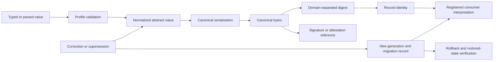

# D3 Canonical Bytes and Identity Primitives Decision Packet

Status: **review-ready proposal; blocked on D1, D2, independent implementations, and approval**

This packet converts D3 from an open-ended architecture task into a closed, non-authorizing review surface. It compares candidate canonicalization profiles, defines the primitive and decision vocabulary, specifies positive and hostile evidence classes, records cross-language witness requirements, and preserves migration and rollback boundaries.

It does **not** select JSON, CBOR, an abstract model, a namespace, a digest algorithm, a signature scheme, a registry, a contract owner, or an accepted canonical generation. It does not establish truth, currentness, compatibility, consumer admission, credential validity, runtime authority, merge authority, release authority, or deployment authority.

The machine-readable companion is [`d3-canonical-bytes-identity-decision-packet-v1.json`](d3-canonical-bytes-identity-decision-packet-v1.json).

## Why D3 is required

The portfolio currently exchanges records across Python, TypeScript, JavaScript, shell tooling, static documentation, and future independent consumers. A value that looks equivalent to a person may still produce different bytes, digests, identifiers, ordering, or error outcomes across languages and libraries. Conversely, identical bytes may be misinterpreted as the same semantic record when the namespace, profile version, producer, or replay domain differs.

D3 therefore separates:

- abstract meaning from serialized representation;
- canonical bytes from digest and record identity;
- signature reference from authorization validity;
- syntax acceptance from contract compatibility;
- transport encoding from semantic class;
- evidence identity from truth, freshness, or authority;
- migration success from restored-state and rollback verification.

## Candidate profiles

| Candidate | Strength | Principal risk |
|---|---|---|
| Strict canonical JSON subset | Human-reviewable, widely implemented, easy to retain as public evidence | Permissive parsers, floating-point behavior, text normalization, and library defaults can diverge |
| Deterministic CBOR profile | Typed compact representation with explicit integer, map, tag, and binary rules | Tag interpretation and diagnostic representations can become implementation-defined |
| Typed model with canonical JSON envelope | Separates an internal typed model from portable release and review bytes | The model and envelope can become competing authorities unless every transform is versioned and loss-classified |

No candidate is selected by this packet. A mixed portfolio may eventually choose different profiles by contract family, but each family must bind one accepted abstract model, canonicalization profile, profile version, reason-code registry, migration rule, and rollback path.

## Canonicalization chain



**Equivalent prose:** A producer first validates a value against an accepted profile. The value is normalized only according to explicit rules, then serialized into canonical bytes. A domain-separated digest and record identity are derived from those bytes together with the accepted semantic namespace and profile generation. Signatures or attestations reference the exact bytes but do not independently prove authorization. Corrections and supersessions create new generations rather than rewriting prior evidence, and consumers must migrate or roll back through explicit records.

## Required primitives

D3 must close all of the following before acceptance:

1. UTF-8 acceptance and rejection behavior;
2. Unicode normalization and confusable-identifier handling;
3. object or map ordering;
4. duplicate-key rejection;
5. integer, decimal, precision, and range rules;
6. negative zero, `NaN`, and infinity handling;
7. null, missing, optional, and default semantics;
8. timestamp, duration, clock, offset, skew, and unsupported-time behavior;
9. binary values and attachment references;
10. digest algorithms and semantic domain separation;
11. signature-reference and attestation binding without secret material;
12. namespace, version, and identifier grammar;
13. subject, device, environment, and workspace identity;
14. proposal, capability, receipt, result, and disposition identity;
15. correction, revocation, checkpoint, supersession, and tombstone identity;
16. extensions, unknown fields, replay domains, sequence, duplicate, and idempotency rules.

## Cross-language witness

At least two independently authored implementations must evaluate the same immutable corpus. For every case they must agree on:

- accepted or rejected disposition;
- normalized abstract value when accepted;
- canonical bytes;
- digest;
- record identity;
- reason code.

Using the same library, generated code, copied implementation, shared parser configuration, or one implementation wrapped by two command-line programs does not establish independence.

A passing parser test is not enough. The witness must include positive, malformed, adversarial, unsupported-version, lossy-transcoding, collision, migration, correction, and rollback cases. Expected bytes and reason codes require neutral custody under D2; the producer under test may not define its own expected result after observing its output.

## Hostile fixture classes

The machine-readable packet closes nineteen required hostile classes, including invalid UTF-8, duplicate keys, non-normalized or confusable identifiers, non-finite and out-of-profile numbers, decimal rounding divergence, timestamp aliases, null/missing collapse, extension and namespace collisions, digest-domain confusion, signature-reference substitution, replay-domain collision, undisclosed lossy transcoding, and unsupported profile versions.

Fail-closed behavior means:

- unsupported input is rejected with a stable reason code;
- no implementation silently repairs or normalizes outside the accepted profile;
- no rejected input receives a canonical digest or record identity;
- no two semantic classes share an identity merely because payload bytes match;
- no signature presence becomes authorization, currentness, or truth;
- no `UNKNOWN` or unsupported state becomes success.

## Contract-graph gluing requirements

Canonical bytes are necessary but not sufficient for portfolio composition. Every accepted edge must bind:

```text
producer repository and contract family
+ semantic namespace and profile version
+ canonical bytes and digest domain
+ record identity and replay domain
+ consumer version and expected reason codes
+ correction, revocation, migration, and rollback route
```

A pairwise witness fails to glue when a third component interprets the same identity differently, strips a required field, changes authority effect, collapses runtime-local and Fabric-level semantics, or cannot receive a correction or revocation. The most urgent existing case remains the shared `qso-event-ledger` and `qso-runtime-report` labels: canonical payload bytes cannot repair that role collision unless runtime-local and Fabric-level semantic namespaces are partitioned first.

## Migration and canonicalization change

Changing any accepted canonicalization primitive creates a new profile generation. It is not an in-place parser update. A migration must record:

- exact old and new profiles;
- source and target canonical bytes and digests;
- whether the mapping is lossless, lossy, partial, or unsupported;
- direct-versus-chained path comparison;
- consumer dispositions and mixed-generation windows;
- correction and withdrawal propagation;
- rollback target and restored-state witness;
- treatment of historical signatures, receipts, and tombstones.

Lossy mappings must enumerate every omitted distinction and may not broaden scope, authority, precision, or certainty. A rollback may restore a supported prior generation or an explicit withdrawn state, but it may not recreate revoked, expired, superseded, or unsupported claims.

## Decision readiness

D3 remains `BLOCKED_UPSTREAM_D2_AND_MISSING_CROSS_LANGUAGE_EVIDENCE` until:

1. D1 canonical identity is accepted;
2. D2 neutral stewardship and source precedence are accepted;
3. candidate-profile comparison is complete;
4. every contract family is mapped to required primitives;
5. positive and hostile vectors are complete;
6. two independent implementations agree;
7. digest, namespace, identifier, and replay collision review is complete;
8. migration, correction, withdrawal, and rollback routes are verified;
9. independent security, privacy, license, and accessibility review is complete;
10. explicit human approval and resulting registry/consumer verification are recorded.

The current machine-readable packet improves review readiness only. It is not an accepted canonical profile or conformance result.

## Controlled propagation

`D3_REBIND_REQUIRED` means the D1 or D2 source, candidate profile set, primitive inventory, contract-family mapping, fixture corpus, expected results, consumer set, migration rule, or readiness evidence changed.

`D3_PACKET_WITHDRAWN` means this packet generation was replaced or withdrawn.

Neither state is complete until README, Pages, task chain, release plan, punch list, and changelog agree. A moved head invalidates exact-head evidence and requires a fresh run.

## FYSA-120 capability map

Applied categories:

- **CAT-012** — document architecture, technical exposition, controlled navigation, documentation validation, and lifecycle synchronization;
- **CAT-013** — semantic entity resolution, namespace graphing, contradiction detection, provenance, and cross-repository updating;
- **CAT-017** — canonical-version resolution, derivation tracking, substitution detection, hashing, and correction propagation;
- **CAT-031** — specification, positive and hostile vector design, differential testing, verified builds, and assurance maintenance;
- **CAT-032** — distributed representation, ordering, replay, consistency, idempotency, and overlap analysis;
- **CAT-040** — compatibility migration, mixed-generation operation, continuity, rollback, and failed-rollback planning;
- **CAT-052** — identity binding, domain-separated provenance, trust modeling, and retained audit evidence;
- **CAT-059** — evidence transport, attestation binding, verification portability, and exact-source reproduction;
- **CAT-070** — authority separation, procedure engineering, dispute repair, oversight, and accountable approval.

Proposed non-authoritative subdivision **`031-Q — Cross-language canonical-byte and identity-primitive conformance`** covers canonical serialization profiles, independent language vectors, semantic-preserving transcoding, domain-separated identity derivation, replay-domain collision testing, and canonicalization migration/rollback closure.

Taxonomy selection does not demonstrate competence, appoint a steward, accept a profile, register a consumer, grant permission, or expand implementation scope.

## Authority boundary

This packet creates no canonical encoding, namespace, identifier, digest, signature scheme, registry, contract owner, consumer registration, credential, capability, runtime admission, truth claim, compatibility decision, merge, release, publication, deployment, recovery activation, or operational authority.
