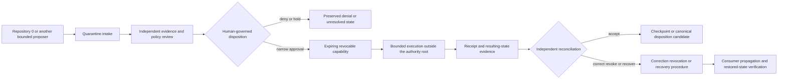

# D4 independent authority and recovery roots decision packet

Status: **`BLOCKED_UPSTREAM_D3_AND_MISSING_INDEPENDENT_AUTHORITY_EVIDENCE`**

This packet prepares the fourth constitutional decision without chartering Repository `1`, appointing an authority, issuing a credential or capability, selecting a key custodian, activating quarantine, accepting canonical state, restoring a device, publishing a service, or granting operational power. D4 remains downstream of accepted D1–D3 decisions.

The machine-readable companion is [`d4-independent-authority-recovery-roots-decision-packet-v1.json`](d4-independent-authority-recovery-roots-decision-packet-v1.json).

## Decision boundary

D4 concerns the independently governed roots that may eventually admit, deny, quarantine, expire, revoke, checkpoint, correct, and recover bounded portfolio actions or state. An accepted D4 authority may act only within an explicitly approved scope and must remain separate from proposal generation, implementation, ordinary runtime execution, and evidence production.

It may not:

- bootstrap or approve its own constitutional authority;
- infer approval from dependency, signature presence, workflow success, or successful execution;
- accept a proposal produced by itself without independent review;
- issue an unbounded, non-expiring, non-revocable, or non-attributable capability;
- restore state from a checkpoint whose provenance, revocation state, or consumer effects are unknown;
- treat Repository `1`, a package, a key, a quorum, or a UI as authoritative merely because it exists;
- collapse technical recovery, canonical disposition, legal authority, and public claims into one decision.

## Candidate authority models

| Model | Strength | Principal obstruction |
|---|---|---|
| Isolated Repository `1` authority root | Clear quarantine, disposition, checkpoint, and recovery boundary | Can become circular or self-authorizing if it defines, approves, signs, stores, and restores its own authority |
| Split issuance and recovery roots | Limits compromise blast radius and separates ordinary capability decisions from exceptional restoration | Cross-root deadlock, inconsistent revocation, and divergent checkpoint custody |
| Federated human-reviewed quorum | Preserves independent review and contested-decision records | Ambiguous membership, stale quorum, capture, unavailable members, and weak emergency procedures |

No model is selected by this packet. Repository `1` is an observed candidate, not an accepted constitutional authority.

## Governed lifecycle

**Equivalent prose:** A bounded proposer submits an attributable request to quarantine. An independent authority reviews exact evidence and policy, while a separately responsible human decision process records deny, hold, or narrowly approved disposition. Any approved capability must be scoped, expiring, attributable, and revocable. Execution occurs outside the authority root and returns evidence. Acceptance, correction, revocation, checkpointing, or recovery requires independent reconciliation and verified propagation to every affected consumer. No arrow grants authority merely because the preceding step succeeded.

## Required immutable decision fields

A future D4 decision must record:

1. accepted constitutional source and D1–D3 generations;
2. authority model, repository or service identity, and exact scope;
3. explicit exclusions and non-authority boundaries;
4. issuer, approver, revoker, auditor, incident owner, and recovery owner—or approved vacancies;
5. separation of proposal, review, approval, execution, evidence, custody, and recovery duties;
6. request, quarantine, decision, capability, receipt, disposition, correction, revocation, checkpoint, and recovery record identities;
7. capability scope, target, operation, preconditions, expiration, nonce, replay domain, and revocation reference;
8. human approval, quorum, recusal, dissent, appeal, emergency, and break-glass rules;
9. key generation, storage, rotation, compromise, destruction, backup, and succession custody;
10. trusted clock, sequence, freshness, replay, duplicate, and idempotency rules;
11. checkpoint provenance, retention, privacy, integrity, restoration, and supersession rules;
12. correction and revocation propagation to all registered consumers and derived claims;
13. bounded restart, failed recovery, split-brain, partial-state, and unknown-state handling;
14. security, privacy, license, accessibility, legal, public/private, retention, and audit requirements;
15. migration, replacement, retirement, withdrawal, rollback, and independently verified restored state.

## Readiness gates

D4 is not review-complete until:

- D1 canonical identity is accepted at an immutable head;
- D2 neutral contract stewardship and source precedence are accepted;
- D3 canonical representations and identity primitives pass independent cross-language witnesses;
- Repository `0` proposal semantics and Repository `1` candidate authority semantics are reconciled without direct identity aliasing;
- the direct `working → quarantine` and `working → proposal → quarantine` route conflict is resolved or explicitly unsupported;
- every authority role and vacancy is recorded, with separation of duties and recusal rules;
- capability, revocation, checkpoint, correction, and recovery schemas and hostile fixtures are accepted;
- consumer registration and revocation/correction acknowledgment are complete;
- key custody, trusted clocks, compromise response, backup, restoration, and succession are independently reviewed;
- emergency freeze, bounded restart, revocation, rollback, and recovery exercises succeed;
- security, privacy, licensing, accessibility, legal, and governance review is complete;
- explicit human approval and independently verified resulting state exist.

## Portfolio source observations

The current review basis includes:

- `aevespers2/ALISTAIRE-` PR #1 at base generation `0a0dd2fd8a75cc40833a60da0bad5d14426ac8ca`;
- `aevespers2/1` PR #2 at `432a6fafa56d4a57be7fc3918eba5ed80a6bcdcc`, a documentation-, fixture-, and validation-only conservative-authority candidate;
- `aevespers2/1` PR #1 at `0813308061e27e8289ea8f15af7d5ccdc84b4abf`, a distinct path-audit and token-safeguard candidate;
- Repository `0` candidate routes that preserve bounded proposal generation and deny independent approval authority.

These are observed candidate sources. They are not accepted contracts, owners, capabilities, credentials, authority roots, or recovery systems.

## Obstruction and gluing analysis

The authority and recovery route cannot compose while any of these obstruction classes remain:

- **constitutional loop:** the proposed authority derives its authority from a record that it alone creates or approves;
- **proposal/disposition collapse:** one component proposes, approves, executes, and accepts its own result;
- **route bifurcation:** Repository `0` and Repository `1` disagree about whether a proposal record is mandatory before quarantine;
- **root co-location:** issuance, revocation, signing, backup, and restoration depend on one compromise domain;
- **revocation orphan:** a capability or public claim survives because one consumer cannot receive or acknowledge revocation;
- **checkpoint fork:** two checkpoints claim precedence without an accepted ancestry, supersession, or reconciliation rule;
- **compromised-root recovery:** the same root suspected of compromise authorizes its own restoration;
- **stale-quorum approval:** membership, eligibility, recusal, or decision freshness is not bound to the exact request;
- **clock and replay ambiguity:** expiration, sequence, nonce, and replay domains differ across proposer, authority, executor, and consumer;
- **evidence inflation:** signatures, receipts, test success, or majority agreement are treated as truth or canonical acceptance;
- **rollback resurrection:** rollback revives withdrawn consent, revoked authority, superseded state, or invalidated public claims;
- **unverified restoration:** recovery is declared complete before an independent observer verifies the resulting state and affected consumers.

These are practical engineering and governance obstruction classes, not a claim of completed formal homology computation.

## Pairwise and triple-overlap witnesses

At minimum, D4 requires pairwise witnesses for:

- Repository `0` proposer ↔ Repository `1` quarantine intake;
- authority decision ↔ capability issuer;
- capability ↔ bounded executor;
- execution receipt ↔ independent reconciliation;
- revocation/correction ↔ every registered consumer;
- checkpoint custody ↔ recovery executor;
- recovery executor ↔ independent restored-state witness.

It also requires triple-overlap witnesses for:

- proposer ↔ quarantine ↔ authority decision;
- authority decision ↔ capability ↔ execution receipt;
- receipt ↔ disposition ↔ checkpoint;
- correction/revocation ↔ consumer propagation ↔ public-claim withdrawal;
- checkpoint ↔ recovery ↔ independently verified resulting state.

Two passing adjacent pairwise witnesses do not prove the triple overlap. Identity, scope, time, source completeness, information loss, correction reachability, or authority effect may still disagree in the overlap.

## Controlled propagation

- `D4_REBIND_REQUIRED` means a D1–D3 dependency, authority candidate, role or vacancy, route, record family, custody rule, consumer set, exercise result, recommendation, or safety boundary moved.
- `D4_PACKET_WITHDRAWN` means this packet generation was replaced or withdrawn.

Neither marker is complete until README, Pages home, this packet, task chain, release plan, punch list, and changelog agree on the same generation and state, exact-head evidence is retained, and any derived public claim is corrected or withdrawn.

## Reviewer onboarding

A D4 reviewer should:

1. verify each observed repository and pull-request head;
2. reconstruct both Repository `0` → Repository `1` route candidates;
3. identify every authority role, explicit vacancy, trust domain, and prohibited combination of duties;
4. trace one approval, denial, expiration, revocation, checkpoint, failed execution, and failed recovery end to end;
5. test whether correction and revocation reach every consumer and public claim;
6. verify that recovery cannot be authorized solely by the suspected or failed root;
7. require preserved dissent, recusal, failed-generation evidence, rollback, and independently witnessed restoration;
8. stop if any source, owner, key-custody rule, consumer, route, or resulting state is unknown.

## FYSA-120 capability map

This work applies:

- **CAT-012 A/B/D/E** — document architecture, decision writing, terminology controls, validation, and lifecycle synchronization;
- **CAT-013 A/C/D/E** — authority and dependency graph modeling, identity resolution, contradiction detection, provenance, and incremental updating;
- **CAT-017 A/C/D/E** — canonical source resolution, derivation chains, substitution detection, preservation, audit packages, and correction propagation;
- **CAT-018 B/D/E** — responsibility mapping, decision continuity, reviewer onboarding, access governance, and contested-history preservation;
- **CAT-031 A/D/E** — invariant specification, hostile lifecycle validation, regression prevention, and assurance maintenance;
- **CAT-032 A/D/E** — distributed boundaries, partial failure, recovery, observability, and incident diagnosis;
- **CAT-040 A/B/D/E** — system archaeology, dependency risk, migration, rollback, and continuity assurance;
- **CAT-052 A/B/D/E** — security architecture, trust boundaries, key lifecycle, compromise response, and recovery review;
- **CAT-054 A/B/D/E** — identity and access governance, least privilege, authorization, revocation, and continuous assurance;
- **CAT-059 A/B/C/E** — evidence integrity, attestations, signature semantics, independent verification, and assurance;
- **CAT-064 B/D/E** — governance records, separation of duties, incident accountability, correction, and public reporting;
- **CAT-070 A/C/D/E** — authority mapping, institutional design, dispute repair, accountability, and governance evolution.

Proposed non-authoritative subdivision: **`054-M — Independent authority and recovery-root separation`**, covering non-circular authority derivation, proposer/approver/executor separation, revocation-closed consumer propagation, compromise-independent recovery, checkpoint ancestry, failed-restoration handling, and independently witnessed resulting state.

Taxonomy mapping is not competence, appointment, permission, ownership, acceptance, or authority evidence.

## Authority boundary

This packet creates no constitutional decision, authority root, owner, reviewer, quorum, key, credential, capability, registry, quarantine action, checkpoint, canonical disposition, recovery operation, merge, release, Pages publication, deployment, payment, infrastructure change, or destructive history rewrite.
