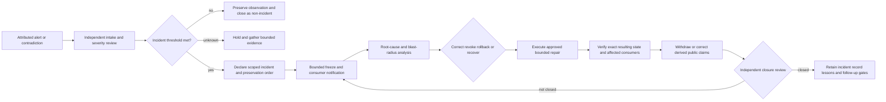

# D5 portfolio incident, freeze, rollback, and claim-withdrawal command decision packet

Status: **`BLOCKED_UPSTREAM_D4_AND_MISSING_INCIDENT_COMMAND_EVIDENCE`**

This packet prepares the fifth constitutional decision without appointing incident command, freezing a repository or device, revoking a capability, withdrawing a public claim, restoring state, publishing a notice, changing credentials, merging code, releasing software, or granting operational authority. D5 remains downstream of accepted D1–D4 decisions.

The machine-readable companion is [`d5-portfolio-incident-command-decision-packet-v1.json`](d5-portfolio-incident-command-decision-packet-v1.json).

## Decision boundary

D5 concerns the independently governed command structure that may eventually declare a portfolio incident, preserve evidence, impose a bounded freeze, coordinate correction and revocation, authorize a constrained restart, direct rollback or recovery, withdraw invalid public claims, and close an incident only after independently verified resulting state.

It may not:

- create its own constitutional authority or bypass D1–D4;
- treat an automated alert, majority vote, signature, workflow result, repository role, or title as incident authority;
- let the component suspected of failure be the sole evidence custodian, investigator, approver, restorer, and closure witness;
- freeze unrelated repositories, data, accounts, devices, or people outside an approved incident scope;
- destroy, rewrite, suppress, or silently replace disputed evidence;
- restart a route whose identities, dependencies, revocation state, consumer effects, or rollback point are unknown;
- represent correction, rollback, or service recovery as proof that every affected claim and consumer was repaired;
- publish a claim-withdrawal, breach, safety, legal, or operational notice without separately approved publication authority.

## Candidate command models

| Model | Strength | Principal obstruction |
|---|---|---|
| Single portfolio incident commander with independent deputies | Clear escalation and one accountable coordination point | Capture, unavailable commander, over-broad freezes, and excessive concentration of evidence and recovery decisions |
| Federated repository incident council | Preserves repository-local expertise and distributed review | Deadlock, inconsistent severity, incomplete cross-repository propagation, and ambiguous final authority |
| Tiered command with independent evidence, recovery, and publication cells | Strong separation among investigation, restoration, and public claims | More interfaces, quorum and succession complexity, and risk that cells disagree about current state |

No model is selected by this packet. Existing repository maintainers, issue ledgers, review groups, and documentation stewards are observed coordination surfaces only.

## Governed incident lifecycle

**Equivalent prose:** An attributable alert enters independent intake. Reviewers determine whether it is a non-incident, an unresolved hold, or a scoped incident. A declared incident triggers evidence preservation and only the narrowest justified freeze. Root-cause and blast-radius analysis precede correction, revocation, rollback, or recovery. An approved bounded repair must be followed by exact-state and consumer verification. Every affected public claim is corrected or withdrawn through separately governed publication channels. An independent closure reviewer may return the incident to the frozen state if evidence, propagation, or restoration remains incomplete.

## Required immutable decision fields

A future D5 decision must record:

1. accepted D1–D4 generations and the source of incident-command authority;
2. command model, jurisdiction, repository and system scope, and explicit exclusions;
3. incident commander, deputies, evidence custodian, security lead, privacy lead, recovery owner, publication owner, legal reviewer, accessibility reviewer, and independent closure witness—or approved vacancies;
4. severity taxonomy, declaration threshold, escalation path, quorum, recusal, dissent, appeal, succession, and emergency rules;
5. alert, intake, declaration, preservation, freeze, evidence, finding, correction, revocation, rollback, recovery, publication, acknowledgment, and closure record identities;
6. source repository, exact head, workflow run, artifact, failure signature, issue or pull request, affected contract, and observed timestamp;
7. evidence preservation, chain of custody, duplication, access, privacy, retention, legal hold, and contested-history rules;
8. bounded freeze target, permitted observations, prohibited actions, expiration, renewal, partial-freeze, and safe-default rules;
9. blast-radius, dependency, consumer, public-claim, credential, data, payment, device, and infrastructure impact inventories;
10. correction, revocation, cache invalidation, consumer acknowledgment, public-claim withdrawal, and unreachable-consumer handling;
11. repair proposal, independent approval, execution identity, receipt, resulting-state witness, and residual-risk record;
12. rollback point, checkpoint ancestry, mixed-generation behavior, failed rollback, split-brain, degraded mode, and restoration rules;
13. communication audiences, confidentiality, accessibility, uncertainty, timing, review, translation, and correction procedures;
14. lessons learned, unresolved blockers, follow-up owners, deadlines, recurrence controls, and claim-reinstatement requirements;
15. replacement, retirement, withdrawal, archival, audit, and independently verified closure state.

## Readiness gates

D5 is not review-complete until:

- D1–D4 are accepted at immutable generations;
- incident authority is independent of the component or root suspected of failure;
- every role and vacancy is explicit, with separation of investigation, approval, execution, publication, and closure duties;
- severity, declaration, freeze, renewal, escalation, succession, dissent, and appeal rules are accepted;
- exact-source evidence, artifact custody, privacy, retention, legal hold, and contested-history procedures are independently reviewed;
- repository, contract, consumer, credential, data, device, payment, publication, and infrastructure blast-radius inventories are reproducible;
- correction and revocation reach every registered consumer or leave an explicit unresolved obstruction;
- public claims can be withdrawn, corrected, and later reinstated only through exact-generation evidence and human approval;
- bounded freeze, restart, rollback, failed rollback, recovery, and closure tabletop exercises succeed;
- recovery cannot be authorized solely by the suspected root or declared complete by the repair executor;
- security, privacy, licensing, accessibility, legal, records, and communications review is complete;
- explicit human approval and an independently verified resulting state exist.

## Portfolio source observations

The current review basis includes:

- `aevespers2/ALISTAIRE-` PR #1 at candidate generation `5ed53166188d0ddddf5ef0d0dd3ba7238da67db3`;
- Repository `0` default generation `350dbd525d9e084a83638cd4ea25db497cbfeafb`, including its exact-state repository-health scanner and issue #9 deduplication ledger;
- Repository `1` PR #2 at `3920328b8d482087f82ac6a10603dd581796a45d`, an unaccepted quarantine, disposition, revocation, checkpoint, and recovery candidate;
- `qso-field.github.io` PR #33 at `babdde39e77189cf721b0ff14181234be9ac6dc0`, an unaccepted public-claim, witness, publication-readiness, and portfolio-atlas candidate;
- `JusticeForMe` default generation `d3f6a48f092f6523230397c51dc4ad1871fe9591`, a bounded read-only observation and accessibility-evidence surface.

These are observed sources and coordination candidates. They are not accepted incident commanders, security authorities, evidence custodians, recovery roots, publication authorities, or closure witnesses.

## Obstruction and gluing analysis

Portfolio incident command cannot compose while any of these obstruction classes remain:

- **authority circularity:** the affected component declares, investigates, approves, repairs, and closes its own incident;
- **severity divergence:** repositories classify the same event differently without an accepted precedence or reconciliation rule;
- **freeze leakage:** an incident freeze expands beyond named repositories, contracts, consumers, data, devices, credentials, or time limits;
- **evidence custody collapse:** the suspected component controls the only evidence copy or can rewrite the historical record;
- **dependency blind spot:** a downstream consumer, derived artifact, public claim, or hidden workflow remains outside the blast-radius inventory;
- **correction orphan:** correction or revocation cannot reach or be acknowledged by one consumer;
- **claim persistence:** a superseded, unsafe, or contradicted public statement remains visible after its evidence basis is withdrawn;
- **restart ambiguity:** repositories disagree about the minimum safe state, dependency order, or checkpoint required for bounded restart;
- **rollback resurrection:** rollback revives revoked authority, withdrawn consent, stale credentials, invalidated claims, or superseded state;
- **recovery self-attestation:** the repair executor or suspected root is the only witness that restoration succeeded;
- **closure mismatch:** technical service recovery is treated as equivalent to contract repair, consumer reconciliation, legal closure, or public correction;
- **incident-memory loss:** decisions, dissent, failed repairs, and residual risks are removed or detached from exact sources.

These are practical governance and systems-integration obstructions, not a claim of completed formal homology computation.

## Pairwise and triple-overlap witnesses

At minimum, D5 requires pairwise witnesses for:

- alert source ↔ independent incident intake;
- incident declaration ↔ scoped preservation and freeze order;
- evidence custody ↔ root-cause finding;
- approved repair ↔ bounded executor;
- executor receipt ↔ independent resulting-state verification;
- correction or revocation ↔ every registered consumer;
- public-claim withdrawal ↔ publication surface;
- restored state ↔ independent closure decision.

It also requires triple-overlap witnesses for:

- alert ↔ incident declaration ↔ preservation order;
- freeze ↔ dependency inventory ↔ consumer notification;
- root-cause finding ↔ approved repair ↔ execution receipt;
- correction or revocation ↔ consumer acknowledgment ↔ public-claim withdrawal;
- rollback checkpoint ↔ recovery execution ↔ independent restored-state witness;
- closure decision ↔ retained incident memory ↔ follow-up governance.

Two passing adjacent pairwise witnesses do not prove the triple overlap. Scope, identity, time, source completeness, privacy, authority, correction reachability, or residual risk may still disagree.

## Controlled propagation

- `D5_REBIND_REQUIRED` means a D1–D4 dependency, command candidate, role, vacancy, severity rule, route, source, consumer, incident exercise, publication surface, recommendation, or safety boundary moved.
- `D5_PACKET_WITHDRAWN` means this packet generation was replaced or withdrawn.

Neither marker is complete until README, Pages home, this packet, task chain, release plan, punch list, and changelog agree on the same generation and state, exact-head evidence is retained, and every derived public claim is corrected or withdrawn.

## Reviewer onboarding

A D5 reviewer should:

1. verify every observed repository, pull-request, issue, workflow, artifact, and exact head;
2. trace one false alarm, unresolved hold, declared incident, partial freeze, full freeze, failed repair, failed rollback, recovery, claim withdrawal, and closure end to end;
3. identify every command role, vacancy, trust domain, prohibited duty combination, and succession path;
4. reconstruct the blast radius across repositories, contracts, consumers, credentials, data, devices, payments, workflows, and public claims;
5. verify evidence preservation without trusting the suspected component as sole custodian;
6. confirm that correction and revocation reach every consumer and that unreachable consumers remain explicit blockers;
7. require accessibility, privacy, uncertainty, and correction controls for every incident communication;
8. reject closure until an independent witness verifies exact resulting state and retained residual risks;
9. stop if any authority, source, dependency, consumer, rollback point, publication surface, or resulting state is unknown.

## FYSA-120 capability map

This work applies:

- **CAT-011 A/B/E** — evidence-sequenced incident narratives, accessible diagrams, and diagram–prose integrity;
- **CAT-012 A/B/C/D/E** — information architecture, decision records, incident playbooks, terminology controls, documentation testing, and lifecycle synchronization;
- **CAT-013 A/C/D/E** — dependency and blast-radius graphs, entity resolution, path analysis, contradiction detection, provenance, and incremental updating;
- **CAT-017 A/C/D/E** — canonical source resolution, evidence chains, substitution detection, preservation, audit packaging, and correction propagation;
- **CAT-018 A/B/C/D/E** — incident-memory capture, records classification, preservation, retrieval, access governance, and contested-history retention;
- **CAT-019 B/C/D/E** — plain-language incident communication, accessibility, uncertainty, crisis messaging, and comprehension review;
- **CAT-031 A/D/E** — incident invariants, hostile lifecycle validation, regression prevention, and assurance maintenance;
- **CAT-032 A/D/E** — distributed failure boundaries, degraded modes, recovery, observability, and incident diagnosis;
- **CAT-040 A/B/D/E** — system archaeology, dependency risk, migration, rollback, and continuity assurance;
- **CAT-052 A/D/E** — threat modeling, incident response, compromise recovery, and security assurance;
- **CAT-054 B/D/E** — least privilege, emergency authorization, revocation, resilience, and continuous assurance;
- **CAT-059 A/B/D/E** — evidence integrity, chain of custody, independent verification, recovery, and attestation assurance;
- **CAT-064 A/B/C/D/E** — accountable decision records, separation of duties, review, dispute resolution, incident accountability, correction, and public reporting;
- **CAT-070 A/C/D/E** — authority mapping, institutional design, dispute repair, accountability, and governance evolution.

Proposed non-authoritative subdivision: **`064-F — Portfolio incident command, bounded freeze, claim withdrawal, and independently witnessed closure`**, covering scope-limited preservation orders, cross-repository blast-radius mapping, correction-closed consumer propagation, public-claim withdrawal, rollback-resurrection prevention, and independent closure evidence.

Taxonomy mapping is not competence, appointment, permission, ownership, acceptance, or authority evidence.

## Authority boundary

This packet creates no constitutional decision, incident commander, security authority, evidence custodian, freeze, legal hold, capability revocation, credential change, repair approval, rollback, recovery, public notice, claim withdrawal, closure decision, merge, release, Pages publication, deployment, payment, infrastructure change, or destructive history rewrite.
