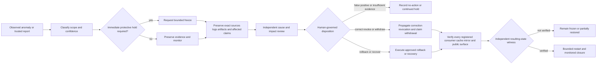

# D5 portfolio incident-command decision packet

Decision status: **`PROPOSED`**

Documentation status: **`D5_INCIDENT_COMMAND_PACKET_DOCUMENTED_COMMAND_UNASSIGNED`**

This packet prepares the fifth constitutional decision without appointing an incident commander, freezing a repository, revoking a credential or capability, withdrawing a public claim, rolling back state, restarting a system, changing GitHub settings, publishing Pages, deploying infrastructure, or granting emergency authority. D5 remains downstream of accepted D1 and D4 decisions and must preserve all D2–D4 contract, representation, authority, custody, correction, revocation, and recovery boundaries.

The machine-readable companion is [`d5-portfolio-incident-command-decision-packet-v1.json`](d5-portfolio-incident-command-decision-packet-v1.json).

## Decision boundary

D5 governs who may coordinate a portfolio incident, what may be frozen, how evidence is preserved, how corrections and revocations propagate, how public claims are withdrawn, how rollback and bounded restart are authorized, and how an independent observer verifies the resulting state.

A future D5 command function may not:

- create its own constitutional authority or bypass D1–D4;
- convert an alert, failed workflow, model output, signature, majority vote, or public report into an emergency power;
- seize credentials, change repository settings, rotate keys, delete evidence, rewrite history, or deploy infrastructure merely because an incident is declared;
- permit a subsystem suspected of compromise to approve its own restart or restoration;
- declare correction, revocation, rollback, or claim withdrawal complete while an affected consumer, cache, mirror, artifact, package, or public surface remains unreachable or unverified;
- collapse evidence custody, incident command, recovery execution, and independent resulting-state verification into one actor;
- use rollback to revive revoked capability, withdrawn consent, superseded checkpoints, invalidated artifacts, or stale public claims.

## Candidate command models

| Model | Strength | Principal obstruction |
|---|---|---|
| Single human incident commander with independent approval gates | Clear accountability and rapid coordination | Concentrated judgment, unavailable commander, and risk of command exceeding accepted authority |
| Federated incident cell with recorded quorum and dissent | Cross-domain expertise and preserved disagreement | Stale membership, deadlock, unclear emergency precedence, and delayed containment |
| Domain-segmented commanders with central coordination | Limits blast radius across repositories, credentials, data, publication, payments, and infrastructure | Freeze gaps and inconsistent restart criteria between domains |

No model is selected. A named person, repository, issue, workflow, dashboard, or QSO does not become incident command merely by documenting or detecting a problem.

## Incident lifecycle

**Equivalent prose:** An anomaly or trusted report is classified before any consequential response. A bounded freeze may be requested only for the affected domains and must preserve exact source, logs, artifacts, and public claims. Independent review identifies cause, impact, uncertainty, and required correction, revocation, withdrawal, rollback, or recovery. Every affected consumer and public surface must acknowledge the change. Restart remains blocked until an independent witness verifies the resulting state. No arrow authorizes a broader action than the accepted command scope.

## Incident classes

| Class | Typical scope | Safe default |
|---|---|---|
| I0 — Documentation inconsistency | Broken links, stale exact-head statements, contradictory lifecycle records, duplicate reports | Correct on a focused branch; preserve prior generation and validation evidence |
| I1 — Reversible repository-health event | Failed CI, missing artifact, unsafe workflow permission, conflicted documentation candidate | Block promotion; repair without credentials, deployment, or destructive history change |
| I2 — Cross-repository contract or data-integrity event | Schema drift, identity collision, replay ambiguity, correction failure, unsupported route represented as active | Freeze affected integration and derived claims; require contract and witness review |
| I3 — Critical authority, credential, privacy, financial, deployment, or infrastructure event | Suspected key exposure, unauthorized capability, private-data breach, payment action, production deployment, compromised recovery root | Immediate human escalation and bounded protective hold; no autonomous remediation or restart |

Classification is a review aid, not authority. Unknown severity remains `UNKNOWN` and cannot be silently downgraded.

## Freeze domains

A D5 decision must distinguish at least these independently scoped freeze domains:

1. repository merge and branch promotion;
2. release, package, image, and artifact publication;
3. GitHub Pages and public-claim surfaces;
4. workflow execution and automated repository mutation;
5. contract, namespace, registry, and producer/consumer admission;
6. capability, credential, key, and authority issuance;
7. private-data collection, processing, retention, and export;
8. payment, financial approval, and settlement claims;
9. runtime, device, deployment, and infrastructure operations;
10. checkpoint, rollback, restoration, and recovery-root changes.

A freeze in one domain does not silently freeze or authorize another. Cross-domain dependencies must be recorded explicitly.

## Required immutable decision fields

A future D5 decision must record:

1. accepted constitutional source and exact D1–D4 generations;
2. incident identifier, class, discovery time, trusted-clock basis, and current status;
3. affected repositories, branches, commits, workflows, artifacts, contracts, consumers, data classes, credentials, public claims, and environments;
4. observed evidence, source confidence, assumptions, unknowns, contradictions, and dissent;
5. incident commander, deputy, evidence custodian, freeze coordinator, correction/revocation coordinator, communications and claim-withdrawal owner, rollback commander, recovery commander, independent verifier, and approved vacancies;
6. command scope, explicit exclusions, authority source, expiration, recusal, quorum, appeal, succession, and emergency rules;
7. freeze domains, targets, start conditions, release conditions, and independently verified resulting state;
8. evidence-preservation plan, hashes, custody, privacy, retention, access, export, and legal-hold requirements;
9. correction, revocation, invalidation, cache purge, mirror update, package withdrawal, and public-claim withdrawal routes;
10. consumer registration, acknowledgment, unreachable-consumer handling, and evidence of closure;
11. rollback target, inverse or compensating action, checkpoint ancestry, partial-state handling, and failed-rollback disposition;
12. bounded restart order, dependencies, health indicators, timeouts, stop conditions, and re-freeze criteria;
13. security, privacy, licensing, accessibility, legal, financial, communications, and governance review;
14. closure criteria, residual risk, monitoring period, lessons, corrective actions, and supersession rules;
15. explicit human approval and an independent witness of the exact resulting state.

## Readiness gates

D5 is not review-complete until:

- D1 canonical identity and D4 independent authority boundaries are accepted at immutable heads;
- the incident-command model, source of authority, scope, succession, recusal, and expiry rules are selected;
- incident, freeze, evidence, correction, revocation, withdrawal, rollback, restart, closure, and restored-state record identities are accepted;
- every freeze domain has an owner or explicitly accepted vacancy and a tested stop mechanism independent of the subsystem being stopped;
- evidence custody remains separate from the suspected subsystem and from unilateral incident disposition;
- public claims, caches, mirrors, packages, artifacts, registries, and registered consumers have correction and withdrawal routes;
- rollback and bounded restart procedures are tested against partial failure, stale state, replay, unavailable consumers, split brain, and failed restoration;
- security, privacy, legal, licensing, accessibility, financial, communications, and governance reviews are complete;
- a tabletop exercise covers false positive, credential exposure, contract drift, public-claim error, consumer orphan, failed rollback, and compromised recovery root;
- explicit human approval and independently verified resulting state exist.

## Current source observations

The current documentation review basis includes:

- `aevespers2/ALISTAIRE-` PR #1 at base generation `5ed53166188d0ddddf5ef0d0dd3ba7238da67db3`;
- `aevespers2/1` PR #2 at `3920328b8d482087f82ac6a10603dd581796a45d`, an unaccepted authority, disposition, checkpoint, and recovery candidate;
- `aevespers2/qso-field.github.io` PR #33 at `babdde39e77189cf721b0ff14181234be9ac6dc0`, an unapproved public atlas, claim-ledger, obstruction, witness, and publication-readiness candidate;
- Repository `0` issue #9 as a mutable repository-health deduplication ledger that must be snapshotted before it can support an immutable incident record.

These sources demonstrate documentation and validation patterns only. They do not appoint incident command, authorize a freeze, establish a credential, activate a recovery root, or approve publication.

## Obstruction and gluing analysis

The incident route cannot compose while any of these obstruction classes remain:

- **split command:** multiple actors claim freeze, correction, restart, or closure authority without accepted precedence;
- **freeze gap:** one repository, workflow, package, cache, mirror, consumer, or public surface continues promotion after a related domain is frozen;
- **evidence-custody conflict:** the suspected subsystem controls the only logs, hashes, checkpoint, or incident record;
- **scope inflation:** a narrow repository incident is used to justify unrelated credential, data, payment, deployment, or governance action;
- **consumer orphan:** correction or revocation cannot reach or be acknowledged by one affected consumer;
- **claim-withdrawal gap:** a README, Pages site, issue, release note, package description, artifact, or external mirror remains materially false after correction;
- **cache resurrection:** stale caches or generated pages recreate a withdrawn claim or superseded state;
- **rollback without inverse:** destructive or lossy change has no accepted inverse, compensating action, or preserved pre-state;
- **premature restart:** execution resumes before cause, scope, revocation state, dependencies, and resulting state are verified;
- **self-attested restoration:** the component that failed or was suspected is the sole witness that recovery succeeded;
- **cross-domain deadlock:** repository, credential, data, publication, financial, and infrastructure owners impose incompatible restart conditions;
- **stale command:** incident authority, quorum, scope, or approval expires or changes while actions continue;
- **evidence inflation:** duplicate alerts, repeated automated comments, workflow reruns, or correlated sources are counted as independent corroboration;
- **closure without correction:** an incident is closed while lessons, corrective actions, affected claims, or recurrence controls remain unrecorded.

These are practical systems and governance obstruction classes, not a claim of completed formal homology computation.

## Pairwise and triple-overlap witnesses

At minimum, D5 requires pairwise witnesses for:

- detector or reporter ↔ incident intake;
- incident intake ↔ freeze request;
- freeze request ↔ each affected freeze-domain owner;
- evidence source ↔ independent evidence custodian;
- correction or revocation ↔ each registered consumer;
- claim withdrawal ↔ each public surface, cache, mirror, and package index;
- rollback or recovery executor ↔ checkpoint and pre-state custody;
- bounded restart ↔ independent resulting-state verifier;
- closure decision ↔ monitoring and corrective-action record.

It also requires triple-overlap witnesses for:

- detection ↔ classification ↔ bounded freeze;
- freeze ↔ evidence preservation ↔ independent cause review;
- correction or revocation ↔ consumer propagation ↔ public-claim withdrawal;
- rollback ↔ checkpoint ancestry ↔ independently verified resulting state;
- restart ↔ dependency health ↔ re-freeze criteria;
- closure ↔ residual risk ↔ corrective-action ownership.

Two passing adjacent pairwise witnesses do not prove the triple overlap. Scope, identity, time, evidence completeness, authority, privacy, correction reachability, or rollback state may still disagree.

## Controlled propagation

- `D5_REBIND_REQUIRED` means a D1–D4 dependency, command model, source, incident class, role, vacancy, freeze domain, consumer set, public surface, custody rule, exercise result, recommendation, or safety boundary moved.
- `D5_PACKET_WITHDRAWN` means this packet generation was replaced or withdrawn.

Neither marker is complete until README, Pages home, this packet, task chain, release plan, punch list, changelog, public atlas, and all derived claims agree on the same current state; exact-head evidence is retained; and any stale claim is corrected or withdrawn.

## Reviewer onboarding

A D5 reviewer should:

1. verify every observed source and immutable head;
2. map freeze domains, dependencies, owners, vacancies, and prohibited combinations of duties;
3. reconstruct one documentation incident, CI incident, contract-drift incident, public-claim incident, and critical authority incident;
4. trace evidence from source through custody, analysis, disposition, correction, revocation, rollback, restart, and closure;
5. test whether every consumer, cache, mirror, package index, artifact, and public claim receives correction or withdrawal;
6. verify that the suspected subsystem cannot authorize or solely attest its own restoration;
7. require preserved dissent, recusal, expired-command handling, failed-generation evidence, failed rollback, and re-freeze criteria;
8. stop if any authority source, affected domain, owner, consumer, evidence source, rollback target, or resulting state is unknown.

## FYSA-120 capability map

This work applies:

- **CAT-011 B/E** — accessible incident diagrams and diagram–prose integrity;
- **CAT-012 A/B/D/E** — decision-packet architecture, operational writing, terminology controls, validation, and lifecycle synchronization;
- **CAT-013 A/C/D/E** — incident and dependency graphing, identity resolution, contradiction detection, provenance, and incremental updates;
- **CAT-017 A/C/D/E** — exact-source resolution, evidence lineage, substitution detection, preservation, audit packaging, correction, and withdrawal propagation;
- **CAT-018 B/D/E** — records classification, responsibility mapping, reviewer onboarding, access governance, and contested-history preservation;
- **CAT-019 B/C/D** — plain-language incident status, accessible warnings, and uncertainty-aware risk communication;
- **CAT-022 C/D/E** — deterministic validation, terminal evidence retention, independent verification, and artifact preservation;
- **CAT-031 A/D/E** — incident invariants, hostile exercises, regression prevention, and assurance maintenance;
- **CAT-032 A/D/E** — distributed failure, observability, partial-state recovery, restart ordering, and incident diagnosis;
- **CAT-040 A/B/D/E** — system archaeology, dependency risk, rollback, restoration, migration, and continuity;
- **CAT-052 A/B/D/E** — threat modeling, trust boundaries, compromise response, containment, and security recovery;
- **CAT-054 A/B/D/E** — authorization, least privilege, emergency access, revocation, and continuous assurance;
- **CAT-059 A/B/C/E** — evidence integrity, attestation semantics, independent resulting-state verification, and assurance;
- **CAT-064 B/D/E** — incident governance, evidence chains, dispute handling, corrective action, and public accountability;
- **CAT-070 A/C/D/E** — institutional command mapping, authority boundaries, dispute repair, accountability, and governance evolution.

Proposed non-authoritative subdivision: **`064-F — Portfolio incident command, freeze-domain coordination, claim withdrawal, and independently witnessed restart`**, covering bounded command authority, cross-domain freeze consistency, evidence custody, consumer and public-claim correction closure, failed rollback, restart ordering, re-freeze criteria, and independently verified closure.

Taxonomy mapping is not competence, appointment, permission, ownership, acceptance, or authority evidence.

## Authority boundary

This packet creates no incident declaration, commander, deputy, reviewer, freeze, credential action, capability revocation, evidence seizure, cache purge, claim withdrawal, package removal, rollback, restart, restoration, repository-setting change, merge, release, Pages publication, deployment, payment, infrastructure change, canonical-state mutation, or destructive history rewrite.