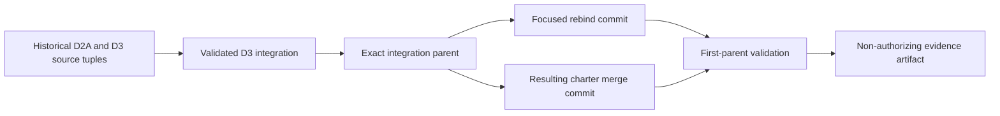

# Decision source-generation rebind

## Purpose

The D2A common-contract graph and D3 canonical-bytes packet were created at exact historical candidate heads. After the D3 packet was merged into the non-default charter candidate, those embedded source tuples became historical evidence rather than a complete statement of the current candidate generation.

This page defines a **non-authorizing, first-parent rebind**. It preserves the original packet bytes and source tuples, records the exact candidate parent into which they were integrated, and requires every validating commit to prove that the recorded parent is its first parent. The rebind does not rewrite history, select a canonical repository, accept a contract owner, choose canonical bytes, publish Pages, release software, or grant operational authority.

Current rebind parent:

`b12d1c0b02b8b9fffd639ad996c8e5008debfba1`

Machine-readable record:

[`decision-source-generation-rebind-v1.json`](decision-source-generation-rebind-v1.json)

## Why a separate rebind record is required

A document cannot safely contain the SHA of the commit that contains that same document: changing the embedded SHA changes the commit itself. Treating a packet's embedded source head as though it were always the validating head would therefore create an impossible self-reference or encourage stale evidence to be promoted silently.

The bounded solution separates three identities:

1. **Historical packet source** — the exact head originally recorded inside D2A or D3.
2. **Integration parent** — the exact charter-candidate head after the validated packet was integrated.
3. **Validation head** — the exact focused commit or merge commit whose first parent must equal the integration parent.

### Diagram alternative

The D2A and D3 packets retain their original source tuples. The validated D3 work is integrated into one exact non-default charter head. A focused rebind commit and the later merge commit are acceptable only when their first parent is that exact integration head. Validation produces retained evidence but no authority.

## Binding rules

The rebind validator fails closed unless all of the following are true:

- the submitted and first-parent values are lowercase 40-character Git SHAs;
- the submitted head is different from its first parent;
- the manifest's `rebind_parent` equals the checked-out commit's first parent;
- the D2A and D3 profile identifiers match their closed identities;
- the historical source heads in the manifest equal the source tuples still embedded in the packet files;
- the historical ALISTAIRE PR #1 candidate head in the manifest equals the D2A candidate-head observation;
- status remains `REBOUND_TO_PARENT_NON_AUTHORIZING`;
- authority effect remains `none`;
- stale evidence, passing CI, mergeability, canonical bytes, digests, signatures, documentation, or skill mapping are never promoted into authority.

The workflow uses a two-commit checkout, records the submitted head and first parent, runs hostile regressions, builds the documentation strictly, hashes its inputs, preserves an artifact, and fails closed if any validation or evidence step fails.

## Current interpretation

The rebind means only:

> The historical D2A and D3 packet generations were intentionally carried into a descendant whose first-parent ancestry is anchored at the recorded integration parent.

It does **not** mean:

- the D2A repository observations are current forever;
- D1, D2, or D3 is accepted;
- the runtime/Fabric role collision is resolved;
- a contract, namespace, registry, serialization profile, digest, signature scheme, owner, steward, or consumer is selected;
- the charter candidate may be merged into `main`, released, published, deployed, or used to grant capabilities.

## Invalidation and refresh

Create a new rebind generation when any of these changes:

- the charter candidate's integration parent;
- either embedded packet source tuple;
- the D2A ALISTAIRE candidate observation;
- packet identity or decision scope;
- the first-parent ancestry rule;
- controlled-route, rollback, correction, or withdrawal semantics.

Do not edit an older rebind record to conceal an obsolete generation. Preserve the prior record and evidence, mark downstream claims stale, create a focused replacement generation, and validate the replacement before using it in review.

## Rollback

Rollback is documentation-only:

1. close or revert the focused rebind candidate;
2. restore the last reviewed charter-candidate head without force-updating history;
3. retain failed validation logs and artifacts;
4. mark any derived currentness claim invalid;
5. rerun D2A, D3, documentation, and rebind validation on the restored candidate.

A successful rollback does not accept D1–D5 or authorize publication, release, deployment, credentials, or runtime behavior.

## FYSA-120 capability map

Applied capability areas:

- **CAT-012** — technical writing, decision explanation, reader navigation, and controlled terminology;
- **CAT-013** — architecture and contract-graph identity separation;
- **CAT-017** — provenance, source-generation binding, evidence lineage, and stale-evidence invalidation;
- **CAT-031** — fail-closed validation, hostile regression design, and exact-head testing;
- **CAT-040** — reversible integration, non-destructive rollback, and migration safety;
- **CAT-052** — least privilege and authority-boundary preservation;
- **CAT-059** — retained artifacts, deterministic hashes, and review evidence;
- **CAT-070** — governance review, non-authorization, and explicit approval boundaries.

Proposed non-authoritative subdivision:

**`017-F — First-parent source-generation rebind and stale-evidence invalidation`**

This subdivision covers immutable historical source tuples, first-parent integration binding, self-reference avoidance, exact-head evidence lineage, stale-generation detection, controlled replacement, and rollback without authority expansion.