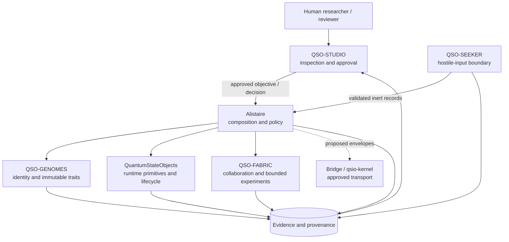
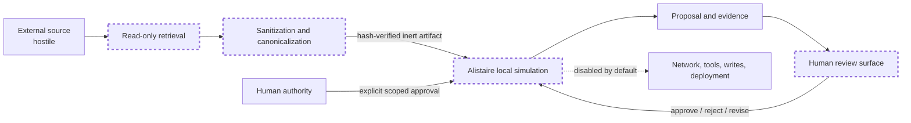
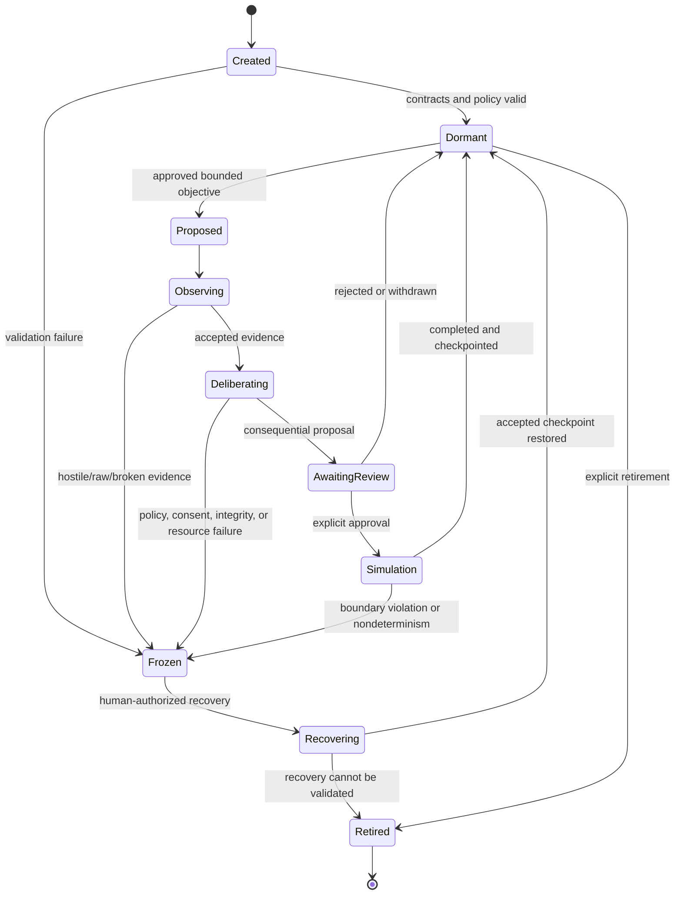
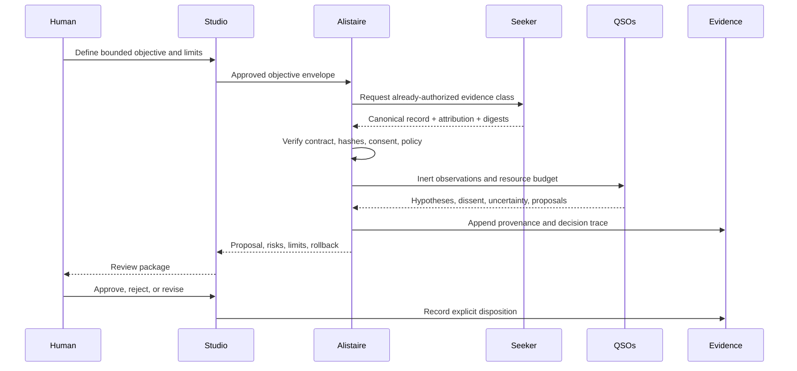
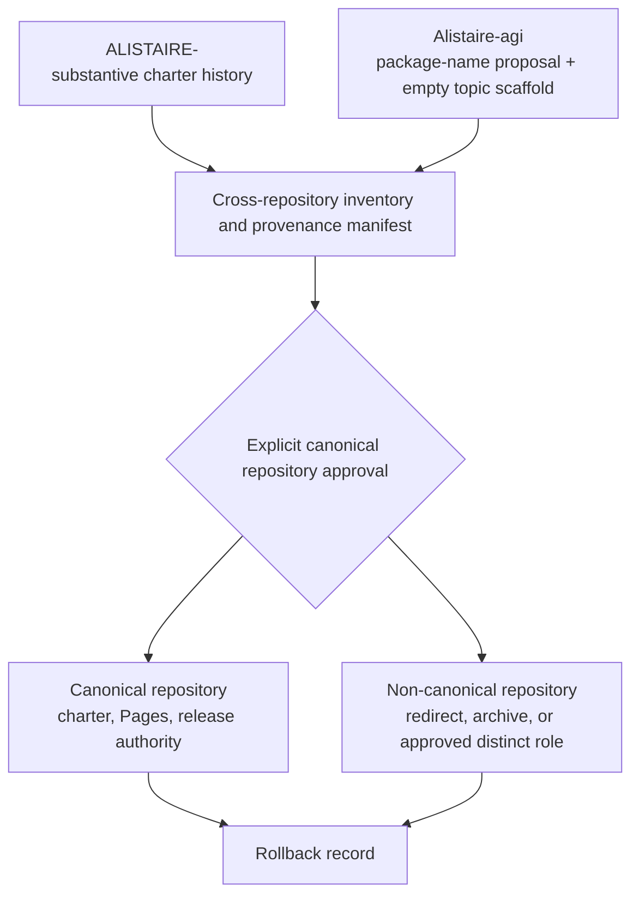
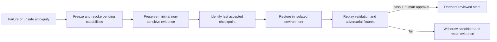

# Architecture diagrams

These diagrams describe the proposed charter boundary. They do not claim that the components or integrations are implemented or verified.

## Portfolio composition

## Authority and trust boundaries

## Lifecycle and freeze path

## Evidence flow

## Repository consolidation

## Rollback

