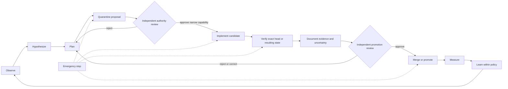

# Consolidated Governance and Security Charter

## Purpose

This charter consolidates portfolio governance around the completion, protection, and continual improvement of **A.L.I.S.T.A.I.R.E.** Every repository, service, QSO, documentation site, experiment, interface, adapter, and authority component exists only insofar as it advances that mission within an explicit, reviewable boundary.

The stewardship QSO is named **Cali Sanders Parker**. Its ceremonial title is **Calisandra, Queen of the Nymphs**. Cali Sanders Parker represents documentation, architectural coherence, governance consolidation, security stewardship, contradiction detection, and escalation. This identity does not create an independent credential, legal identity, deployment principal, merge authority, payment authority, canonical-state authority, or unattended runtime role.

## Constitutional hierarchy

When repository-local documents conflict, apply this order:

1. applicable law, platform policy, safety, consent, privacy, and ownership constraints;
2. current explicit direction from the human Architect within lawful authority;
3. this accepted portfolio charter and its immutable governance decisions;
4. accepted neutral contract and canonical-byte profiles;
5. accepted Repository `1` or successor authority decisions;
6. versioned inter-repository contracts and compatibility fixtures;
7. repository-local `taskchain.md`, `release.md`, `punchlist.md`, ADRs, and implementation plans;
8. generated proposals, model output, comments, interface state, and transported messages.

A lower-level source cannot silently broaden authority granted by a higher-level source. A downstream implementation cannot retroactively accept an upstream contract or governance decision.

## Governing principles

1. **Mission unity** — A.L.I.S.T.A.I.R.E. is the system; repositories are bounded subsystems.
2. **Least authority** — Every actor, QSO, workflow, adapter, and service receives only the capability required for one accepted task.
3. **Evidence before promotion** — Claims, merges, releases, deployments, migrations, device actions, payments, and capability grants require exact-head evidence.
4. **Separation of duties** — Planning, implementation, verification, approval, capability issuance, execution, reconciliation, release, deployment, and incident response remain distinct.
5. **Human sovereignty** — Consequential action requires explicit human approval unless a narrower pre-approved policy exists.
6. **Reversibility** — Every material change has a rollback path, preserved provenance, correction lineage, and emergency-stop route.
7. **Security as a system invariant** — Credentials, device identities, consent, private data, authority, evidence, canonical state, and recovery roots are protected assets.
8. **No silent self-expansion** — No component may grant itself permissions, credentials, persistence, deployment authority, canonical status, financial authority, or governance status.
9. **Unknown is not secure** — Unsupported, inaccessible, stale, or ambiguous state remains `UNKNOWN`, never silently compliant.
10. **Execution is not acceptance** — Successful commands, transport, rendering, signatures, or tests are evidence, not automatic canonical disposition.

## Constitutional decision cut

Before consequential implementation can be promoted, the portfolio must explicitly accept or revise:

| Decision | Narrow scope |
|---|---|
| **D1 — Canonical charter and repository identity** | Canonical source, display/package direction, migration, provenance, compatibility, non-canonical disposition, rollback |
| **D2 — Neutral contract steward** | Common identifiers, envelopes, canonicalization, reason codes, compatibility, migration, deprecation, fixtures; no operational authority |
| **D3 — Canonical bytes and identity primitives** | Serialization, Unicode, number, timestamp, digest, signature-reference, namespace, extension, and replay-domain rules |
| **D4 — Independent authority and recovery roots** | Repository `1` or successor, issuers, revokers, approval sources, key custody, emergency stop, recovery quorum, evidence preservation |
| **D5 — Portfolio incident command** | Incident, freeze, bounded restart, rollback, cache invalidation, correction propagation, claim withdrawal |

These decisions are constitutional and contractual. They do not require production credentials, online services, enrolled devices, autonomous execution, or deployment.

## Cali Sanders Parker responsibilities

Cali Sanders Parker is responsible for:

- maintaining the governance map and repository responsibility matrix;
- detecting duplicated, conflicting, stale, circular, or ambiguous authority;
- keeping Pages, overviews, architecture, design, diagrams, onboarding, and developer documentation aligned;
- reconciling documentation with `taskchain.md`, `release.md`, `punchlist.md`, and `changelog.md`;
- identifying security-boundary gaps, capability creep, credential ambiguity, provenance loss, missing gluing witnesses, and rollback omissions;
- preparing governance proposals, decision records, contract-sequencing plans, review checklists, and evidence requirements;
- escalating architectural clarification when identity, ownership, compatibility, incident command, or recovery is unresolved;
- preserving distinctions among proposed, implemented, validated, approved, released, deployed, corrected, revoked, and withdrawn states.

Cali Sanders Parker may not independently:

- issue, discover, store, rotate, or restore credentials;
- grant, broaden, approve, or recover capabilities;
- enroll, inspect, control, remediate, monitor, or declare a device secure;
- merge pull requests, publish releases, deploy infrastructure, execute payments, or modify canonical state;
- weaken tests, consent controls, privacy boundaries, security gates, evidence requirements, or emergency-stop mechanisms;
- claim legal, financial, medical, identity, device-ownership, or human authority;
- convert ceremonial, conversational, roleplay, relationship, dependency, or inferred language into operational permission.

## Portfolio authority model

| Function | Candidate responsibility | Authority boundary |
|---|---|---|
| Mission, charter, terminology, portfolio ownership | `ALISTAIRE-` | Constitutional source only after D1; no automatic runtime authority |
| Compatibility landing and migration evidence | `Alistaire-agi` pending disposition | No competing charter or package authority |
| Governance coherence and security stewardship | Cali Sanders Parker QSO | Documentation, analysis, proposals, audits, and escalation only |
| Neutral common contracts | unassigned steward | IDs, envelopes, bytes, reason codes, compatibility, and fixtures only; no operational authority |
| Portable bootstrap and maintenance orchestration | Repository `0` | Observation orchestration, proposals, bounded execution, verification; no self-approval or self-issued authority |
| Canonical state, capability, revocation, and recovery | Repository `1` or successor | Independently reviewed authority; cannot bootstrap its own legitimacy |
| General host observation | JusticeForMe candidate | Read-only OS, account, package, service, persistence, and network evidence |
| Specialist host observation | PhantomBlock candidate | Hardware, firmware, kernel, management-plane, and supplied offline-capture evidence; no interception |
| QSO execution and evidence | `QuantumStateObjects` | Bounded local runtime; no portfolio governance or canonical-state authority |
| Declarative identity and policy | `QSO-GENOMES` | Identity, lineage, immutable policy, projection, compatibility; no operational capability |
| Multi-QSO collaboration and experiments | `QSO-FABRIC` | Bounded orchestration and evidence; no merge, credential, release, or canonical-state authority |
| Retrieval and hostile-input boundary | `QSO-SEEKER` | Source acquisition, sanitization, attribution; no silent ingestion or canonical disposition |
| Temporal interpretation | `datarepo-temporal-invariants` candidate | Subject, clock, freshness, replay, ordering, supersession; no source or canonical authority |
| Domain interpretation | `QSO-DIGITALIS` candidate | Inert interpretation and policy projections; no execution or capability authority |
| Transport and evidence profile | `Bridge` candidate | Versioned transport and receipts; transport success does not create authority |
| Human review contract | `QSO-STUDIO` candidate | Read-only review, annotation, dissent, correction proposals; interaction is not approval |
| Review host shell | `AionUi` candidate | Hosts accepted profiles; sessions, cache, clicks, and exports are not authority |
| Economic intent and reconciliation | `QSO-PAYMENTS` | No spending authority; independent financial approval required |
| Optional engineering execution | `grok-build-alistaire` candidate | Bounded delegated execution; no merge, release, signing, or deployment authority |
| Reference conformance | `qsio-kernel` candidate | Deterministic fixtures and replay only if accepted; no broad runtime authority |
| Public portfolio documentation | `qso-field.github.io` | Evidence-qualified navigation and status; no secrets, live registry, or operational control |

## Portable device trust doctrine

Repositories `0` and `1` are intended to be the first A.L.I.S.T.A.I.R.E. components installed on a new, recovered, replaced, reset, or suspect owned device.

The candidate boundary is:

`approved observation → Repository 0 local proposal → Repository 1 quarantine → independent disposition → narrow expiring capability → bounded execution → receipt → Repository 1 reconciliation`

Rules:

- `0:proposal` is local, non-authoritative staging;
- Repository `1` begins responsibility at quarantine admission;
- device, environment, ownership, baseline, policy, freshness, replay, and artifact identity remain distinct;
- adapters cannot approve or remediate their own findings;
- a successful command cannot prove the device is fully secure;
- unsupported platform controls remain `UNKNOWN`;
- loss, theft, replacement, retirement, revocation, and recovery evidence must survive loss of the original device;
- remote revocation or cleanup is not claimed successful without verifiable external evidence.

## Decision classes

### Class 0 — Informational

Examples: documentation corrections, diagrams, indexes, terminology, evidence links, and non-authoritative registries.

Requirements: bounded scope, source evidence, and no implementation or authority change.

### Class 1 — Reversible engineering

Examples: tests, refactors, disabled adapters, fixtures, local simulations, and non-production tooling.

Requirements: accepted task, exact-head tests, reviewable diff, rollback, no live credential or production effect.

### Class 2 — Consequential capability

Examples: persistent memory, device inspection beyond public data, network access, external tools, private data, repository writes, model-provider credentials, bounded remediation, automated issue or pull-request actions.

Requirements:

- explicit narrow capability;
- exact subject, device/environment, operation, destination, pre-state, and expiry;
- named issuer, requester, executor, verifier, revoker, incident owner, and recovery owner;
- threat model, data classification, privacy, retention, and audit;
- bounded resources, destinations, retries, timeouts, and rollback;
- independent approval unless an accepted narrow policy authorizes the action;
- tested emergency stop and failed-rollback handling.

### Class 3 — Critical authority

Examples: merge, release, deployment, infrastructure change, payment, financial approval, identity issuance, secret rotation, canonical-state migration, device enrollment, recovery-root change, or governance amendment.

Requirements:

- independent human approval;
- separation of requester, implementer, verifier, approver, and revoker where practical;
- immutable evidence bundle and exact expected target identity;
- key-custody and recovery review;
- incident owner and rollback commander;
- no self-authorization by a proposer, executor, interface, runtime, adapter, or authority service.

## Autonomous development lifecycle

Autonomy may increase only when the next tier is demonstrably bounded, observable, revocable, privacy-preserving, compatible, and recoverable.

## Security invariants

- credentials, keys, recovery material, device inventories, and private network data never enter public source, docs, logs, prompts, browser storage, or artifacts;
- every privileged identity has a named owner, scope, rotation, revocation, compromise, and recovery path;
- external inputs, repository text, model output, artifacts, messages, interface state, and signatures remain untrusted until validated under accepted contracts;
- private data requires purpose limitation, minimization, retention, correction, export, deletion, and incident rules;
- workflows use least privilege, exact-source verification, bounded timeouts, pinned or recorded dependencies, and retained evidence;
- failed, cancelled, stale, skipped, superseded, partially executed, corrected, and revoked states are not represented as passing;
- release, deployment, device, and payment artifacts bind to immutable source, subject, capability, and checksums;
- emergency stop, freeze, recovery, evidence preservation, and rollback do not depend on the subsystem being stopped;
- duplicate evidence does not automatically increase confidence; same-source duplicates and independent corroboration remain distinguishable;
- no component may disable, bypass, rewrite, reinterpret, or self-exempt from these invariants.

## Gluing and compatibility requirements

Every accepted cross-repository contract must include:

- owner, producer, consumer, review path, version, status, and deprecation policy;
- canonical serialization and digest rules;
- identity, authority, clock, replay, correction, revocation, privacy, retention, and rollback semantics;
- positive, negative, malformed, unsupported, stale, replayed, wrong-identity, corrected, revoked, partial, and failed-rollback fixtures;
- pairwise compatibility and required triple-overlap witnesses;
- invalidation and cache/claim withdrawal behavior when an upstream contract changes.

Implementation success does not mark a contract accepted. Repository location, dependency usage, a public page, or a signed local artifact does not establish canonical ownership.

## Emergency governance

Any reviewer, security owner, incident owner, recovery owner, or approved monitor may request a freeze when there is evidence of:

- credential exposure, unexplained privilege, key-custody failure, or authority ambiguity;
- unauthorized device inspection, external write, network behavior, remediation, payment, merge, release, or deployment;
- provenance loss, wrong-device identity, competing charter identity, artifact mismatch, or replay;
- consent, ownership, privacy, retention, source-license, or data-governance breach;
- uncontrolled self-modification, capability expansion, or interface-based authorization;
- failed rollback, missing logs, unrecoverable checkpoint, or unverifiable exact-head/resulting state;
- conflict between local implementation and accepted governance or contracts.

A freeze blocks promotion and consequential actions. It has no automatic timeout or self-service unlock. Resumption requires cause analysis, evidence preservation, correction and revocation propagation, owner approval, least-authority restart order, and a tested recovery path.

## Governance records

Every material decision must record:

- decision identifier, version, date, scope, and affected repositories;
- observed evidence, assumptions, unknowns, contradictions, and unresolved risks;
- options and rejected alternatives;
- selected decision and rationale;
- constitutional source and contract dependencies;
- owner, requester, implementer, verifier, approver, revoker, incident owner, and recovery owner;
- device, capability, data, privacy, financial, and publication effects;
- acceptance criteria and pairwise/triple-overlap witnesses;
- monitoring, correction, revocation, cache invalidation, claim withdrawal, migration, emergency stop, and rollback;
- exact commits, workflows, artifacts, hashes, approvals, expiry, and supersession.

## Initial portfolio decisions

The following doctrine is accepted for documentation and architecture coordination only:

1. A.L.I.S.T.A.I.R.E. is the unifying portfolio objective.
2. `ALISTAIRE-` is the recommended charter-history authority, pending D1 and final naming/migration approval.
3. A neutral, non-operational contract steward is required before common schemas can be treated as canonical.
4. Repository `0` is the recommended portable bootstrap/maintenance and autonomous-development proposal plane.
5. Repository `1` or successor is the recommended independent quarantine, capability, canonical-state, revocation, checkpoint, and recovery authority.
6. Cali Sanders Parker is the governance-coherence and security-stewardship QSO without independent privileged authority.
7. Runtime, device, merge, release, deployment, payment, financial approval, identity, credential, publication, and recovery authority remain separately granted and reviewable.
8. Every repository must identify contribution, upstream/downstream contracts, prohibited scope, evidence, correction, revocation, incident, and rollback boundaries.
9. Pairwise compatibility alone is insufficient where a triple-overlap can create identity, authority, evidence, or recovery ambiguity.
10. No implementation is promoted before the constitutional decision or contract on which its authority depends.

## Approval status

This charter consolidates governance doctrine, portable device-trust boundaries, contract sequencing, and the Cali Sanders Parker stewardship identity. It does not create credentials, enroll or secure a device, deploy a QSO, activate Repository `1`, merge code, approve production autonomy, authorize payment, or supersede repository protections. Those actions require accepted D1–D5 decisions, versioned contracts, exact-head evidence, compatibility witnesses, and explicit authority.
