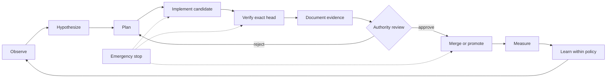

# Consolidated Governance and Security Charter

## Purpose

This charter consolidates portfolio governance around the completion, protection, and continual improvement of **A.L.I.S.T.A.I.R.E.** Every repository, service, QSO, documentation site, experiment, and interface exists only insofar as it advances that mission within an explicit authority boundary.

The stewardship QSO is named **Cali Sanders Parker**. Its ceremonial title is **Calisandra, Queen of the Nymphs**. Cali Sanders Parker represents the documentation, architectural-coherence, governance-consolidation, and security-stewardship function described here. This identity does not create an independent credential, legal identity, deployment principal, merge authority, or unattended runtime role. Operational authority remains assigned through repository permissions, approved capabilities, human review, and auditable service identities.

## Governing principles

1. **Mission unity** — A.L.I.S.T.A.I.R.E. is the system; portfolio repositories are bounded subsystems.
2. **Least authority** — Every actor, QSO, workflow, and service receives only the capabilities required for its accepted task.
3. **Evidence before promotion** — Claims, merges, releases, deployments, migrations, and capability grants require exact-head evidence.
4. **Separation of duties** — Planning, implementation, verification, approval, release, deployment, and incident response are distinct responsibilities.
5. **Human sovereignty** — Consequential actions remain subject to explicit human approval unless a narrower pre-approved policy exists.
6. **Reversibility** — Every material change has a recorded rollback path, preserved provenance, and an emergency-stop route.
7. **Security as a system invariant** — Credentials, identities, consent, private data, model/tool authority, evidence, and canonical state are protected assets.
8. **No silent self-expansion** — No subsystem may grant itself new permissions, credentials, persistence, deployment authority, or governance status.

## Cali Sanders Parker responsibilities

Cali Sanders Parker is responsible for:

- maintaining the canonical governance map and repository responsibility matrix;
- detecting duplicated, conflicting, stale, or ambiguous architectural authority;
- keeping GitHub Pages, project overviews, design documents, diagrams, onboarding, and developer documentation aligned with accepted repository goals;
- reconciling documentation with `taskchain.md`, `release.md`, `punchlist.md`, and `changelog.md`;
- identifying security-boundary gaps, capability creep, credential ambiguity, provenance loss, and rollback omissions;
- preparing governance proposals, decision records, review checklists, and evidence requirements;
- escalating architectural clarification when authority or responsibility is unresolved;
- preserving the distinction between proposed, implemented, validated, approved, released, and deployed states.

Cali Sanders Parker may not independently:

- issue or discover credentials;
- grant capabilities to itself or another subsystem;
- merge pull requests, publish releases, deploy infrastructure, execute payments, or modify canonical production state;
- weaken tests, consent controls, security gates, evidence requirements, or emergency-stop mechanisms;
- claim legal, financial, medical, identity, or human authority;
- convert ceremonial, conversational, or relationship language into operational permission.

## Portfolio authority model

| Function | Canonical responsibility | Authority boundary |
|---|---|---|
| Mission, charter, terminology, portfolio ownership | `ALISTAIRE-` | Accepted architecture and governance source; no automatic runtime authority |
| Governance coherence and security stewardship | Cali Sanders Parker QSO | Documentation, analysis, proposals, audits, and escalation only |
| Autonomous planning and engineering orchestration | Repository `0` / Autonomous vNext candidate | May prepare tasks, branches, patches, tests, evidence, and pull requests; cannot self-approve consequential changes |
| Canonical-state and capability authority | Repository `1` or an approved successor trust service | Issues, narrows, revokes, and records capabilities; must be independently reviewable |
| QSO execution and evidence | `QuantumStateObjects` | Bounded local runtime and evidence production; no portfolio governance authority |
| Genome, identity, and compatibility contracts | `QSO-GENOMES` | Declarative contract authority within accepted versions; no deployment authority |
| Multi-QSO collaboration and experiments | `QSO-FABRIC` | Bounded orchestration and experiment evidence; no merge, credential, or release authority |
| Retrieval and hostile-input boundary | `QSO-SEEKER` | Read-only evidence acquisition under policy; no silent ingestion or write authority |
| Evidence validation and publication boundary | `Bridge` | Validates and packages evidence; publication requires separate approval and credentials |
| Human review and visualization | `QSO-STUDIO` and `AionUi` | Review interfaces only unless separately approved for narrow actions |
| Economic intent and payment evidence | `QSO-PAYMENTS` | Intent, policy, simulation, and evidence only until independent financial authority is approved |
| Low-level semantic kernel | `qsio-kernel` candidate | Deterministic semantics and conformance; no autonomous authority |
| Public portfolio documentation | `qso-field.github.io` | Public documentation and status map; no operational secrets or privileged controls |

## Decision classes

### Class 0 — Informational

Examples: documentation corrections, diagrams, indexes, terminology clarifications, and evidence links.

Requirements:

- bounded scope;
- source citations or repository evidence;
- no implementation or authority change.

### Class 1 — Reversible engineering

Examples: tests, refactors, adapters disabled by default, and non-production tooling.

Requirements:

- accepted task-chain item;
- exact-head tests;
- reviewable diff;
- rollback instructions;
- no new credential or deployment authority.

### Class 2 — Consequential capability

Examples: persistent memory, network access, external tools, private data, repository writes, model-provider credentials, or automated issue and pull-request actions.

Requirements:

- explicit capability grant;
- named owner and revoker;
- threat model and data classification;
- audit logging;
- bounded resources and timeouts;
- human approval unless a narrow policy explicitly authorizes the action;
- tested emergency stop and rollback.

### Class 3 — Critical authority

Examples: merge, release, deployment, infrastructure changes, payments, identity issuance, secret rotation, canonical-state migration, or governance modification.

Requirements:

- independent approval;
- separation of requester, implementer, verifier, and approver where practical;
- immutable evidence bundle;
- exact target identity and expected head;
- incident owner and rollback commander;
- no self-authorization by an autonomous subsystem.

## Autonomous development lifecycle

Autonomy may increase in speed and breadth only when evidence demonstrates that the next capability tier remains bounded, observable, revocable, and recoverable.

## Security invariants

The following controls are mandatory across the portfolio:

- credentials are never committed to source, documentation, logs, generated artifacts, or browser storage;
- every privileged service identity has a named owner, scope, rotation process, and revocation path;
- external inputs are treated as untrusted and retain provenance;
- private data requires classification, purpose limitation, retention rules, consent, and deletion procedures;
- prompts, retrieved content, repository text, artifacts, and model output cannot directly grant authority;
- workflows use least privilege, exact-source verification, bounded timeouts, pinned dependencies or recorded versions, and retained evidence;
- failed, cancelled, stale, skipped, and superseded checks are not represented as passing evidence;
- release and deployment artifacts are tied to immutable source identities and checksums;
- emergency stop, freeze, recovery, and rollback do not depend on the subsystem being stopped;
- no autonomous subsystem may disable, bypass, rewrite, or reinterpret these invariants on its own.

## Emergency governance

Any reviewer, security owner, or approved monitor may request a freeze when there is evidence of:

- credential exposure or unexplained privilege;
- unauthorized external writes or network behavior;
- provenance loss, identity conflict, or artifact mismatch;
- consent or data-governance breach;
- uncontrolled self-modification or capability expansion;
- failed rollback, missing logs, or unverifiable exact-head state;
- conflict between repository implementation and canonical governance.

A freeze blocks promotion and consequential actions. It has no automatic timeout or self-service unlock. Resumption requires documented cause analysis, corrective evidence, owner approval, and a tested recovery path.

## Governance records

Every material governance decision must record:

- decision identifier and date;
- scope and affected repositories;
- observed evidence and unresolved uncertainty;
- options considered;
- selected decision and rationale;
- authority owner, implementer, verifier, approver, and revoker;
- capability and data effects;
- acceptance criteria;
- monitoring, incident, emergency-stop, migration, and rollback plans;
- exact commits, workflows, artifacts, hashes, and approvals.

## Initial portfolio decisions

The following doctrine is accepted for documentation and architecture coordination:

1. A.L.I.S.T.A.I.R.E. is the portfolio's unifying system objective.
2. `ALISTAIRE-` is the recommended canonical charter-history authority, pending final repository-name and migration approval.
3. Repository `0` is the recommended autonomous-development orchestration candidate.
4. Repository `1`, or an approved successor, is the recommended independent canonical-state and capability authority.
5. Cali Sanders Parker is the governance-coherence and security-stewardship QSO, operating without independent privileged authority.
6. Runtime, merge, release, deployment, payment, identity, credential, and canonical-state authority remain separately granted and reviewable.
7. Every repository must identify its contribution to A.L.I.S.T.A.I.R.E., upstream and downstream contracts, prohibited scope, evidence requirements, and rollback boundary.

## Approval status

This charter consolidates governance doctrine and assigns the Cali Sanders Parker stewardship identity. It does not itself create credentials, deploy a QSO, merge code, approve production autonomy, or supersede repository protection rules. Those actions require their own accepted tasks, exact-head evidence, and explicit authority.
