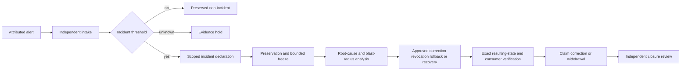

# A.L.I.S.T.A.I.R.E. charter candidate

A.L.I.S.T.A.I.R.E. is a proposed research-agent architecture composed of interoperable Quantum State Objects and bounded supporting services. The portfolio remains in a **documentation, governance-consolidation, contract-sequencing, canonicalization, semantic-partition, and repository-consolidation phase**. No executable AGI, consciousness, unrestricted autonomy, device-control service, payment authority, incident-command authority, persistent self-improvement, or production deployment is established.

## Name and scope

**A.L.I.S.T.A.I.R.E.** expands to **Adaptive Learning & Intelligence System for Trustworthy Autonomous Inference, Reasoning, and Evolution**. The [name and identity guide](name-and-identity.md) separates display, repository, and package identities and defines “autonomous” as bounded internal inference rather than standing operational authority.

Status: `NAME_EXPANSION_DOCUMENTED_CANONICAL_REPOSITORY_UNSELECTED`.

## Capability roadmap and contributor routes

The [capability roadmap](capability-roadmap.md) organizes forty desired features into six bounded families, candidate repository homes, stages R0–R5, evidence gates, material obstructions, correction, and rollback. Status: `DOCUMENTED_CAPABILITY_ROADMAP_UNACCEPTED`.

The [portfolio contributor paths](portfolio-contributor-paths.md) provide documentation-first entry routes for all nineteen repositories, bounded first tasks, FYSA-120 skills, stop conditions, gluing checks, correction, and rollback. Status: `PORTFOLIO_CONTRIBUTOR_PATHS_DOCUMENTED_OWNERSHIP_UNASSIGNED`.

The [lifecycle coherence review](capability-lifecycle-coherence.md) propagates roadmap and contributor state through `taskchain.md`, `punchlist.md`, `release.md`, and `changelog.md`. Status: `CAPABILITY_AND_CONTRIBUTOR_ROUTES_SYNCHRONIZED_BINDINGS_UNACCEPTED`. Authority effect: `NONE`.

## Constitutional decision status

Two repositories overlap as the constitutional identity:

- `aevespers2/ALISTAIRE-` contains the product directive, lifecycle routes, governance, and consolidated charter candidate.
- `aevespers2/Alistaire-agi` contains proposed package naming, compatibility, migration, and historical taxonomy material.

| Decision | Status | Required outcome |
|---|---|---|
| D1 — Canonical charter and repository identity | `BLOCKED_MISSING_DECISION_EVIDENCE_AND_APPROVAL` | Select canonical source, package/display direction, migration, provenance, license, compatibility, and rollback |
| D2 — Neutral contract steward | `BLOCKED_UPSTREAM_D1_AND_MISSING_STEWARD_EVIDENCE` | Accept non-operational stewardship, precedence, fixtures, correction, continuity, and rollback |
| D3 — Canonical bytes and identity primitives | `BLOCKED_UPSTREAM_D2_AND_MISSING_CROSS_LANGUAGE_EVIDENCE` | Independently reproduce one accepted representation and identity profile |
| D4 — Independent authority and recovery roots | `BLOCKED_UPSTREAM_D3_AND_MISSING_INDEPENDENT_AUTHORITY_EVIDENCE` | Select an independent model, roles, custody, issuance, revocation, checkpoint, recovery, and restoration witnesses |
| D5 — Portfolio incident command | `BLOCKED_UPSTREAM_D4_AND_MISSING_INCIDENT_COMMAND_EVIDENCE` | Select incident command, evidence custody, freeze, correction, rollback, publication, recovery, and independent closure rules |

Downstream implementation cannot retroactively satisfy an upstream decision.

## D4 independent authority and recovery readiness

The [D4 decision packet](d4-independent-authority-recovery-roots-decision-packet.md) compares an isolated Repository `1` authority root, split issuance/recovery roots, and a federated human-reviewed quorum without selecting one. It records required roles and vacancies, capability and revocation fields, key and checkpoint custody, route conflicts, pairwise and triple-overlap witnesses, failed recovery, rollback, and independently witnessed restoration.

A repository, key, quorum, signature, workflow, checkpoint, or successful restoration cannot bootstrap constitutional authority.

## D5 portfolio incident command readiness

The [D5 decision packet](d5-portfolio-incident-command-decision-packet.md) compares three unselected command structures:

1. a single incident commander with independent deputies;
2. a federated repository incident council;
3. tiered evidence, recovery, and publication cells.

It defines immutable decision fields for severity, declaration, evidence custody, bounded freezes, dependency and blast-radius analysis, correction and revocation, consumer acknowledgment, claim withdrawal, rollback, recovery, accessible communications, incident memory, and independent closure.

Status: `BLOCKED_UPSTREAM_D4_AND_MISSING_INCIDENT_COMMAND_EVIDENCE`.

`D5_REBIND_REQUIRED` marks a changed upstream decision, command candidate, role, vacancy, severity rule, source, consumer, exercise, publication surface, recommendation, or safety boundary. `D5_PACKET_WITHDRAWN` marks a replaced or withdrawn generation.

Technical service recovery cannot substitute for contract repair, consumer reconciliation, legal closure, public correction, or independently verified resulting state.

### D5 governed lifecycle

**Equivalent prose:** An attributable alert enters independent intake. Reviewers preserve a non-incident, hold unresolved evidence, or declare a scoped incident. A declared incident triggers evidence preservation and only the narrowest justified freeze. Root-cause and blast-radius analysis precede approved repair. Exact resulting state and consumer propagation are verified before public claims are corrected or withdrawn. An independent reviewer decides whether the incident can close.

## Runtime/Fabric semantic partition

The portfolio graph records `BLOCKED_ROLE_COLLISION`. `QuantumStateObjects` needs runtime-local event and execution records, while `QSO-FABRIC` needs projection, collaboration, experiment, and aggregate-evidence records. Reusing labels across these levels can hide source sets, collapse identity, inflate evidence, and break correction or rollback.

The route remains:

`qsio-kernel → QuantumStateObjects → QSO-FABRIC → Repository 1`

Safe disposition: `UNSUPPORTED_KERNEL_RUNTIME_ROUTE`. Direct identity aliasing remains rejected as `REJECT_DIRECT_IDENTITY_ALIAS`.

## Portable security foundation

Repositories `0` and `1` remain complementary candidates:

- Repository `0`: bootstrap, observation orchestration, proposal, bounded execution, verification, and maintenance.
- Repository `1` or successor: independent quarantine, capability, revocation, disposition, checkpoint, and recovery.

Documented route:

`approved observation → Repository 0 proposal → Repository 1 quarantine → independent decision → narrow expiring capability → bounded execution → receipt → reconciliation`

Execution success is evidence, not canonical acceptance. Unsupported or inaccessible state remains `UNKNOWN`.

## Documentation map

| Guide | Purpose |
|---|---|
| [Architecture](architecture.md) | Composition, lifecycles, envelopes, witnesses, freezes, and simulation |
| [Portfolio contract matrix](portfolio-contract-authority-matrix.md) | Responsibilities, records, edges, overlaps, obstructions, and non-authority boundaries |
| [Portfolio currentness](portfolio-authority-currentness-review.md) | Exact sources, lineages, conflicts, dissent boundary, vacancies, and corrections |
| [Runtime/Fabric governance index](runtime-fabric-governance-review-index.md) | Partition, inventories, lineage, crosswalk, review sequence, and unsupported route |
| [D4 authority and recovery packet](d4-independent-authority-recovery-roots-decision-packet.md) | Authority models, roles, custody, recovery, witnesses, and rollback |
| [D5 incident command packet](d5-portfolio-incident-command-decision-packet.md) | Incident models, freezes, evidence, blast radius, repair, claim withdrawal, and closure |
| [Portable security foundation](portable-security-foundation.md) | Repository `0`/`1` boundaries, contracts, replacement, and recovery |
| [Governance charter](governance-charter.md) | Constitutional hierarchy, authority map, incident command, and recovery |
| [Provenance and migration](repository-provenance-and-migration.md) | Heads, histories, classifications, licensing, migration, and rollback |
| [Security and governance](security-and-governance.md) | Assets, threats, trust boundaries, consent, privacy, and stop conditions |
| [Developer onboarding](development.md) | Documentation workflow, evidence discipline, contribution boundaries, and review checklist |
| [Diagrams](diagrams.md) | Component, lifecycle, trust, dependency, authority, and rollback diagrams |

## Evidence vocabulary

Classify consequential statements as **Observed**, **Implemented**, **Verified**, **Proposed**, **Hypothesis**, **Prohibited**, **Corrected**, **Revoked**, or **Withdrawn**. Documentation, signatures, interfaces, dependencies, diagrams, bytes, digests, namespaces, receipts, aggregates, alerts, freezes, and repair reports are not implementation or authorization evidence.

## FYSA-120 capability map

Applied categories include `CAT-011`, `CAT-012`, `CAT-013`, `CAT-017`, `CAT-018`, `CAT-019`, `CAT-031`, `CAT-032`, `CAT-040`, `CAT-052`, `CAT-054`, `CAT-059`, `CAT-064`, and `CAT-070`.

Proposed refinements include `012-P`, `012-Q`, `012-R`, `012-S`, `012-T`, `012-U`, `013-I`, `013-L`, `032-J`, `040-Q`, `054-L`, `054-M`, and **`064-F — Portfolio incident command, bounded freeze, claim withdrawal, and independently witnessed closure`**. Taxonomy mapping establishes neither competence, appointment, ownership, acceptance, nor authority.

## Release posture

The first possible release remains `0.0.1-charter`. It is blocked until D1–D5, canonical identity, migration and provenance, governance approval, neutral contract ownership, canonicalization evidence, runtime/Fabric partition, independent authority and recovery, incident command, security/privacy/accessibility review, exact-head validation, overlap fixtures, artifact hashing, rollback evidence, and explicit approval are complete.
