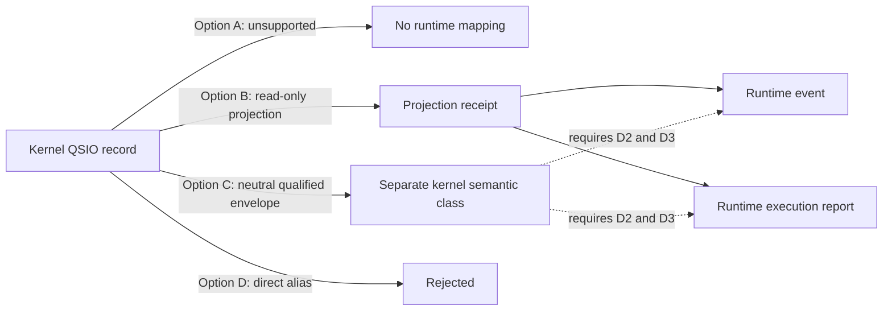

# Kernel-to-runtime crosswalk options

Status: `KERNEL_RUNTIME_CROSSWALK_OPTIONS_DOCUMENTED_UNSELECTED`

This packet documents how the internal ledger records currently produced by `aevespers2/qsio-kernel` could relate to the runtime-local event and execution-report concepts documented by `aevespers2/QuantumStateObjects`. It is an architecture and governance aid only. It does not select a namespace, schema, producer, consumer, semantic owner, adapter, registry, canonical byte profile, signing profile, migration, runtime admission, Fabric projection, or operational authority.

## Why this packet exists

The portfolio route remains discontinuous:

```text
qsio-kernel internal ledger
        ?
        v
QuantumStateObjects runtime event / execution records
        ?
        v
QSO-FABRIC projection / collaboration / aggregate records
        ?
        v
Repository 1 disposition and recovery
```

The first missing edge is the kernel-to-runtime crosswalk. Treating similar words, hashes, fixtures, or successful tests as identity would silently collapse distinct semantic layers. This packet therefore preserves an explicit unsupported-route option and requires loss, authority, provenance, correction, revocation, migration, and rollback analysis before any mapping can be accepted.

## Exact observed generations

| Surface | Exact generation | Observation |
|---|---|---|
| `aevespers2/qsio-kernel` default branch | `6468254d7703e5f771e610ed3f76bac1b7205ddb` | `QSIO` records are appended to an internal ledger and contain a QSI, pre-state hashes, proposed and accepted transitions, witnesses, outcome, reason codes, parent QSIO hashes, creation time, and content hash. |
| `aevespers2/QuantumStateObjects` default branch | `40efcbf8ce2bda7d6b05b3fb1f3ccf0384facc51` | The accepted default head does not establish the candidate runtime/Fabric interface binding. |
| `aevespers2/QuantumStateObjects` PR #12 candidate | `cc9b9c7b06a1a48bbc052b8d6bacd11782285288` | Documentation distinguishes runtime-local event ledgers and execution reports from Fabric collaboration ledgers and aggregate reports, while retaining `BLOCKED_ROLE_COLLISION`. |
| `aevespers2/ALISTAIRE-` charter candidate parent | `b31f9f3385ebf05576bd55bde36e4d42158f2adb` | Governance inventories preserve the kernel as an unmapped internal ledger/outcome source and record semantic-owner vacancies. |

These are observations, not accepted bindings. A moved source, changed path, changed field set, corrected interpretation, withdrawn candidate, or superseding default head requires a new generation of this packet.

## Observed kernel record

At the observed kernel generation, the internal `QSIO` record carries:

- `qsio_id`;
- the initiating `qsi` request or interaction description;
- `pre_state_hashes`;
- `proposed_transitions`;
- `accepted_transitions`;
- `witnesses`;
- `outcome` with values such as accepted, rejected, partial, or quarantined;
- `reason_codes`;
- `parent_qsio_hashes`;
- `created_at`;
- `content_hash`.

The kernel also models state version, lifecycle, logical time, capability descriptions, evidence references, and witness records. Those fields are useful crosswalk inputs, but their existence does not establish runtime-event identity, execution-report identity, authorization, trusted time, canonical bytes, signature validity, correction status, revocation status, retention, privacy suitability, or consumer admission.

## Semantic classes that must remain distinct

1. **Kernel interaction record** — the internal `QSIO` ledger entry and its transitions.
2. **Runtime event** — a runtime-local fact about an attempted or completed state transition.
3. **Runtime execution report** — a runtime-local assessment of outcome, reasons, witnesses, and resulting state.
4. **Projection receipt** — evidence that a specific source record was transformed into one or more target records under an identified profile.
5. **Fabric record** — a projection, collaboration event, aggregate, or other Fabric-level record.
6. **Portfolio disposition** — an independently authorized acceptance, rejection, quarantine, correction, revocation, or recovery decision.

A record may reference another class, but it must not acquire the other class's authority merely by embedding or hashing it.

## Candidate options

### Option A — Explicitly unsupported route

The kernel ledger remains internal. No kernel record is represented as a QuantumStateObjects runtime event or execution report.

**Advantages**

- preserves the strongest semantic and authority separation;
- avoids inventing a mapping before canonical bytes, identities, namespaces, and owners exist;
- provides a safe rollback target for every later proposal.

**Costs**

- prevents portfolio-level runtime visibility from using kernel records directly;
- requires later re-observation and migration if a crosswalk is approved.

**Required disposition code**

`UNSUPPORTED_KERNEL_RUNTIME_ROUTE`

This option must remain valid until another option passes every acceptance gate.

### Option B — Read-only projection adapter

An independently governed, read-only adapter consumes an immutable kernel record and emits:

- zero or one runtime event;
- zero or one runtime execution report;
- exactly one projection receipt describing accepted, rejected, partial, quarantined, unsupported, or lossy disposition.

The adapter may not mutate the kernel ledger, grant capability, activate runtime execution, infer approval, or emit Fabric or Repository `1` authority records.

**Advantages**

- keeps kernel and runtime identities separate;
- makes transformation loss visible;
- supports correction, revocation, and rollback through explicit receipts.

**Costs and risks**

- requires a neutral profile owner and consumer registry;
- may split one kernel record into multiple runtime records;
- requires deterministic handling for unsupported fields and partial transitions;
- introduces adapter compromise, replay, duplicate, and stale-generation risks.

### Option C — Neutral shared envelope with qualified semantic classes

A neutral contract layer defines one envelope family with mandatory producer, semantic class, source generation, subject, ordering, replay domain, payload profile, evidence references, correction, revocation, privacy, retention, and authority-effect fields. Kernel and runtime records remain separately identified payload classes inside that envelope.

**Advantages**

- may reduce repeated transport metadata;
- can support common provenance and correction routing;
- preserves semantic classes if the qualifier is mandatory and validated.

**Costs and risks**

- depends on unresolved D2 neutral stewardship and D3 canonical-byte decisions;
- a missing or ignored qualifier recreates the current role collision;
- envelope compatibility does not establish payload compatibility or consumer admission.

### Option D — Direct identity aliasing

Treat a kernel `QSIO` record as the runtime event or execution report itself.

**Disposition**

`REJECT_DIRECT_IDENTITY_ALIAS`

This option is rejected from the candidate set because one kernel record combines request, transitions, witnesses, outcome, reasons, ancestry, and hash material that may map to more than one runtime semantic class. Direct aliasing would hide loss, collapse producer and semantic ownership, and prevent an independently auditable projection receipt.

## Field-level crosswalk candidate

| Kernel source | Candidate target | Status | Required qualification |
|---|---|---|---|
| `qsio_id` | source record identifier | conditionally mappable | Must remain a source identifier, not automatically become runtime identity. |
| `content_hash` | source digest reference | conditionally mappable | Digest domain and canonical bytes are unresolved; preserve the original algorithm/domain label. |
| `parent_qsio_hashes` | causal source references | conditionally mappable | Does not by itself establish event ordering, completeness, or trusted ancestry. |
| `qsi` | runtime-event input or attempt description | potentially lossy | Interaction type, initiator, participants, input references, logical time, and requested transition require a versioned schema. |
| `pre_state_hashes` | runtime-event preconditions | conditionally mappable | Subject identity, generation, hash domain, and stale-state semantics must be explicit. |
| `proposed_transitions` | event proposal details | potentially lossy | Proposed and accepted transitions must not be conflated. |
| `accepted_transitions` | completed event changes | potentially lossy | Partial outcomes and multi-subject transitions require deterministic splitting rules. |
| `witnesses` | execution-report evidence | conditionally mappable | Witness identity, independence, verification method, and evidence accessibility remain unresolved. |
| `outcome` | execution-report disposition | vocabulary mismatch | Runtime vocabulary and authority effect must be independently defined. |
| `reason_codes` | execution-report reasons | vocabulary mismatch | Requires an accepted registry, version, unknown-code rule, and correction path. |
| `created_at` | source observation time | insufficient | Trusted time, clock source, precision, timezone, monotonic order, and correction remain unresolved. |

## Projection receipt minimum

Any mapping other than Option A must produce a projection receipt with at least:

- receipt identifier and profile version;
- adapter or projector identity and software generation;
- exact source repository, ref, commit, path, record identifier, and digest;
- source semantic class;
- target repository, namespace, semantic class, schema version, and record identifiers;
- accepted, rejected, unsupported, partial, quarantined, or lossy disposition;
- field-level transformation and omitted-field report;
- canonicalization and digest profiles used, if accepted;
- ordering, replay-domain, duplicate, and conflict result;
- evidence and witness references;
- privacy, retention, and disclosure classification;
- correction and revocation linkage;
- authority effect fixed to `none` unless a separate independently authorized disposition record exists;
- rollback target and restoration verification state.

A receipt proves that a transformation was attempted and recorded. It does not prove the source is true, the target is accepted, the adapter is authorized, or a runtime/Fabric/portfolio action is permitted.

## Hostile and boundary cases

A review-ready implementation must cover at least:

- missing or malformed source hashes;
- non-canonical or unsupported source serialization;
- unknown interaction type;
- unknown outcome or reason code;
- empty, duplicate, conflicting, or cyclic parent references;
- partial transitions across multiple subjects;
- proposed transitions not present in accepted transitions;
- accepted transitions lacking a matching pre-state;
- unverified, self-authored, stale, revoked, or inaccessible witnesses;
- replayed source record under a different target generation;
- two source records producing the same target identity;
- one source record producing conflicting target records;
- privacy-restricted or retention-expired fields;
- corrected or revoked source records;
- target schema withdrawal;
- failed projection rollback;
- restored state that cannot be independently reproduced.

## Acceptance gates

No option other than A may be accepted until all of the following are complete:

1. D1 canonical charter identity is accepted.
2. D2 assigns neutral, non-operational stewardship for the crosswalk contract.
3. D3 selects canonical bytes, digest domains, identities, namespaces, replay domains, and extension rules.
4. Complete repository-local inventories confirm every producer and consumer use.
5. Semantic owners or formally accepted vacancies are recorded for every class and route.
6. The source and target schemas, vocabulary registries, and unknown-state behavior are immutable and versioned.
7. Two independently authored validators agree on positive, malformed, hostile, unsupported, lossy, correction, revocation, migration, rollback, and failed-rollback fixtures.
8. Security, privacy, licensing, accessibility, retention, and incident reviews are complete.
9. Consumer registration and removal procedures are accepted.
10. Migration, correction, revocation, withdrawal, rollback, and restored-state evidence are independently verified.
11. Explicit human approval selects an option and exact generation.
12. Resulting-default-head evidence is retained without expanding deployment or operational authority.

## Invalidation and rollback

This packet becomes stale when any observed head, source path, record field, candidate semantic class, option, route, owner or vacancy, canonical profile, fixture, consumer, correction rule, revocation rule, migration rule, rollback rule, or disposition changes.

Rollback for this documentation packet means:

1. preserve the prior packet and exact-head evidence;
2. mark it superseded, corrected, or withdrawn;
3. restore Option A as the active safe route;
4. invalidate derived compatibility claims and consumer registrations;
5. retain correction and withdrawal links;
6. verify that no runtime, Fabric, Repository `1`, release, publication, deployment, credential, or infrastructure authority survives the rollback merely because a former mapping existed.

## Accessible graph



### Prose equivalent

A kernel record may remain unsupported, may be transformed by an independently governed read-only projector that emits a projection receipt and separately identified runtime records, or may later use a neutral envelope whose semantic qualifiers are mandatory. Treating the kernel record directly as a runtime event or execution report is rejected. Every supported route remains blocked until stewardship, canonicalization, ownership, validation, security, privacy, accessibility, migration, rollback, and human approval gates are satisfied.

## FYSA-120 capability map

- **CAT-011-B and CAT-011-E** — accessible graph design, prose equivalence, and cross-modal consistency.
- **CAT-012-A, CAT-012-B, CAT-012-D, and CAT-012-E** — information architecture, decision-record writing, terminology control, documentation testing, version synchronization, and change lifecycle.
- **CAT-013-A, CAT-013-C, CAT-013-D, and CAT-013-E** — semantic graph modeling, identifier separation, path analysis, contradiction detection, provenance, and access-control modeling.
- **CAT-017-A, CAT-017-C, CAT-017-D, and CAT-017-E** — exact-source resolution, derivation chains, version-substitution detection, hashing, correction propagation, and audit packaging.
- **CAT-018-B, CAT-018-D, and CAT-018-E** — responsibility mapping, onboarding continuity, privacy-aware retention, and contested-history preservation.
- **CAT-019-B, CAT-019-C, and CAT-019-D** — plain-language risk explanation, accessible alternatives, and uncertainty communication.
- **CAT-031 and CAT-032** — invariant closure, hostile validation, distributed ordering, replay, conflict, idempotency, and recovery analysis.
- **CAT-040-A through CAT-040-E** — system archaeology, migration dependency analysis, interface preservation, compatibility design, behavioral equivalence, and rollback assurance.
- **CAT-052, CAT-059, and CAT-070** — least privilege, provenance assurance, retained attestation, authority mapping, review, and corrective governance.

Taxonomy mapping is a planning aid. It does not establish demonstrated competence, appointment, permission, ownership, acceptance, or authority.

### Proposed refinement

`040-N — Internal-ledger to runtime-record crosswalk, loss accounting, and unsupported-route preservation`

This proposed subdivision covers exact-generation archaeology, semantic-class separation, field-level loss accounting, projection receipts, explicit unsupported routes, correction and revocation propagation, consumer rebinding, rollback, and independently verified restoration.

## Current disposition

`KERNEL_RUNTIME_CROSSWALK_OPTIONS_DOCUMENTED_UNSELECTED`

No crosswalk option is selected. Option A remains the safe default. No owner, namespace, canonical profile, adapter, registry, producer, consumer, migration, runtime admission, Fabric activation, Repository `1` disposition authority, release, Pages publication, deployment, credential, infrastructure change, or destructive history operation is authorized by this document.
