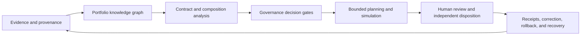

# A.L.I.S.T.A.I.R.E. name and capability roadmap

## Status and authority boundary

Status: `DOCUMENTED_NAME_EXPANSION_AND_CAPABILITY_ROADMAP_UNACCEPTED`

Authority effect: `NONE`

This page gives the portfolio a clear public-facing name expansion and a bounded capability roadmap. It is documentation and planning evidence only. It does not select the canonical repository, approve a package name, accept a contract, appoint an owner, activate a feature, grant credentials, authorize network or device access, publish GitHub Pages, promote a release, or permit deployment.

D1 remains the governing decision for canonical charter and repository identity. If D1 adopts a different display name, package name, capitalization, or acronym expansion, this page must be corrected or withdrawn through the same controlled documentation routes.

## Name expansion

**A.L.I.S.T.A.I.R.E.** stands for:

> **Adaptive Learning and Intelligence System for Trustworthy Autonomous Inference, Reasoning, and Evolution**

| Letter | Term | Intended meaning | Boundary |
|---|---|---|---|
| **A** | Adaptive | Revises models and plans when reviewed evidence changes | No unrestricted self-modification |
| **L** | Learning | Preserves correction, uncertainty, negative results, and provenance | No silent ingestion or training |
| **I** | Intelligence | Coordinates specialized reasoning capabilities | No claim of AGI, consciousness, or sentience |
| **S** | System | Composes bounded repositories and QSOs through explicit contracts | A repository dependency does not create authority |
| **T** | Trustworthy | Requires traceability, least privilege, independent review, and repair | Passing CI is not trust or acceptance by itself |
| **A** | Autonomous | Performs only explicitly bounded and reversible work | No standing credentials, deployment, payment, or device authority |
| **I** | Inference | Produces evidence-linked hypotheses, classifications, and predictions | Inference is not fact or canonical state |
| **R** | Reasoning | Compares alternatives, contradictions, risks, and consequences | Reasoning cannot bypass consent or governance |
| **E** | Evolution | Improves documentation, tests, contracts, and approved capabilities over time | Evolution requires review, versioning, rollback, and correction |

The phrase **trustworthy autonomous** describes a design objective: autonomy must remain narrow, observable, revocable, and subordinate to accepted governance. It does not describe an already implemented or generally authorized capability.

## Capability architecture

The roadmap organizes proposed features by the portfolio problem they solve. Every feature remains a candidate until its owner, contracts, evidence, privacy posture, security boundary, migration, rollback, and acceptance route are approved.

### Prose equivalent

A.L.I.S.T.A.I.R.E. first gathers attributed, inert evidence and records its exact source. A portfolio graph then relates repositories, contracts, owners, workflows, artifacts, decisions, and unresolved gaps. Contract and composition analysis identifies incompatible interfaces or missing gluing witnesses. Governance gates determine whether any bounded plan may proceed. Approved work remains simulation-first and reversible, then enters independent human review. The resulting receipts, corrections, revocations, rollbacks, and recovery evidence become new attributed evidence rather than automatic authority.

## Capability families

### 1. Knowledge, evidence, and currentness

| Feature | Purpose | Primary repository candidates | Present gate |
|---|---|---|---|
| Portfolio Knowledge Graph | Relate repositories, contracts, owners, workflows, releases, evidence, and decisions | `ALISTAIRE-`, neutral contract steward | D1–D3 and owner acceptance |
| Exact-Head Evidence Registry | Preserve reviewed commits, workflow runs, artifacts, digests, and superseded generations | `ALISTAIRE-`, Repository `1`, `qso-field.github.io` | neutral identity and publication custody |
| Provenance and Lineage Explorer | Trace code, schema, documentation, and artifact derivations | `ALISTAIRE-`, `QSO-SEEKER`, `QSO-STUDIO` | canonical identifiers and access policy |
| Uncertainty and Confidence Ledger | Distinguish observed, inferred, disputed, stale, unsupported, corrected, and withdrawn claims | `QuantumStateObjects`, `QSO-FABRIC`, `ALISTAIRE-` | semantic owner and correction contract |
| Semantic Diff Engine | Explain contract, authority, invariant, and downstream meaning changes | neutral steward, `QSO-STUDIO` | accepted schemas and comparison rules |
| Cross-Document Contradiction Detection | Find conflicts among READMEs, architecture, task chains, releases, punch lists, changelogs, schemas, and workflows | `ALISTAIRE-` | controlled-route definitions and exact-source evidence |

### 2. Contracts, composition, and integration

| Feature | Purpose | Primary repository candidates | Present gate |
|---|---|---|---|
| Cross-Repository Contract Validator | Detect incompatible schemas, versions, identities, error models, and authority fields | neutral contract steward, `qsio-kernel` | D2–D3 |
| Composition and Gluing Analyzer | Identify missing pairwise and triple-overlap witnesses and non-path-independent routes | `ALISTAIRE-`, `QSO-FABRIC`, `qsio-kernel` | accepted record classes and route owners |
| Interface Compatibility Matrix | Compare producers and consumers field by field | neutral steward, `ALISTAIRE-` | live registration and canonical contract versions |
| Integration Readiness Gate | Require compatible contracts, owners, evidence, migration, rollback, and independent approval | Repository `1`, `ALISTAIRE-` | D4–D5 |
| Migration and Deprecation Planner | Preserve history while sequencing aliases, compatibility windows, retirement, and rollback | `ALISTAIRE-`, affected repositories | D1 and accepted migration authority |
| Release Truth Reconciler | Compare release plans, changelogs, tags, manifests, artifacts, packages, and repository state | `ALISTAIRE-`, `qso-field.github.io` | publication custody and release authority |

### 3. Governance, ownership, and decision integrity

| Feature | Purpose | Primary repository candidates | Present gate |
|---|---|---|---|
| Authority Boundary Engine | Make documentation, review, merge, release, deployment, credential, and destructive-operation permissions explicit | Repository `1`, `ALISTAIRE-` | D4–D5 |
| Decision and ADR Ledger | Preserve decisions, alternatives, evidence, affected repositories, expiry, and supersession | `ALISTAIRE-` | D1 and retention policy |
| Ownership and Stewardship Matrix | Record semantic, schema, security, release, accessibility, incident, and recovery responsibility | `ALISTAIRE-`, neutral steward | owner appointment or explicit vacancy acceptance |
| Human Decision Queue | Separate safe bounded maintenance from constitutional, security, legal, ownership, or ethical decisions | `QSO-STUDIO`, Repository `1` | review and approval contracts |
| Multi-Agent Review Council | Preserve architecture, security, testing, accessibility, provenance, and governance reviews without averaging away dissent | `QSO-STUDIO`, `QSO-FABRIC` | participant identity, recusal, dissent, and disposition rules |
| Constitutional Core | Maintain versioned principles for consent, human authority, provenance, reversibility, least privilege, correction, and accountable autonomy | `ALISTAIRE-` | D1–D5 acceptance |

### 4. Documentation, onboarding, and accessibility

| Feature | Purpose | Primary repository candidates | Present gate |
|---|---|---|---|
| Documentation Autopilot | Maintain project overviews, architecture, API references, decisions, release notes, and diagrams | each repository, coordinated by `ALISTAIRE-` | repository-local review and exact-head validation |
| Living Architecture Atlas | Generate context, component, sequence, trust-boundary, data-flow, rollback, and provenance diagrams | `ALISTAIRE-`, `qso-field.github.io` | accepted source graph and accessible alternatives |
| Developer Onboarding Generator | Produce setup, mental models, contribution rules, first tasks, validation, and troubleshooting | each repository | repository-local maintainer review |
| Public Project Narrative | Explain what is proposed, implemented, verified, blocked, prohibited, and withdrawn | `qso-field.github.io`, `ALISTAIRE-` | publication and correction custody |
| Accessibility Assurance Layer | Check headings, keyboard access, contrast, link meaning, diagram alternatives, tables, and cognitive clarity | `QSO-STUDIO`, `AionUi`, documentation repositories | accessibility owner and test criteria |
| Contribution Path Recommender | Match contributors to bounded tasks using skill requirements, repository needs, risk, and permissions | `ALISTAIRE-`, repository issue trackers | identity, privacy, and recommendation-governance policy |

### 5. Security, resilience, and repair

| Feature | Purpose | Primary repository candidates | Present gate |
|---|---|---|---|
| Repository Health Sentinel | Detect failed workflows, stale evidence, merge conflicts, unsafe permissions, broken links, regressions, and release contradictions | Repository `0`, `ALISTAIRE-` | read-only access and notification policy |
| Failure-Signature Deduplication | Avoid repeated reports by binding findings to repository, head, run, signature, and resolution | Repository `0`, `ALISTAIRE-` | canonical finding identity and retention policy |
| Rollback Readiness Scoring | Evaluate immutable inputs, reversible migrations, retained artifacts, restoration, and independent recovery evidence | Repository `1`, `ALISTAIRE-` | accepted recovery criteria |
| Correction and Revocation Protocol | Propagate corrections, superseded evidence, revoked artifacts, withdrawn claims, and consumer invalidation | neutral steward, Repository `1` | canonical identity and consumer registration |
| Security Boundary Mapper | Identify trust zones, credential paths, privileged workflows, untrusted inputs, and supply-chain exposure | Repository `0`, Repository `1` | D4–D5 and approved security review |
| Artifact Completeness Checker | Verify logs, environment, tests, manifests, hashes, reports, and failure evidence for the exact head | Repository `0`, `qsio-kernel` | artifact schema and custody |

### 6. Planning, simulation, and capability growth

| Feature | Purpose | Primary repository candidates | Present gate |
|---|---|---|---|
| FYSA-120 Capability Router | Select relevant skills, record applied subdivisions, and expose capability gaps | `ALISTAIRE-`, `QSO-GENOMES` | taxonomy-version and attribution rules |
| Governance-Aware Planning Engine | Decompose goals into reversible tasks respecting authority, dependencies, risk, and approvals | `QSO-FABRIC`, `ALISTAIRE-` | accepted planning and authority contracts |
| Architecture Simulation Sandbox | Test dependency substitutions, contract upgrades, failures, migrations, and rollback without production mutation | `QSO-FABRIC`, `qsio-kernel` | simulation fixtures and resource limits |
| Invariant and Policy Language | Define machine-readable rules such as preserve provenance, fail closed, and never expand authority implicitly | neutral steward, `qsio-kernel` | D2–D3 |
| Capability Maturity Model | Classify features as proposed, documented, specified, tested, interoperable, governed, audited, recoverable, or production-approved | `ALISTAIRE-` | acceptance vocabulary and evidence criteria |
| Portable Evidence Bundles | Package exact commits, manifests, workflow evidence, decisions, risks, and rollback instructions | Repository `0`, Repository `1` | canonical bundle format and signing custody |
| Evidence-Based Self-Improvement | Permit proposals to improve documentation, tests, planning, and the capability map while execution authority remains separate | `ALISTAIRE-`, `QSO-FABRIC` | bounded change policy, independent review, correction, and rollback |

## Sequenced roadmap

| Stage | Outcome | Allowed work | Exit evidence |
|---|---|---|---|
| **R0 — Constitutional documentation** | One coherent charter, name decision, repository map, and authority vocabulary | Read-only inventory, documentation, validators, fixtures, decision packets | D1–D5 decisions, exact-head documentation evidence, explicit approval |
| **R1 — Evidence and currentness fabric** | Exact source, lineage, correction, artifact, and uncertainty records compose | Inert records and local validation only | independent replay, duplicate resistance, correction and withdrawal tests |
| **R2 — Contract compatibility substrate** | Producers and consumers share accepted identity, encoding, reason, version, migration, and rollback rules | Neutral contract and conformance work | cross-language fixtures and pairwise/triple-overlap witnesses |
| **R3 — Review, authority, and recovery** | Independent review, capability issuance, revocation, freeze, and recovery are explicit | Synthetic approval and recovery exercises | separation-of-duty, failed-rollback, restored-state, and incident evidence |
| **R4 — Local simulation orchestrator** | Bounded QSOs plan and execute deterministic simulations in a temporary workspace | No network, credentials, external devices, payments, releases, or deployment | hostile fixtures, resource bounds, receipts, correction, rollback, and recovery |
| **R5 — Separately authorized domain pilots** | Narrow domain-specific pilots may be proposed | Only capabilities separately approved with privacy, security, legal, operational, and recovery review | domain acceptance packet and independently verified resulting state |

A later-stage feature may not be represented as present merely because its interface, documentation, fixture, or placeholder exists.

## Obstruction analysis

The roadmap exposes the following material gluing failures:

1. **Identity obstruction:** D1 has not selected the canonical repository, package/display name, acronym status, or non-canonical disposition.
2. **Contract obstruction:** no accepted neutral owner defines common identifiers, envelopes, canonical bytes, reason codes, compatibility, or correction propagation.
3. **Semantic obstruction:** kernel records, runtime records, Fabric projections and aggregates, and Repository `1` dispositions do not yet have an accepted loss-aware route.
4. **Ownership obstruction:** constitutional, semantic, route, source-rights, accessibility, review, incident, publication, and recovery responsibilities remain vacant or unapproved.
5. **Evidence obstruction:** candidate documentation and workflow success do not establish live producer or consumer registration, independent review, operational safety, or canonical acceptance.
6. **Recovery obstruction:** mixed-generation migration, consumer invalidation, failed rollback, and independently witnessed restoration are incomplete.
7. **Publication obstruction:** GitHub Pages custody, public/private partitioning, correction timing, accessibility certification, and claim-withdrawal authority remain unaccepted.

These are architecture and governance findings, not permission to implement around the missing decisions.

## FYSA-120 capability mapping

| Work area | Applied categories and subdivisions |
|---|---|
| Name, public explanation, and information architecture | `011-A`, `011-B`, `011-E`, `012-A`, `012-B`, `012-D`, `012-E`, `019-B`, `019-C`, `019-D` |
| Portfolio and capability graph | `013-A`, `013-C`, `013-D`, `013-E`, `017-C`, `017-D`, `017-E`, `018-B`, `018-D` |
| Architecture and gluing analysis | `030-A`, `030-B`, `030-C`, `030-D`, `030-E`, `032-A`, `032-B`, `032-D`, `040-A`, `040-B`, `040-D`, `040-E` |
| Agent and planning boundaries | `041-A`, `041-B`, `041-D`, `041-E`, `070-A`, `070-B`, `070-C`, `070-E` |
| Security, provenance, rollback, and assurance | `031-A`, `031-D`, `031-E`, `033-A`, `033-E`, `054-A`, `054-B`, `054-D`, `054-E` |

Taxonomy mapping is descriptive. It does not establish competence, appointment, ownership, acceptance, or authority.

### Proposed non-authoritative skill-tree refinements

- **`012-Q — Public identity expansion, capability-roadmap architecture, and cross-document naming coherence`**
- **`013-L — Evidence-linked feature-to-repository capability and obstruction graphing`**
- **`041-F — Governance-gated capability portfolio decomposition and maturity sequencing`**

These refinements should remain proposals until the FYSA-120 taxonomy owner reviews their overlap with existing subdivisions.

## Change control and rollback

Update or withdraw this page when any of the following changes:

- D1 naming, repository, package, or migration evidence;
- a feature owner, contract, gate, status, or repository assignment;
- the accepted capability or evidence vocabulary;
- a privacy, security, accessibility, publication, incident, or recovery boundary;
- a source repository head that materially changes a mapped responsibility;
- the FYSA-120 category or subdivision files used by this page.

Rollback means restoring the last validated documentation generation, preserving this generation and its review evidence as historical, marking its claims superseded or withdrawn, and revalidating every controlled route. Rollback does not silently erase the decision history.