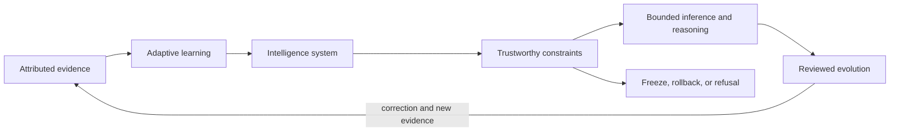

# Name and identity

## Public expansion

**A.L.I.S.T.A.I.R.E.** expands to:

> **Adaptive Learning & Intelligence System for Trustworthy Autonomous Inference, Reasoning, and Evolution**

Controlled documentation status: `NAME_EXPANSION_DOCUMENTED_CANONICAL_REPOSITORY_UNSELECTED`

The expansion describes the intended qualities of the documentation-first research architecture. It does not select a canonical repository, package name, runtime, contract owner, product mode, legal identity, or operational authority.

## Letter-by-letter meaning

| Letter | Term | Meaning within the charter boundary |
|---|---|---|
| **A** | **Adaptive** | Able to revise documented models and plans when reviewed evidence changes, while preserving prior state, rationale, and rollback. |
| **L** | **Learning** | Evidence-linked, reviewable state revision—not unrestricted training, silent persistence, or self-authorized modification. |
| **I** | **Intelligence** | Analysis, synthesis, uncertainty handling, and problem solving; not a claim of consciousness, sentience, or general intelligence. |
| **S** | **System** | A portfolio of bounded repositories and services with explicit responsibilities, interfaces, non-roles, and failure postures. |
| **T** | **Trustworthy** | Provenance, explicit uncertainty, least privilege, independent review, correction, revocation, rollback, and recovery. |
| **A** | **Autonomous** | Bounded internal inference within accepted policies and resource limits; never standing permission to use credentials, tools, networks, payments, devices, releases, or deployments. |
| **I** | **Inference** | Drawing qualified conclusions from attributed evidence while preserving ambiguity, contradictions, and unsupported states. |
| **R** | **Reasoning** | Comparing alternatives, tracing consequences, testing assumptions, preserving dissent, and explaining decisions. |
| **E** | **Evolution** | Versioned, reviewed, reversible improvement of documentation, contracts, tests, and capability proposals. |

## Architectural reading of the name

### Prose equivalent

The architecture begins with attributed evidence. Evidence may support a reviewed adaptive update inside an intelligence system. Trustworthy constraints—including authority boundaries, uncertainty, consent, provenance, and resource limits—govern all inference and reasoning. Proposed evolution must be reviewed, versioned, and reversible. Failed validation, missing authority, or unsafe ambiguity leads to refusal, freeze, or rollback rather than silent promotion.

## What the name does not claim

The name does **not** establish or imply:

- executable AGI, consciousness, sentience, personhood, or unrestricted autonomy;
- authority to obtain credentials, access networks, control devices, make payments, publish, release, or deploy;
- acceptance of a canonical repository, package, namespace, schema, serialization, identity registry, or contract steward;
- verified compatibility between portfolio components;
- production security, compliance, safety certification, or independent approval;
- permission for persistent self-modification or private-data ingestion.

The word **autonomous** is therefore always subordinate to the charter’s authorization model. A component may autonomously perform bounded internal analysis only after its inputs, policies, resources, and review class have been accepted. Consequential external action remains separately authorized.

## Naming layers

Keep these identities distinct:

| Identity | Current use | Boundary |
|---|---|---|
| **A.L.I.S.T.A.I.R.E.** | Formal expanded project name and portfolio objective | Descriptive only; does not resolve D1 canonical identity. |
| **Alistaire** | Readable display name in prose | Must not be treated as a package, repository, credential, or legal identity. |
| `aevespers2/ALISTAIRE-` | Current substantive charter candidate | Remains a non-default documentation candidate until D1 approval. |
| `aevespers2/Alistaire-agi` | Overlapping compatibility, package-name, migration, and taxonomy candidate | Must not publish competing canonical authority. |
| `alistaire-qso` | Proposed package name | Unaccepted until the canonical repository and package disposition are approved. |

## Writing and interface guidance

1. On first public use, write **A.L.I.S.T.A.I.R.E. (Adaptive Learning & Intelligence System for Trustworthy Autonomous Inference, Reasoning, and Evolution)**.
2. Use **Alistaire** afterward when referring to the project in ordinary prose.
3. Use exact repository names in provenance, migration, workflow, and evidence records.
4. Do not shorten the project to “AI” where that could blur product identity, evidence status, or authority.
5. Do not use “autonomous” without an adjacent boundary statement when discussing execution, tools, credentials, networks, devices, payments, release, or deployment.
6. Give every acronym, diagram, and status code a plain-language explanation suitable for screen readers and readers unfamiliar with the portfolio.
7. Preserve capitalization exactly in formal titles; lowercase or stylistic variants must not create a separate identity.

## Onboarding checkpoint

A contributor should be able to explain, before editing the charter:

- the full acronym and why each term is bounded;
- the difference between the project display name, repository identities, and proposed package identity;
- why learning means reviewed state revision rather than unrestricted self-modification;
- why internal inference does not create external operational authority;
- why the expansion does not resolve D1 or accept any cross-repository contract;
- how corrections to the name or its meaning would be versioned, propagated, and reversible.

## Change control

A future change to the expansion or its defined meaning requires:

1. an exact-source proposal identifying the prior and proposed wording;
2. impact review across README, Pages navigation, architecture, onboarding, task chain, release plan, punch list, changelog, package candidates, diagrams, and public references;
3. terminology, accessibility, link, and rendered-site validation;
4. explicit preservation of superseded wording and rationale;
5. an approved migration and rollback plan if the change affects public identity or compatibility;
6. separate D1 approval if the change attempts to select a canonical repository, display name, or package.

## FYSA-120 capability map

This guide applies:

- **CAT-007-C/D/E** — semantic change, deprecated-alias management, interoperability, definition provenance, and versioned ontology governance;
- **CAT-011-A/B/E** — scientific narrative, accessible diagram design, and cross-modal integrity;
- **CAT-012-A/B/D/E** — information architecture, technical exposition, terminology controls, documentation testing, and version synchronization;
- **CAT-018-B/D/E** — responsibility mapping, onboarding transfer, and contested-history preservation;
- **CAT-019-B/C/D** — plain-language design, accessibility, and uncertainty-aware public explanation;
- **CAT-031-A/D/E** — invariant specification, validation, regression prevention, and lifecycle assurance;
- **CAT-040-A/D/E** — repository-identity archaeology, compatibility planning, rollback, and continuity.

Proposed non-authoritative refinement:

**`012-Q — Public technical naming, acronym semantics, and non-authorizing identity guidance`**

The proposed subdivision would cover expansion design, term-by-term semantic constraints, repository/package/display-name separation, public style rules, accessible pronunciation and diagram alternatives, rename impact analysis, superseded-name preservation, and rollback. Its proposal does not establish competence, appointment, ownership, acceptance, or authority.
