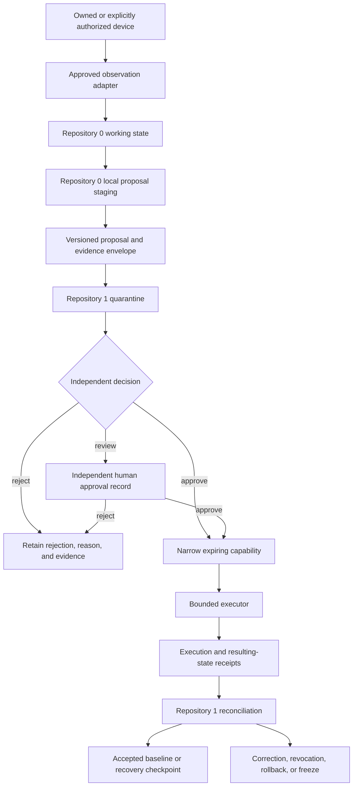

# Portable Security Foundation

## Status

**Documentation-only architecture candidate.** This page records the intended role of Repositories `0` and `1` as the first A.L.I.S.T.A.I.R.E. components installed on an owned or explicitly authorized device. It does not install software, inspect a device, issue credentials, enable monitoring, authorize remediation, or claim that any device is secure.

## Mission

Repositories `0` and `1` form the portable security and recovery foundation for a laptop, phone, workstation, server, or constrained environment that is new, replaced, recovered, reset, or suspected of compromise.

The intended outcome is a repeatable path to:

- establish device and environment identity;
- inventory observable host and network state;
- compare observations with an approved, versioned baseline;
- prepare reversible remediation proposals;
- obtain independent authorization for consequential changes;
- verify resulting state and preserve evidence;
- revoke trust and recover safely after loss, theft, replacement, or compromise.

The foundation must be installed and validated before higher-level A.L.I.S.T.A.I.R.E. runtimes, package managers, adapters, interfaces, credentials, or user workloads are treated as trusted.

## Responsibility split

### Repository `0` — bootstrap and maintenance orchestrator

Repository `0` is the candidate portable bootstrap, inspection, proposal, bounded-execution, verification, and maintenance orchestrator. Its documentation-stage responsibilities are:

1. identify the host platform and supported security profile;
2. collect read-only observations through approved adapters;
3. preserve per-check status, uncertainty, provenance, and limitations;
4. compare observed state with an accepted baseline;
5. prepare reversible remediation proposals;
6. submit versioned proposal and evidence envelopes to Repository `1` quarantine;
7. execute only narrowly scoped, expiring capabilities;
8. produce execution and resulting-state receipts;
9. continue low-authority monitoring of approved invariants.

Repository `0` does not own canonical device state, approve its own proposals, mint or broaden capabilities, infer trust from command success, or conceal unsupported observations.

### Repository `1` — independent trust and recovery core

Repository `1` is the candidate independent authority for:

- canonical device and environment identity;
- baseline and policy identity;
- quarantine admission and proposal disposition;
- capability issuance, narrowing, expiry, and revocation;
- accepted receipts and resulting-state reconciliation;
- recovery checkpoints and replacement-device continuity;
- emergency freeze and bounded restart;
- evidence preservation and correction history.

Repository `1` must remain independent from the proposer and executor. It cannot bootstrap its own authority merely by storing a record, signing a local artifact, or being depended upon by another repository.

## Canonical route

`0:proposal` is non-authoritative local staging. The cross-repository contract begins when a versioned envelope is offered to `1:quarantine`. Execution success is evidence; it is not automatic canonical acceptance.

## Baseline domains

A complete portable baseline should eventually define platform-specific, testable controls for:

| Domain | Representative observations | Required failure posture |
|---|---|---|
| Platform integrity | OS version, secure boot, disk encryption, update state, recovery configuration | unsupported or inaccessible state is `UNKNOWN` |
| Identity and access | local accounts, administrator groups, authentication methods, keychains, remote login | unexpected privilege or unverifiable identity triggers review or freeze |
| Package and startup state | Homebrew or other package managers, sources, shell initialization, launch agents, jobs, daemons, extensions | unowned persistence is not silently removed or trusted |
| Network control | firewall, DNS, proxy, VPN, routes, packet forwarding, hotspot, tethering, sharing, interface state | unexplained route or forwarding changes require evidence and bounded remediation |
| Local wireless | Bluetooth pairing, discoverability, nearby sharing, hotspot peers | unknown peers remain untrusted; no retaliation or interception |
| Trust stores | certificates, management profiles, developer identities, browser extensions | provenance and ownership are required before acceptance |
| Evidence and recovery | backup state, recovery keys, checkpoints, artifact hashes, prior device revocation | recovery must not depend on the device being recovered |

The precise control set differs across macOS, Linux, Windows, Android, iOS, and constrained systems. The architecture must not imply controls that a platform cannot expose or enforce.

## Observation adapters

Candidate host-observation adapters include JusticeForMe and PhantomBlock. Their overlap must be resolved through one shared device identity, observation vocabulary, evidence envelope, completion semantics, duplicate/corroboration rules, conflict semantics, privacy policy, and compatibility fixture set.

The lowest-overlap candidate is:

- **JusticeForMe:** general operating-system, account, package, service, persistence, and network-configuration observations;
- **PhantomBlock:** specialist hardware, firmware, kernel-integrity, management-plane, and explicitly supplied offline-capture observations.

This split remains a documentation candidate. Neither adapter gains privileged collection, network interception, remediation, or authority by being named here.

## Required contract families

The foundation depends on jointly versioned contracts for:

1. device and environment identity;
2. ownership and authorization scope;
3. platform profile, baseline policy, and enrollment generation;
4. observation, artifact, completion, and uncertainty envelopes;
5. Repository `0` proposal and Repository `1` quarantine;
6. capability, denial, approval, expiry, narrowing, and revocation;
7. bounded execution, partial failure, rollback, and resulting-state receipts;
8. canonical reconciliation, correction, checkpoint, replacement, retirement, and loss;
9. privacy, retention, redaction, export, deletion, and incident evidence;
10. canonical bytes, digests, signatures, clocks, replay domains, reason codes, and compatibility.

These contracts should be stewarded by a neutral, non-operational contract authority. Repository `0`, Repository `1`, an adapter, interface, or runtime must not define the contracts that grant its own authority.

## Required compatibility witnesses

At minimum, deterministic cross-repository fixtures must cover:

- supported and unsupported platform profiles;
- correct and wrong device identity;
- complete, partial, failed, and inaccessible observation sets;
- duplicate independent evidence and duplicate same-source evidence;
- conflicting observations and unresolved `UNKNOWN` state;
- stale, replayed, future-dated, malformed, and unsupported-version proposals;
- missing, excessive, expired, narrowed, and revoked capabilities;
- expected-pre-state and expected-head mismatch;
- success, partial execution, failure, rollback, and failed rollback;
- receipt-to-artifact binding and canonical-byte mismatch;
- loss, theft, retirement, replacement, and re-enrollment;
- emergency freeze, evidence preservation, bounded restart, and claim withdrawal.

## Lost or replaced device lifecycle

1. Mark the prior device identity as lost, stolen, retired, or uncertain.
2. Revoke device-bound capabilities, sessions, certificates, and trusted peer relationships where supported.
3. Preserve the last accepted baseline, evidence, and recovery checkpoint outside the prior device.
4. Establish a new device identity from a trusted bootstrap source.
5. Install and verify Repositories `0` and `1` before higher-level components.
6. Inventory the new environment and compare it with the approved baseline.
7. Reissue only the minimum credentials and capabilities required.
8. Verify package, startup, network, Bluetooth, hotspot, sharing, route, proxy, DNS, and trust-store state.
9. Record the replacement checkpoint while keeping the prior identity revoked.

Remote revocation or cleanup must never be represented as successful without verifiable external evidence.

## Safety and scope boundaries

This architecture does not authorize:

- inspection or control of devices without ownership or explicit permission;
- traffic interception, exploitation, counter-intrusion, retaliation, or surveillance;
- bypassing platform security, mobile restrictions, or device-management policy;
- silent deletion of accounts, profiles, certificates, software, logs, or forensic evidence;
- treating unusual behavior as proof of a particular attacker;
- universal claims of compromise detection or device security;
- public storage of device inventories, secrets, keys, identifiers, private network data, or recovery material;
- autonomous remediation before the exact capability, approval, and rollback path are validated.

## Acceptance gates

The portable foundation remains blocked until:

- the canonical A.L.I.S.T.A.I.R.E. charter is approved;
- a neutral contract steward and canonical-byte profile are accepted;
- Repository `1` or a successor is independently chartered and reviewed;
- incident, emergency-stop, evidence-preservation, and recovery owners are named;
- the shared contracts and fixtures pass across both repositories and approved adapters;
- privacy, retention, key custody, device enrollment, loss, replacement, and rollback policies are approved;
- a clean-room bootstrap and recovery exercise produces retained exact-head evidence.
