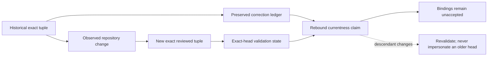

# Portfolio authority currentness rebind

Status: `PORTFOLIO_CURRENTNESS_REBIND_COMPLETED_STALE_TUPLES_PRESERVED_BINDINGS_UNACCEPTED`

Authority effect: `NONE`

## Purpose

This addendum corrects exact-source tuples that changed after the nineteen-repository authority-currentness snapshot. It preserves every superseded tuple, records why the replacement is current for this review, separates focused evidence from resulting-head evidence, and prevents a documentation branch from claiming its own not-yet-created commit as an exact source.

It does **not** replace the [portfolio authority currentness review](portfolio-authority-currentness-review.md). The original packet remains the historical snapshot; this addendum is its correction and rebinding ledger. The machine-readable companion is [`portfolio-authority-currentness-rebind-v1.json`](portfolio-authority-currentness-rebind-v1.json).

## Correction model

### Prose equivalent

A historical exact tuple is never overwritten. A repository change produces a new observed tuple, while the previous tuple is retained in the correction ledger. Validation belongs only to the exact head on which it ran. The corrected currentness claim remains non-authorizing, and every descendant must obtain fresh evidence rather than reuse an ancestor's identity.

## Rebound source register

| Repository | Preserved tuple | Rebound tuple | Evidence state | Current disposition |
|---|---|---|---|---|
| `aevespers2/ALISTAIRE-` | PR #1 `38213e4e…` | reviewed parent `39357f4d…` | PR #17 focused and resulting workflows passed | parent generation bound; descendant revalidation required |
| `aevespers2/JusticeForMe` | PR #5 `aa530d27…` | PR #5 `33db8613…` | focused accessibility workflow passed; resulting visibility pending | conflict preserved; no resulting-head pass claimed |
| `aevespers2/QSO-GENOMES` | PR #15 `c29bd681…` | PR #15 `75d675d2…` | Documentation, capability review, and consent workflows passed | multiple lineages remain; documentation head corrected |
| `aevespers2/QSO-SEEKER` | PR #14 actual `3a4db281…`, body `1038a349…` | PR #14 `5ddb8312…`, body agrees | source review, documentation, security, and consent workflows passed | declared-head mismatch resolved; bindings still unaccepted |

## What changed

### QSO-SEEKER mismatch closed as a source-record defect

The earlier currentness snapshot correctly recorded a mismatch between QSO-SEEKER PR #14 metadata and its body. The PR body now names `5ddb831250d537622035f04e0e30488ec4fdd15a`, matching the actual head, and four exact-head workflows passed. The prior mismatch remains evidence of the defect and repair; it is no longer a current obstruction.

### QSO-GENOMES documentation head advanced

The documentation candidate advanced from `c29bd681bab680e467903784527776d284469a3d` to `75d675d274b504965836aadf8e0792d606d6c3fb` after the accessibility-review milestone. This corrects the reviewed source only. Divergent identity, compatibility, migration, and reconciliation lineages remain unresolved.

### JusticeForMe evidence is mixed, not silently promoted

The candidate advanced to `33db861320c29e71059ec390cbdafe04c8f8793d`. Focused validation passed for the accessibility milestone, but no resulting-head run is visible. The correct state is therefore **focused pass / resulting pending**, not a complete exact-head validation claim.

### ALISTAIRE self-currentness remains non-self-referential

This addendum binds parent `39357f4d4df76bf969e08dc8c2c3212766345bce`, the exact reviewed target generation from which the focused branch begins. It deliberately does not claim the focused or future integration commit before that commit exists. The resulting descendant must run and retain its own evidence.

## Planning-route compatibility

The base status remains:

`PORTFOLIO_AUTHORITY_CURRENTNESS_RECONCILED_CONFLICTS_DISSENT_AND_VACANCIES_RECORDED_BINDINGS_UNACCEPTED`

The controlling propagation marker remains:

`PORTFOLIO_CURRENTNESS_REBIND_REQUIRED`

`taskchain.md`, `punchlist.md`, `release.md`, and `changelog.md` already define that marker for changed repository sources, exact heads, classifications, mergeability, conflicts, dissent, vacancies, routes, and safety boundaries. This packet performs a bounded source correction under that rule. It does not change D1–D5, appoint an owner, accept a contract, select a namespace, or authorize implementation.

## Material obstruction after correction

Correcting stale tuples improves provenance but does not close the portfolio's gluing failures. The route

`qsio-kernel → QuantumStateObjects → QSO-FABRIC → Repository 1`

still lacks accepted semantic and route owners, canonical payloads and bytes, projection receipts, source-set identities, ordering and replay rules, live registrations, correction and revocation propagation, privacy and retention governance, mixed-generation migration, rollback, and independently verified restoration.

The constitutional identity split between `aevespers2/ALISTAIRE-` and `aevespers2/Alistaire-agi`, overlapping lineages, unvalidated or conflicting sources, and review/adapter authority vacancies also remain unresolved.

## Reviewer procedure

1. Confirm each repository and PR identity.
2. Compare the actual PR head with any exact head stated in the body.
3. Preserve both the superseded and replacement tuples.
4. Bind workflow evidence only to its exact source.
5. Distinguish focused, resulting, historical, pending, failed, and unavailable evidence.
6. Keep self-currentness anchored to an already-existing parent generation.
7. Re-run validation after integration and update the parent charter PR without rewriting historical evidence.
8. Withdraw or correct this addendum if any tuple is disproven.

## Accessibility

The diagram has a prose equivalent and no meaning depends on color. Tables repeat full repository identities, and statuses are expressed in text. Rendered review must still test keyboard access, screen-reader order, zoom and reflow, contrast, reduced motion, low-bandwidth behavior, and comprehension. Documentation validation is not accessibility certification.

## FYSA-120 mapping

Applied nodes:

- **CAT-011-B/E** — diagram design, accessible encoding, and cross-modal consistency;
- **CAT-012-A/B/D/E** — document architecture, decision writing, terminology control, documentation testing, and lifecycle synchronization;
- **CAT-013-A/C/D/E** — temporal graph updates, identity resolution, contradiction detection, and provenance-aware maintenance;
- **CAT-017-A/C/D/E** — canonical-source resolution, derivation chains, version-substitution detection, audit packaging, and correction propagation;
- **CAT-018-B/D/E** — records classification, rationale reconstruction, onboarding continuity, and contested-history preservation;
- **CAT-019-B/C/D** — plain language, accessibility, and uncertainty communication;
- **CAT-031-A/D/E** — closed requirements, hostile validation, regression prevention, and assurance maintenance;
- **CAT-040-A/B/D/E** — lineage archaeology, migration-risk analysis, compatibility preservation, and rollback;
- **CAT-054-B/D/E** and **CAT-064-B/E** — workflow integrity, evidence retention, auditability, and governance review.

Proposed non-authoritative subdivision:

**`017-H — Exact-source correction ledger and non-self-referential currentness rebinding`**

Taxonomy membership is a capability map, not proof of competence or authority.

## Safety boundary

No default-branch merge, Pages publication, contract acceptance, owner appointment, runtime activation, credential change, capability issuance, payment execution, release, deployment, infrastructure apply, or destructive history rewrite is authorized.
