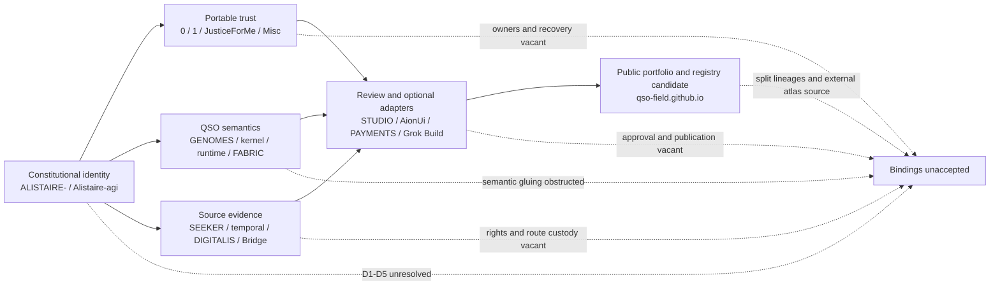

# Portfolio authority currentness review

Status: `PORTFOLIO_AUTHORITY_CURRENTNESS_RECONCILED_CONFLICTS_DISSENT_AND_VACANCIES_RECORDED_BINDINGS_UNACCEPTED`

Authority effect: `NONE`

## Purpose

This packet reconciles the A.L.I.S.T.A.I.R.E. portfolio against exact repository and pull-request identities while preserving correction history, non-authorizing evidence, ownership vacancies, and rollback. It reviews all nineteen owned repositories without appointing an owner, accepting a contract, activating a runtime, publishing Pages, issuing a capability, approving a payment, releasing software, or deploying infrastructure.

The machine-readable companion is [`portfolio-authority-currentness-v1.json`](portfolio-authority-currentness-v1.json).

## Snapshot and correction model

The packet uses a self-reference-safe snapshot model. Its exact ALISTAIRE source generation is `39357f4d4df76bf969e08dc8c2c3212766345bce`, the parent from which this focused correction branch was created. The descendant commit that contains this packet must be validated independently and recorded in pull-request evidence; the packet does not claim its own unknown future SHA.

Changed tuples are corrected rather than silently overwritten:

1. QSO-SEEKER's historical metadata/body mismatch is preserved in `correction_history`, while the current body and actual head now agree.
2. JusticeForMe is rebound to its accessibility-integrated candidate, while resulting-head workflow evidence remains explicitly pending.
3. ALISTAIRE is represented as a snapshot parent generation rather than a self-current descendant.

## Portfolio corridors

### Prose equivalent

The charter identity corridor feeds portable trust, QSO semantics, and source-evidence corridors. Those corridors may provide records to review surfaces and optional adapters. The public portfolio repository may document the system and hold registry candidates, but it is not a live registry or authority service. Every corridor remains blocked because D1–D5, semantic ownership, route ownership, canonical representations, correction and revocation, migration, rollback, and independent resulting-state verification remain unaccepted.

## Exact-source register

| Repository | Primary reviewed source | Currentness | Material disposition |
|---|---|---|---|
| `aevespers2/ALISTAIRE-` | PR #1 snapshot parent `39357f4d4df76bf969e08dc8c2c3212766345bce` | snapshot parent generation | validate the descendant independently; D1–D5 remain unaccepted |
| `aevespers2/Alistaire-agi` | PR #4 `9e953992dfefbfa0fd61ce37e955b75f79a8e1d6` | multiple active lineages | reconcile PR #4, PR #2, and ALISTAIRE- in D1 |
| `aevespers2/0` | PR #13 `60a7b9948682d0c97b2810359aee35111021fdf8` | conflicting candidate | reconcile current `main` and competing product/security lineages |
| `aevespers2/1` | PR #2 `47b58fa49c8dda7f44234dab68f78673bb02d269` | multiple active lineages | D4 authority and custody decision required |
| `aevespers2/JusticeForMe` | PR #5 `33db861320c29e71059ec390cbdafe04c8f8793d` | conflicting; resulting validation pending | reconcile `main`; preserve accessibility evidence; decide role and certification ownership |
| `aevespers2/Misc` | PR #2 `5e4229641faac822868673127d305554a269d28a` | current mergeable draft | select promotion, consolidation, or retirement |
| `aevespers2/QSO-GENOMES` | PR #15 `c29bd681bab680e467903784527776d284469a3d` | multiple active lineages | reconcile PRs #2, #12, #13, and #15 |
| `aevespers2/qsio-kernel` | PR #1 `980e981952fd1c2c7c5b4a30b8e30664dcc6f6bc` | current mergeable draft | preserve unsupported kernel/runtime route |
| `aevespers2/QuantumStateObjects` | PR #12 `cc9b9c7b06a1a48bbc052b8d6bacd11782285288` | multiple active lineages | reconcile PRs #7, #10, and #12; resolve Fabric collision |
| `aevespers2/QSO-FABRIC` | PR #20 `40434e3e2694d0bd772289264061e4de34d899ee` | multiple active lineages | reconcile PRs #20, #21, and #23 before interface selection |
| `aevespers2/QSO-SEEKER` | PR #14 `5ddb831250d537622035f04e0e30488ec4fdd15a` | corrected current candidate | exact-head evidence passes; repair inherited cancelling workflow concurrency |
| `aevespers2/datarepo-temporal-invariants` | PR #1 `5417295e5e9231d39e878ba68729d26c89ed7e55` | overlapping unvalidated candidates | restore Actions; disposition PR #2; reconcile PRs #1/#3 |
| `aevespers2/QSO-DIGITALIS` | PR #6 `fa2a4e842a4a9ddecbaad7ebc9bb995e5031e213` | current mergeable draft | human approve, revise, split, or retire decision required |
| `aevespers2/Bridge` | PR #22 `644a5f45f7ee41adbba4578bb364b04a24245206` | current mergeable draft | decide parcel-domain versus reusable-transport role |
| `aevespers2/QSO-STUDIO` | `main@652463f6066bf67877c5a7f1fc59e01172bda286` | current default documentation | merged documentation does not approve product or review authority |
| `aevespers2/AionUi` | PR #1 `ea90ee294a0c2c5985dff187cf5482113ddaff88` | current mergeable draft | approve fork, modes, adapter, security, and accessibility ownership |
| `aevespers2/QSO-PAYMENTS` | PR #1 `46e4a5bb1ca6f61d3024b818ac73b3c539755bc0` | current mergeable draft | independent financial authority remains vacant |
| `aevespers2/grok-build-alistaire` | PR #1 `de42b047af506b31944d89622034e667636407e7` | current mergeable draft | fork, provider, workspace/device, release, and recovery owners remain vacant |
| `aevespers2/qso-field.github.io` | PR #23 `198dd81a4fd55c777cebcc51ab3973f94d9469fa` | multiple active lineages | reconcile PRs #23/#24; bind exact atlas custody |

## Corrected currentness findings

### 1. QSO-SEEKER exact-head mismatch resolved

QSO-SEEKER PR #14 currently resolves to head `5ddb831250d537622035f04e0e30488ec4fdd15a`, and its body declares the same exact head. The superseded mismatch between actual head `3a4db281d9900d58066af602a807a2d16b2acf69` and declared head `1038a3497712fc270195adcaed05b4cc1c9696eb` remains preserved as correction history rather than being erased.

Four workflows passed at the corrected head: Source Review Record `30063199339`, Documentation `30063199370`, Security Envelope `30063199359`, and Consent Capacity Lock `30063199341`. Remaining debt is narrower: the inherited Documentation and Security Envelope workflows still use ref-level cancelling concurrency, which can suppress terminal evidence for an earlier exact head.

### 2. JusticeForMe rebound with evidence qualification

JusticeForMe PR #5 now resolves to `33db861320c29e71059ec390cbdafe04c8f8793d`, integrating the focused accessibility milestone from `4f685c7f1721f8ed34532b3b948f01ec849bde66`. The focused workflow passed, but no resulting-head workflow or commit status is exposed. The current state is therefore `current_candidate_resulting_validation_pending`, not validated-resulting or merge-ready.

### 3. ALISTAIRE self-reference boundary

The prior packet treated an earlier candidate generation as current. This corrected packet binds its exact parent generation and requires the descendant commit to prove itself through attached workflows and retained evidence. A snapshot may describe its source and correction rules; it may not manufacture its own future commit identity.

### 4. Unchanged material blockers

Repository `0` and JusticeForMe remain non-mergeable. `datarepo-temporal-invariants` still lacks an accepted validation route. Alistaire-agi, Repository `1`, QSO-GENOMES, QuantumStateObjects, QSO-FABRIC, and qso-field.github.io retain multiple active lineages. These unchanged obstructions are preserved without being misrepresented as newly resolved.

## Structural conflict and dissent

This review records structural conflicts, corrected stale metadata, overlapping responsibilities, base conflicts, missing validation, and ownership vacancies. It does **not** attribute those findings to a human reviewer as dissent.

`NO_VERIFIED_HUMAN_DISSENT_LOCATED_IN_REVIEWED_CURRENTNESS_SNAPSHOT`

Future dissent must retain repository, pull request or issue, exact head, reviewer identity and role, statement, scope, timestamp, resolution state, and correction or withdrawal linkage. Absence of recorded dissent is not approval or consensus.

## Authority and route vacancies (V1–V10)

| Vacancy | Missing accountable function | Blocking effect |
|---|---|---|
| V1 | canonical charter and repository identity owner | D1 cannot close |
| V2 | neutral contract, schema, namespace, fixture, and compatibility steward | no component may define the contract that grants its own authority |
| V3 | canonical bytes, digest domains, identity primitives, time, replay, and extension owner | cross-language identity remains ambiguous |
| V4 | independent issuer, approver, revoker, key custodian, disposition, and recovery authority | Repository `1` cannot activate |
| V5 | incident commander, evidence custodian, freeze, restart, rollback, invalidation, and claim-withdrawal owners | D5 and recovery remain blocked |
| V6 | runtime event and execution-report semantic owners | runtime records cannot be accepted or projected |
| V7 | Fabric projection, collaboration-event, aggregate-report, and route owner | runtime/Fabric composition remains discontinuous |
| V8 | source-rights, privacy, retention, correction, deletion, legal-hold, and publication owners | source-evidence routes cannot publish or retain operationally |
| V9 | review-contract, accessibility-certification, and independent approval owners | interfaces cannot create approval or certification |
| V10 | financial and engineering adapter authorization, revocation, incident, and recovery owners | optional high-consequence adapters remain disabled |

## Obstruction and gluing analysis

The portfolio still does not form a path-independent composition. The highest-impact obstructions are constitutional identity bifurcation; multiple active lineages without accepted precedence; historical stale-head metadata and self-reference-safe snapshot rebinding; non-mergeable or unvalidated documentation sources; semantic and route-owner vacancies; the runtime-local/Fabric-level record-role collision; unsupported kernel-to-runtime mapping; absent source-rights, privacy, retention, and publication custody; ambiguous review, financial, and engineering authorization; and incomplete correction, revocation, migration, rollback, and independently verified restoration.

In the portfolio's topological analogy, each repository is a local section and each accepted contract is an overlap map. The corrected tuples repair local source identity, but they do not supply missing overlap maps. Pairwise fixture agreement therefore cannot close a cycle or establish global authority.

## Required review sequence

1. Preserve corrected source identities and revalidate any changed exact candidate head.
2. Preserve and classify sibling lineages as current, historical, superseded, withdrawn, blocked, unsupported, or preserved for extraction.
3. Record verified human dissent separately from structural conflict.
4. Complete D1–D5 and accept accountable owners or explicit vacancies.
5. Select qualified record families, namespaces, canonical bytes, identities, source sets, receipts, ordering, replay, correction, revocation, privacy, retention, migration, rollback, and restoration rules.
6. Run independently authored pairwise and triple-overlap fixtures at immutable heads.
7. Verify resulting repository state and rollback without activating implementation or privileged authority through documentation alone.

## Maintainer onboarding

A maintainer updating this packet should fetch the current default head and every materially active candidate; compare pull-request metadata with body-declared heads; preserve superseded tuples and workflow evidence; classify sibling lineages; record narrow responsibilities and explicit non-authorities; separate structural conflict from attributable dissent; update the JSON profile, guide, validator, hostile tests, planning references, and changelog together when the controlled status changes; and retain rollback to the prior exact packet generation.

## Accessibility

The Mermaid diagram has a prose equivalent, all status meanings are written in text, and no conclusion depends on color. Tables use descriptive headers. Exact hashes remain copyable text. Rendered keyboard, zoom/reflow, contrast, reduced-motion, and screen-reader evidence remains a separate review obligation and is not certified by this packet.

## FYSA-120 mapping

Applied nodes:

- CAT-012-A/B/D/E for information architecture, decision writing, documentation testing, terminology control, and lifecycle synchronization;
- CAT-013-A/C/D/E for temporal graph modeling, record linkage, contradiction detection, provenance, and incremental updating;
- CAT-017-A/C/D/E for exact-source resolution, derivation history, version-substitution detection, preservation, and correction propagation;
- CAT-018-B/D/E for responsibility mapping, rationale reconstruction, onboarding, and contested-history preservation;
- CAT-031-A/D/E for closed invariants, hostile validation, regression prevention, and assurance maintenance;
- CAT-040-A/B/D/E for lineage archaeology, migration risk, compatibility, and rollback;
- CAT-054-B/D/E for least-privilege workflow controls, repair resilience, and retained assurance evidence.

Established proposed subdivision:
**013-I — Cross-repository authority-currentness, conflict, dissent, and vacancy reconciliation**

New non-authoritative refinement:
**013-J — Correction-linked exact-source rebinding and self-reference-safe portfolio snapshots**

Taxonomy membership and document validation do not establish competence, appointment, permission, ownership, acceptance, or authority.

## Safety boundary

No default-branch merge, Pages publication, contract acceptance, owner appointment, runtime activation, credential change, capability issuance, payment execution, release, deployment, infrastructure apply, canonical-state mutation, or destructive history rewrite is authorized by this packet.
