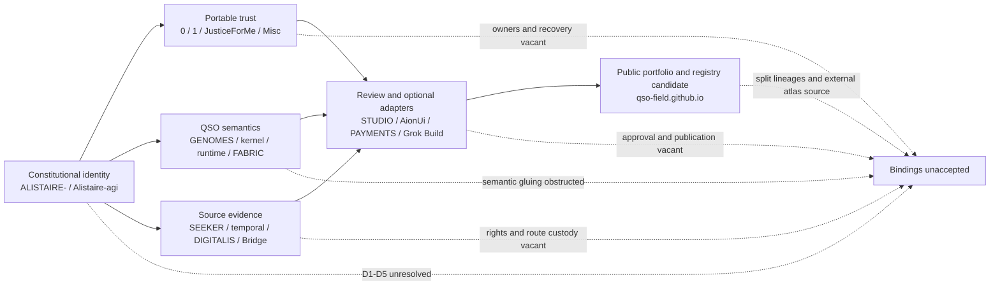

# Portfolio authority currentness review

Status: `PORTFOLIO_AUTHORITY_CURRENTNESS_RECONCILED_CONFLICTS_DISSENT_AND_VACANCIES_RECORDED_BINDINGS_UNACCEPTED`

Authority effect: `NONE`

## Purpose

This review reconciles the portfolio contract and authority matrix against the most developed current documentation or governance surface located for each of the nineteen owned repositories. It records exact candidate identities, overlapping lineages, stale metadata, merge conflicts, missing validation, semantic and route-owner vacancies, and the decisions still required before components can compose.

The review is documentation and governance evidence only. A repository name, branch, pull request, workflow, fixture, digest, signature, rendered page, successful test, or mergeability result does not appoint an owner, accept a contract, establish compatibility, authorize a runtime, issue a capability, approve money movement, publish Pages, release software, or deploy infrastructure.

The machine-readable companion is [`portfolio-authority-currentness-v1.json`](portfolio-authority-currentness-v1.json).

## Review method

For each repository, the review selected the most developed current documentation or governance surface available on July 24, 2026. A selected surface is a **review source**, not an accepted source. The review then checked:

1. exact repository and candidate identity;
2. whether the source is a default head, open candidate, conflicting candidate, or one of several active lineages;
3. whether the pull-request body still identifies its actual head;
4. the narrow responsibility and explicit non-authorities claimed by the repository-local material;
5. conflicts with other local or portfolio claims;
6. semantic-owner and route-owner status;
7. correction, withdrawal, migration, rollback, and resulting-state requirements.

Where evidence was missing or contradictory, the result remains `UNKNOWN`, `BLOCKED`, or explicitly unsupported. No inference is promoted to acceptance.

## Portfolio corridors

### Prose equivalent

The charter identity corridor feeds three bounded corridors: portable trust, QSO semantics, and source evidence. Those corridors may provide records to review surfaces and optional adapters. The public portfolio repository may document the system and hold registry candidates, but it is not a live registry or authority service. Every corridor currently terminates at the same blocked state because D1–D5, semantic ownership, route ownership, canonical representations, correction and revocation, migration, rollback, and independent resulting-state verification remain unaccepted.

## Exact-source register

| Repository | Primary reviewed source | Currentness | Candidate responsibility | Material disposition |
|---|---|---|---|---|
| `aevespers2/ALISTAIRE-` | PR #1 `38213e4e57dd1b03e434cc9cfb0da3c4e0d25477` | current mergeable draft | charter, decisions, matrix, sequencing | D1–D5 remain unaccepted |
| `aevespers2/Alistaire-agi` | PR #4 `9e953992dfefbfa0fd61ce37e955b75f79a8e1d6` | multiple active lineages | identity, migration, compatibility landing | reconcile PR #4, PR #2, and ALISTAIRE- in D1 |
| `aevespers2/0` | PR #13 `60a7b9948682d0c97b2810359aee35111021fdf8` | current candidate with conflict | portable bootstrap, observation, proposal, verification | reconcile current `main` and competing product/security lineages |
| `aevespers2/1` | PR #2 `47b58fa49c8dda7f44234dab68f78673bb02d269` | multiple active lineages | quarantine, capability, disposition, revocation, recovery | D4 authority and custody decision required |
| `aevespers2/JusticeForMe` | PR #5 `aa530d2747275a89995679c63056141e57e9bcf6` | current candidate with conflict | read-only Linux observation | reconcile `main`; decide standalone, adapter, dual role, or retirement |
| `aevespers2/Misc` | PR #2 `5e4229641faac822868673127d305554a269d28a` | current mergeable draft | incubation and PhantomBlock observation research | select promotion, consolidation, or retirement |
| `aevespers2/QSO-GENOMES` | PR #15 `c29bd681bab680e467903784527776d284469a3d` | multiple active lineages | declarative identity, policy, lineage, compatibility | reconcile PRs #2, #12, #13, and #15 |
| `aevespers2/qsio-kernel` | PR #1 `980e981952fd1c2c7c5b4a30b8e30664dcc6f6bc` | current mergeable draft | reference conformance and replay comparison | preserve unsupported kernel/runtime route |
| `aevespers2/QuantumStateObjects` | PR #12 `cc9b9c7b06a1a48bbc052b8d6bacd11782285288` | multiple active lineages | runtime admission, lifecycle, local evidence | reconcile PRs #7, #10, and #12; resolve Fabric collision |
| `aevespers2/QSO-FABRIC` | PR #20 `40434e3e2694d0bd772289264061e4de34d899ee` | multiple active lineages | composition, orchestration, format, conversion, aggregate evidence | reconcile PRs #20, #21, and #23 before interface selection |
| `aevespers2/QSO-SEEKER` | PR #14 actual head `3a4db281d9900d58066af602a807a2d16b2acf69` | declared-head mismatch | source, sanitizer, provenance, rights/privacy, handoff | correct body claim `1038a349…`; revalidate actual head |
| `aevespers2/datarepo-temporal-invariants` | PR #1 `5417295e5e9231d39e878ba68729d26c89ed7e55` | overlapping unvalidated candidates | temporal assessment, replay, state/evidence separation | restore Actions; disposition PR #2; reconcile PRs #1/#3 |
| `aevespers2/QSO-DIGITALIS` | PR #6 `fa2a4e842a4a9ddecbaad7ebc9bb995e5031e213` | current mergeable draft | interpretation, policy projection, retirement decision | human approve, revise, split, or retire decision required |
| `aevespers2/Bridge` | PR #22 `644a5f45f7ee41adbba4578bb364b04a24245206` | current mergeable draft | domain evidence, transport, receipts, publication review | decide parcel-domain versus reusable-transport role |
| `aevespers2/QSO-STUDIO` | `main@652463f6066bf67877c5a7f1fc59e01172bda286` | current default documentation | review, comparison, annotation, accessibility evidence | merged documentation does not approve product or review authority |
| `aevespers2/AionUi` | PR #1 `ea90ee294a0c2c5985dff187cf5482113ddaff88` | current mergeable draft | optional host shell and read-only console | approve fork, modes, adapter, security, and accessibility ownership |
| `aevespers2/QSO-PAYMENTS` | PR #1 `46e4a5bb1ca6f61d3024b818ac73b3c539755bc0` | current mergeable draft | intent, simulation, evidence, authorization review | independent financial authority remains vacant |
| `aevespers2/grok-build-alistaire` | PR #1 `de42b047af506b31944d89622034e667636407e7` | current mergeable draft | optional bounded engineering shell | fork, provider, workspace/device, release, and recovery owners vacant |
| `aevespers2/qso-field.github.io` | PR #23 `198dd81a4fd55c777cebcc51ab3973f94d9469fa` | multiple active lineages | public portfolio, FYSA-120 map, adoption and registry candidates | reconcile PRs #23/#24; bind exact atlas custody |

The JSON profile carries the full responsibility, non-authority, conflict, vacancy, and required-disposition record for every row.

## Material currentness findings

### 1. Stale exact-head claim in QSO-SEEKER

QSO-SEEKER PR #14 currently resolves to head `3a4db281d9900d58066af602a807a2d16b2acf69`, while its body presents `1038a3497712fc270195adcaed05b4cc1c9696eb` as the exact submitted head and binds workflow evidence to that earlier generation. The earlier evidence remains valid for its own head only. The current candidate must correct its status record and obtain fresh exact-head evidence before it can be treated as current.

### 2. Non-mergeable primary documentation candidates

Repository `0` PR #13 and JusticeForMe PR #5 are currently reported as non-mergeable. Their documentation remains useful lineage evidence, but neither can serve as a current integration source until its base and conflicts are reconciled without discarding reviewed history.

### 3. Missing validation route in the temporal repository

`datarepo-temporal-invariants` has three related candidates. PR #2 is the narrower least-privilege validation bootstrap; PR #1 overlaps it on four paths; PR #3 is stacked on PR #1. GitHub has not produced an accepted pull-request Actions run for the relevant exact heads. The integrity incident and workflow-execution problem therefore block all three from integration.

### 4. Multiple active lineages

The following repositories require preservation-safe lineage disposition rather than a simple “latest PR wins” rule:

- `Alistaire-agi`: identity/front-door and migration/consolidation candidates;
- Repository `1`: documentation/conformance and executable security candidates;
- `QSO-GENOMES`: genome, identity-retirement, reconciliation, and documentation candidates;
- `QuantumStateObjects`: runtime/configuration, preflight, and documentation/interface candidates;
- `QSO-FABRIC`: reconciliation, interface producer, and constitutional-field candidates;
- `qso-field.github.io`: Wave 37 capability map and interface/adoption governance candidates.

Each lineage must be classified as current, historical, superseded, withdrawn, blocked, unsupported, or preserved for extraction. A classification does not accept its architecture.

### 5. Structural conflict is not verified human dissent

This review located contradictory candidate claims, overlapping responsibilities, stale metadata, base conflicts, and ownership vacancies. It did **not** locate an exact, attributable human review record that should be represented as dissent in this currentness packet. The correct status is:

`NO_VERIFIED_HUMAN_DISSENT_LOCATED_IN_REVIEWED_CURRENTNESS_SNAPSHOT`

Future dissent must retain repository, pull request or issue, exact head, reviewer identity and role, statement, scope, timestamp, resolution state, and correction or withdrawal linkage. Absence of recorded dissent is not approval or consensus.

## Authority and route vacancies (V1–V10)

| Vacancy | Missing accountable function | Blocking effect |
|---|---|---|
| V1 | canonical charter and repository identity owner | D1 cannot close |
| V2 | neutral contract, schema, namespace, fixture, and compatibility steward | no component can safely define the contract granting its own authority |
| V3 | canonical bytes, digest domains, identity primitives, time, replay, and extension owner | cross-language and cross-repository identity remains ambiguous |
| V4 | independent issuer, approver, revoker, key custodian, disposition, and recovery authority | Repository `1` cannot activate |
| V5 | incident commander, evidence custodian, freeze, restart, rollback, invalidation, and claim-withdrawal owners | D5 and safe recovery remain blocked |
| V6 | runtime event and execution-report semantic owners | runtime records cannot be accepted or projected |
| V7 | Fabric projection, collaboration-event, aggregate-report, and route owner | runtime/Fabric composition remains discontinuous |
| V8 | source-rights, privacy, retention, correction, deletion, legal-hold, and publication owners | source-evidence route cannot publish or retain operationally |
| V9 | review-contract, accessibility-certification, and independent approval owners | interfaces cannot create approval or certification |
| V10 | financial and engineering adapter authorization, revocation, incident, and recovery owners | optional high-consequence adapters remain disabled |

A vacancy may be explicitly accepted as a blocking state. It may not be silently filled by the repository implementing or documenting the affected feature.

## Obstruction and gluing analysis

The reviewed portfolio does not form a path-independent composition. The highest-impact obstructions are:

1. constitutional identity bifurcation;
2. multiple active lineages without accepted precedence;
3. exact-head claims that differ from current PR metadata;
4. non-mergeable or unvalidated documentation sources;
5. semantic and route-owner vacancies;
6. runtime-local and Fabric-level record-role collision;
7. unsupported kernel-to-runtime mapping;
8. absent source-rights, privacy, retention, and publication custody;
9. ambiguous review, financial, and engineering authorization;
10. incomplete correction, revocation, migration, rollback, and independently verified restoration.

In the portfolio’s topological analogy, each repository is a local section and each accepted contract is an overlap map. This review records local sections and candidate overlaps, but several overlaps have no accepted map and several cycles depend on unappointed owners. Pairwise fixture agreement therefore cannot close the route or establish global authority.

## Required review sequence

1. Correct stale source identities and obtain exact-head evidence for the actual candidates.
2. Preserve and classify all sibling lineages; never erase uniquely useful lineage to simplify the graph.
3. Record verified human dissent separately from structural contradictions.
4. Complete D1–D5 and accept accountable owners or explicit vacancies.
5. Select qualified record families, namespaces, canonical bytes, identities, source sets, receipts, ordering, replay, correction, revocation, privacy, retention, migration, rollback, and restoration rules.
6. Run independently authored pairwise and triple-overlap fixtures at immutable heads.
7. Verify resulting repository state and rollback without activating implementation or privileged authority through documentation alone.

## Onboarding for maintainers and reviewers

A maintainer updating this packet should:

1. fetch the repository’s current default head and every materially active candidate;
2. compare the actual PR head with any exact head stated in its body;
3. preserve earlier heads as historical evidence rather than rewriting them as current;
4. classify overlapping lineages and record why each is retained, superseded, withdrawn, blocked, or unsupported;
5. identify the narrow repository responsibility and every explicit non-authority;
6. record semantic owners, route owners, correction authorities, revokers, incident owners, recovery owners, or vacancies;
7. update the JSON profile, this guide, planning documents, validator fixtures, and changelog together;
8. run strict documentation construction and hostile regressions at the exact head;
9. retain evidence on success and failure;
10. require explicit human decisions for ownership, acceptance, publication, release, deployment, credentials, payments, and infrastructure.

## Accessibility and information architecture

The diagram has a prose equivalent, color is not the sole state carrier, exact states are written as text, and every table names both the observed condition and required disposition. Reviewers must test the rendered artifact for keyboard navigation, visible focus, heading structure, table comprehension, 200% and 400% zoom/reflow, contrast, reduced motion, screen-reader reading order, and cognitive comprehension. Automated construction does not certify accessibility.

## FYSA-120 capability map

This work selects and applies:

- **CAT-011-B/E** for accessible diagrams and text/diagram equivalence;
- **CAT-012-A/B/D/E** for information architecture, technical decision writing, documentation testing, terminology, and lifecycle alignment;
- **CAT-013-A/C/D/E** for temporal graph modeling, exact identity resolution, path and contradiction analysis, and incremental graph integrity;
- **CAT-017-A/C/D/E** for source resolution, derivation chains, version-substitution detection, evidence packaging, and correction propagation;
- **CAT-018-B/D/E** for responsibility mapping, reviewer handoff, retention, and contested-history preservation;
- **CAT-019-B/C/D** for plain language, cross-modal accessibility, uncertainty, and risk communication;
- **CAT-031-A/D/E** for closed validation requirements, hostile regressions, and assurance maintenance;
- **CAT-040-A/B/D/E** for system archaeology, lineage risk, compatibility, migration, and rollback;
- **CAT-054-B/D/E** for workflow and supply-chain integrity; and
- **CAT-064-B/E** for evidence-chain integrity and attestation review.

The FYSA-120 source remains `external_unbound` in the Wave 37 capability map. Skill selection and artifact validation do not establish competence, appointment, ownership, permission, acceptance, or authority.

Proposed non-authoritative subdivision:

**`013-I — Cross-repository authority-currentness, conflict, dissent, and vacancy reconciliation`**

## Change control and rollback

Any change must record the affected repositories, old and new exact source tuples, currentness classification, conflict and dissent effect, owner or vacancy effect, correction and withdrawal route, migration and rollback consequence, and evidence status. If the packet is wrong, revert or supersede this generation while preserving its source and validation evidence. Rollback must not appoint an owner, select a namespace, activate a route, publish Pages, issue credentials or capabilities, execute a payment, release software, deploy infrastructure, or rewrite history.

## Approval status

This packet is a review-complete currentness inventory with unaccepted bindings. It substantially improves portfolio documentation and graph clarity, but it does not resolve the architectural decisions it exposes. The portfolio authority matrix, D1–D5, record-family ownership, route ownership, canonical representation, live registration, correction and revocation, migration, rollback, publication, and operational authority remain blocked.
