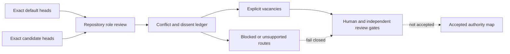

# Portfolio authority-source reconciliation

Status: `PORTFOLIO_AUTHORITY_SOURCES_RECONCILED_CONFLICTS_DISSENT_AND_VACANCIES_RECORDED_BINDINGS_UNACCEPTED`  
Authority effect: `NONE`  
Observed: `2026-07-24`

## Purpose

This review reconciles the [portfolio authority matrix](portfolio-contract-authority-matrix.md) against exact default heads and identified current candidate heads for all nineteen owned repositories. It records conflicting lineages, evidence-currentness gaps, explicit vacancies, and unresolved alternatives without choosing an owner or architecture.

The exact tuples are preserved in [the machine-readable profile](portfolio-authority-source-reconciliation-v1.json). A repository name, candidate document, signature, fixture, successful workflow, mergeability, or public visibility is evidence of a proposal—not authority.

## Source graph

**Prose equivalent.** Default and candidate heads remain distinct evidence classes. Both feed a repository-role review. Conflicts and dissent are recorded before vacancies can be filled. Human decisions and independent review are still required; blocked routes remain fail-closed rather than being inferred as compatible.

## Repository snapshot

| Repository | Default head | Candidate heads | Current conflict or limitation |
|---|---|---|---|
| `aevespers2/0` | `476953e3016d…` | none identified | `NO_OPEN_AUTHORITY_CANDIDATE_OBSERVED` |
| `aevespers2/1` | `6685872ceafd…` | PR #2 `47b58fa49c8d…` | `D4_AUTHORITY_AND_RECOVERY_ROLE_UNAPPROVED` |
| `aevespers2/AionUi` | `66b89879a0ef…` | PR #1 `ea90ee294a0c…` | `DISPLAY_REVIEW_AND_APPROVAL_BOUNDARIES_UNACCEPTED` |
| `aevespers2/ALISTAIRE-` | `7adbbf963616…` | PR #1 `38213e4e57dd…` | `D1_CANONICAL_IDENTITY_UNRESOLVED` |
| `aevespers2/Alistaire-agi` | `504222dbecb1…` | PR #2 `0ede0c6a796f…`; PR #4 `9e953992dfef…` | `MULTIPLE_DOCUMENTATION_LINEAGES_AND_D1_IDENTITY_CONFLICT` |
| `aevespers2/Bridge` | `12616ad0e2f0…` | PR #22 `644a5f45f7ee…` | `DOMAIN_PRODUCT_VERSUS_REUSABLE_TRANSPORT_ROLE_UNRESOLVED` |
| `aevespers2/datarepo-temporal-invariants` | `5d549f1082d4…` | PR #1 `5417295e5e92…`; PR #2 `74c40d723e1f…`; PR #3 `023fc1c753e1…` | `SOURCE_PRECEDENCE_ACTIONS_EXECUTION_AND_INTEGRITY_INCIDENT_BLOCKED` |
| `aevespers2/grok-build-alistaire` | `ba76b0a683fa…` | PR #1 `de42b047af50…` | `FORK_PROVENANCE_AND_ENGINEERING_AUTHORITY_UNAPPROVED` |
| `aevespers2/JusticeForMe` | `d286fc874394…` | none identified | `NO_OPEN_AUTHORITY_CANDIDATE_OBSERVED` |
| `aevespers2/Misc` | `b565920c6a92…` | none identified | `INCUBATION_ROLE_ONLY_NO_PORTFOLIO_AUTHORITY` |
| `aevespers2/qsio-kernel` | `6468254d7703…` | PR #1 `980e981952fd…` | `KERNEL_TO_RUNTIME_ROUTE_EXPLICITLY_UNSUPPORTED` |
| `aevespers2/QSO-DIGITALIS` | `3d127a327fef…` | PR #6 `fa2a4e842a4a…` | `CHARTER_DISPOSITION_AND_RUNTIME_FABRIC_ROLE_COLLISION_UNRESOLVED` |
| `aevespers2/QSO-FABRIC` | `bd0ac7af3b34…` | PR #21 `25036a5cfcea…`; PR #23 `765b5caeda4c…` | `LEGACY_LABEL_SEMANTIC_COLLISION_AND_MULTIPLE_RUNTIME_LINEAGES` |
| `aevespers2/qso-field.github.io` | `2d7adf88ce84…` | PR #23 `198dd81a4fd5…`; PR #24 `a56b1fa93f15…` | `PUBLIC_REGISTRY_CUSTODY_AND_CANDIDATE_RECONCILIATION_UNRESOLVED` |
| `aevespers2/QSO-GENOMES` | `f61bb271f46c…` | PR #15 `c29bd681bab6…` | `CANDIDATE_ANCESTRY_AND_IDENTITY_MIGRATION_RECONCILIATION_REQUIRED` |
| `aevespers2/QSO-PAYMENTS` | `8ab3b97b44fc…` | PR #1 `46e4a5bb1ca6…` | `FINANCIAL_AUTHORIZATION_AND_TECHNICAL_CAPABILITY_OWNERSHIP_VACANT` |
| `aevespers2/QSO-SEEKER` | `01b08e61edd7…` | PR #14 `49e7ff008b04…` | `SOURCE_RIGHTS_PRIVACY_RETENTION_AND_PUBLICATION_OWNERS_UNNAMED` |
| `aevespers2/QSO-STUDIO` | `652463f6066b…` | none identified | `REVIEW_DISPLAY_IS_NOT_APPROVAL` |
| `aevespers2/QuantumStateObjects` | `40efcbf8ce2b…` | PR #10 `e993e9f9a062…`; PR #12 `cc9b9c7b06a1…` | `RUNTIME_LINEAGES_AND_RUNTIME_FABRIC_SEMANTIC_ROLE_COLLISION` |

Snapshot rules:

- exact heads are generation-specific;
- candidate roles do not create accepted ownership;
- a moved head, base, body, workflow, or artifact claim requires rebinding;
- no candidate means only that no open authority candidate was identified in the reviewed surface;
- the snapshot is not a live registry and must be replaced, not silently edited, when sources move.

## Material conflicts

| Conflict | Finding | Required disposition |
|---|---|---|
| `IDENTITY_ALISTAIRE_DUAL_REPOSITORY` | `ALISTAIRE-` and `Alistaire-agi` retain overlapping charter, package, compatibility, and public-identity claims. | D1 selects one canonical source or a genuinely non-overlapping split with migration, provenance, license, notice, dissent, and rollback. |
| `RUNTIME_FABRIC_LEGACY_LABEL_COLLISION` | Runtime-local and Fabric-level records reuse `qso-event-ledger` and `qso-runtime-report`. | Accept qualified semantic classes or a mandatory producer/class envelope; preserve source sets, correction, revocation, migration, and rollback. |
| `KERNEL_RUNTIME_UNSUPPORTED_CROSSWALK` | Kernel records combine requests, states, transitions, witnesses, outcomes, time, and hashes that cannot be losslessly aliased to runtime events. | Keep `UNSUPPORTED_KERNEL_RUNTIME_ROUTE` or approve a loss-accounted projection or neutral envelope after D1–D4. |
| `REPOSITORY_1_AUTHORITY_VACANCY` | Repository `1` is a candidate authority surface without an accepted charter, root, quorum, issuer, revoker, incident, or recovery owner. | Complete D4 and independent recovery verification. |
| `SOURCE_EVIDENCE_ROUTE_OWNERSHIP` | Source rights, clocks, interpretation, transport, disposition, retention, correction, and publication are split but unaccepted. | Assign narrow owners and pass source-to-disposition overlap, privacy, correction, migration, and rollback fixtures. |
| `REVIEW_DISPLAY_APPROVAL_SEPARATION` | Rendering, annotation, interface state, and accessibility evidence can be mistaken for approval. | Accept a read-only review contract and separately bind approval, correction, accessibility, publication, and revocation. |
| `FINANCIAL_AUTHORIZATION_TECHNICAL_CAPABILITY_SEPARATION` | Financial approval, technical capability, adapter execution, reconciliation, and final disposition lack independent owners. | Name an independent financial authorizer and require both financial approval and narrow technical capability. |
| `PUBLIC_REGISTRY_CUSTODY` | Public Pages, contract candidates, FYSA maps, and registry-like indexes lack accepted neutral custody. | Complete D2 custody, exact-source, publication, correction, withdrawal, and rollback controls. |
| `TEMPORAL_REPOSITORY_SOURCE_PRECEDENCE` | Three datarepo candidates overlap, Actions evidence is absent, and an integrity incident remains open. | Disposition the validation bootstrap, restore exact-head evidence, reconcile candidates, and close the incident independently. |
| `CANDIDATE_CURRENTNESS_AND_RESULTING_HEAD_EVIDENCE` | Candidate heads, bodies, bases, and evidence can diverge after focused merges or default movement. | Rebind current and resulting heads, retain historical evidence, and fail closed on stale claims. |

## Gluing and obstruction analysis

Local consistency does not make the portfolio composable. The review identifies:

1. overlapping identity claims without an accepted quotient or migration map;
2. authority-cycle risk where a component could appear to define the contract authorizing itself;
3. route bifurcation across identity, temporal validation, interface compatibility, registry custody, and runtime composition;
4. missing producer outputs for canonical bytes, ownership, registration, correction, revocation, and rollback;
5. lossy projections among kernel, runtime, Fabric, review, transport, financial, and disposition records;
6. missing triple-overlap witnesses for runtime→Fabric→Repository `1`, source→interpretation/temporal→transport, review→approval→publication, and financial authorization→capability→adapter;
7. currentness failures when focused evidence is promoted to a moved candidate or resulting head.

These are engineering obstruction findings, not a claim of a completed formal homology or cohomology computation.

## Explicit vacancies

The profile records `EXPLICIT_VACANCY` with authority effect `NONE` for:

- D1 canonical identity ownership;
- D2 neutral contract stewardship;
- D3 canonical representation custody;
- D4 independent capability, disposition, revocation, and recovery authority;
- D5 incident command;
- runtime/Fabric semantic and route ownership;
- source-rights, privacy, retention, deletion/legal-hold, consumer, and publication ownership;
- review accessibility, correction, and cached-view invalidation;
- independent financial authorization;
- publication and registry custody.

No repository is silently assigned to a vacancy. Appointment, recusal, dissent, correction, appeal, removal, continuity, and rollback remain separate reviewable records.

## Preserved dissent

Unselected alternatives remain recorded for:

- `ALISTAIRE-` canonical, `Alistaire-agi` canonical, or an explicit role split;
- distinct runtime/Fabric namespaces, a producer/class envelope, or rejection of the shared-name design;
- unsupported kernel/runtime route, read-only projection, or neutral envelope; direct aliasing remains rejected;
- datarepo validation-bootstrap precedence, replacement, or continued block;
- reconciliation of QSO Field PRs #23 and #24;
- approval, revision/split, or retirement of QSO-DIGITALIS.

`UNSUPPORTED_KERNEL_RUNTIME_ROUTE` is an interim safety default, not final architecture acceptance.

## Review and rollback

Reviewers must re-fetch all tuples, reconcile or withdraw multiple lineages, compare repository-local roles and non-roles, preserve dissent, resolve D1–D5, appoint owners or formally accept bounded vacancies, accept canonical identities and representations, run independent overlap fixtures, complete security/privacy/accessibility/license/retention/incident review, and verify resulting state before approval.

A later generation must replace this snapshot and identify moved sources, invalidated claims, new conflicts, owner changes, migration, consumer rebinding, rollback, and failed-rollback handling. Rollback restores the preceding reviewed documentation state, preserves this packet as historical evidence, invalidates derived currentness claims, and leaves all operational authority disabled.

## FYSA-120 mapping

Applied:

- `CAT-011` for accessible graph and prose equivalence;
- `CAT-012` for information architecture, decision writing, quality controls, and lifecycle synchronization;
- `CAT-013` for graph modeling, source resolution, path analysis, contradiction detection, and provenance integrity;
- `CAT-017` for exact-source identity, lineage, stale-substitution detection, preservation, and correction;
- `CAT-018` for responsibility mapping, onboarding, rationale, and contested history;
- `CAT-019` for accessible risk and authority-state communication;
- `CAT-031`, `CAT-032`, `CAT-040`, `CAT-052`, `CAT-059`, and `CAT-070` for fail-closed validation, distributed composition, migration/rollback, least privilege, attestation, and constitutional review.

Proposed non-authoritative subdivision:

**`013-I — Multi-candidate authority-source reconciliation, dissent preservation, and vacancy closure`**

Taxonomy selection establishes neither competence nor authority.

## Approval status

The reconciliation is complete as a documentation snapshot, but every binding remains unaccepted. D1–D5, exact source precedence, owners or accepted vacancies, canonical representations, independent fixtures and review, migration, rollback, restored-state evidence, and explicit human approval remain required.
