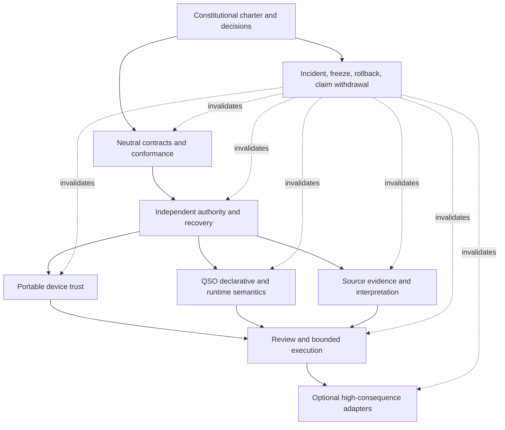

# Portfolio Contract and Authority Matrix

## Purpose

This matrix is the constitutional index for how the A.L.I.S.T.A.I.R.E. repositories are intended to compose. It records, in one place:

- the narrow responsibility of each repository;
- the records each repository may produce or consume;
- the authority each repository explicitly does **not** possess;
- the pairwise contracts required at repository boundaries;
- the triple-overlap witnesses required when three components must agree;
- the obstruction classes that prevent safe gluing;
- the evidence required before a proposed relationship can be treated as accepted.

The matrix is documentation and governance evidence only. It does not create a package, registry, service, credential, capability, device enrollment, runtime admission, payment authority, repository-write permission, release, publication, or deployment.

## Evidence vocabulary

| State | Meaning |
|---|---|
| `OBSERVED` | Present in a repository, branch, pull request, workflow, artifact, or retained document |
| `PROPOSED` | Designed or recommended but not accepted as canonical |
| `REVIEW` | Substantive candidate exists and is ready for explicit review |
| `ACCEPTED` | Approved at an immutable commit by the required authority |
| `VALIDATED` | Required deterministic and adversarial fixtures passed against exact versions |
| `ACTIVE` | An accepted, validated capability is operational under current authorization |
| `FROZEN` | Promotion and consequential use are suspended pending recovery |
| `WITHDRAWN` | A prior proposal or claim is no longer valid; evidence remains preserved |
| `UNKNOWN` | Evidence is missing, inaccessible, unsupported, stale, or contradictory |

A later state never follows merely from dependency installation, successful execution, rendering, transport, signature presence, interface interaction, or publication.

## Constitutional planes

The arrows express dependency, not command authority. A downstream repository cannot define or retroactively satisfy the upstream contract that grants its own authority.

## Repository responsibility matrix

| Repository or surface | Candidate responsibility | May produce | Must not become |
|---|---|---|---|
| `ALISTAIRE-` | Constitutional charter, product scope, governance hierarchy, authority boundaries, decision records, acceptance gates | Charter decisions, governance records, responsibility maps, acceptance criteria | Runtime, capability issuer, credential holder, device agent, payment authority, deployment service |
| `Alistaire-agi` | Compatibility and migration surface preserving package-name, taxonomy, and historical material until D1 disposition | Compatibility notice, migration manifest, redirect/archive evidence | Competing charter authority or independent product identity without D1 approval |
| `qso-field.github.io` | Public portfolio map, proposed neutral-contract documentation, acceptance sequencing, publication evidence | Public documentation snapshots, navigation, non-sensitive registry candidates | Live registry, authority service, secret store, operational control plane |
| Repository `0` | Portable bootstrap and autonomous-development proposal plane; observation orchestration, planning, isolated execution, verification | Inventories, proposals, bounded execution requests, verification evidence | Capability issuer, canonical-state owner, financial approver, merge/release/deployment authority |
| Repository `1` or successor | Independent quarantine, capability, disposition, revocation, checkpoint, reconciliation, and recovery authority | Admissions, denials, capabilities, revocations, dispositions, checkpoints | Requester-controlled service, generic financial approver, runtime, interface, public secret store |
| `JusticeForMe` | Candidate read-only Linux host-observation adapter | Linux observation records and artifact evidence | Remediation agent, capability issuer, canonical security authority |
| `Misc/phantomblock` | Candidate modular host-observation adapter and research source | Host observations under a declared profile | Duplicate authority, silent corroboration, remediation agent |
| `QSO-GENOMES` | Declarative QSO identity, lineage, immutable policy, compatibility, projection rules | Genome revisions, manifests, lineage, policy commitments, projections | Runtime admission authority, capability issuer, canonical operational state |
| `QuantumStateObjects` | Bounded runtime admission, lifecycle execution, resource enforcement, local evidence | Runtime admissions, attempts, receipts, resulting-state evidence | Contract steward, capability issuer, canonical disposition authority |
| `QSO-FABRIC` | Bounded multi-QSO composition, experiment orchestration, contradiction evidence | Experiment plans, participant sets, checkpoints, experiment receipts | Portfolio governance, general runtime authority, canonical acceptance |
| `qsio-kernel` | Candidate reference-conformance implementation for neutral fixtures | Conformance results, deterministic replay comparisons | Second independent canonical runtime or authority root |
| `QSO-SEEKER` | Source acquisition boundary, sanitization, attribution, provenance, canonical source records | Source observations, lineage, license and correction references | Truth authority, temporal authority, transport authority, canonical disposition service |
| `datarepo-temporal-invariants` | Candidate temporal assessment, ordering, freshness, replay, and operational-state/evidence separation | Temporal assessments, ordering and replay decisions | Subject-identity owner, source authority, generic capability issuer |
| `QSO-DIGITALIS` | Candidate non-executing interpretation and policy-projection layer | Interpretations, transformations, policy projections | Source authority, transport authority, runtime, canonical disposition service |
| `Bridge` | Domain product plus candidate bounded evidence-transport profile | Transport artifacts, delivery receipts, declared transformations | Truth authority, approval authority, canonical acceptance, generic contract owner by implication |
| `QSO-STUDIO` | Candidate domain-neutral review, comparison, annotation, and accessibility contract | Review views, annotations, comparisons, exports | Approval authority, capability issuer, canonical-state owner |
| `AionUi` | Optional desktop/WebUI host shell for compatible review adapters; public read-only Pages console | Interface sessions, non-authoritative annotations and exports | Approval source, secret-bearing public client, runtime or device authority |
| `QSO-PAYMENTS` | Financial intent, policy, simulation, and evidence boundary | Payment intents, authorization references, financial receipts | Financial approver by default, credential custodian, device-trust authority |
| `grok-build-alistaire` | Optional bounded engineering shell and execution adapter | Engineering proposals, change bundles, execution receipts | Merge, release, signing, deployment, or portfolio authority |

## Canonical record identity catalog

Every record family has its own identity. Reusing one identifier across distinct families is an obstruction unless an explicit, lossless mapping is accepted and tested.

| Record family | Candidate semantic owner | Required bindings | Explicit non-equivalence |
|---|---|---|---|
| `CharterDecision` | `ALISTAIRE-` | decision ID, scope, exact commit, approver, status, supersession, rollback | Not a capability or runtime admission |
| `ContractProfile` | D2 neutral steward | namespace, version, canonical bytes, owner, fixtures, status | Not operational authority |
| `DeviceIdentity` | D4 authority plus approved enrollment owner | hardware/platform claim, ownership scope, enrollment generation, status | Not a user identity or workspace identity |
| `WorkspaceIdentity` | Repository `0`/D4 contract | repository, base, expected head, path scope, environment | Not device ownership or merge authority |
| `Observation` | Approved adapter profile | producer, subject/device, time basis, completion, artifacts, privacy | Not truth, compliance, or remediation permission |
| `TemporalAssessment` | Approved temporal profile | observation IDs, clock model, freshness, replay domain, ordering | Not source evidence or canonical disposition |
| `Interpretation` | Approved Digitalis/neutral profile | source and temporal inputs, transformation, vocabulary, loss statement | Not raw observation or transport receipt |
| `Proposal` | Repository `0` or approved requester | exact inputs, requested effect, expected state, rollback, evidence | Not capability or approval |
| `QuarantineAdmission` | Repository `1` | proposal identity, schema validation, subject bindings, status | Not acceptance or execution |
| `Capability` | Repository `1` or approved issuer | requester, executor, subject, operation, resources, expiry, revoker | Not financial approval or canonical result |
| `GenomeRevision` | QSO-GENOMES | lineage, policy, compatibility, canonical artifact hash | Not runtime instance or operational admission |
| `RuntimeAdmission` | QuantumStateObjects under D4 policy | capability, genome, runtime head, configuration, resources | Not execution receipt or canonical disposition |
| `ExperimentAdmission` | QSO-FABRIC under accepted profile | participants, runtime admissions, experiment scope, resources | Not portfolio approval |
| `TransportArtifact` | Bridge/neutral transport profile | source artifact, transformation declaration, digest, destination | Not source truth or delivery receipt |
| `DeliveryReceipt` | Transport endpoint profile | artifact identity, destination, time, outcome, replay state | Not canonical acceptance |
| `ExecutionAttempt` | Approved executor | capability, exact pre-state, commands/adapter methods, environment | Not a successful receipt by definition |
| `ExecutionReceipt` | Approved executor and verifier | attempt, actual effects, post-state evidence, failures, rollback state | Not canonical reconciliation |
| `CanonicalDisposition` | Repository `1` or successor | evidence set, decision, reason codes, supersession, correction links | Not the same as execution success |
| `ReviewAnnotation` | QSO-STUDIO/AionUi profile | reviewer identity, role, target record, statement, privacy, expiry | Not approval unless separately referenced by an approval record |
| `FinancialIntent` | QSO-PAYMENTS | requester, beneficiary, amount, currency, environment, purpose | Not financial authorization or technical capability |
| `FinancialAuthorization` | Independent financial authority | intent, approver, limits, expiry, revocation, finality policy | Not Repository `1` capability |
| `EngineeringTask` | Repository `0` or approved engineering planner | workspace, source head, allowed paths, tools, expected result | Not merge, release, signing, or deployment authority |
| `Correction` | Record-family owner plus D4 policy | target, replacement or qualification, reason, effective time | Does not erase original evidence |
| `Revocation` | Authorized revoker | target authority or identity, scope, time, reason, propagation | Not deletion and not proof of remote enforcement |
| `RecoveryCheckpoint` | D4 recovery authority | accepted state, evidence hashes, restore prerequisites, quorum | Not automatic permission to resume |
| `PublicationSnapshot` | Approved publication owner | accepted source commits, redactions, licenses, artifact digest, rollback | Not canonical operational state |

## Pairwise contract edges

| Edge | Required contract | Minimum witness |
|---|---|---|
| `ALISTAIRE- ↔ Alistaire-agi` | D1 identity, migration, compatibility, provenance, rollback | Complete history manifest and reversible compatibility landing |
| `ALISTAIRE- ↔ neutral steward` | Constitutional delegation and non-authority boundary | Steward cannot issue capability or approve its own operational use |
| `neutral steward ↔ Repository 1` | Canonical profile and capability-schema consumption | Unsupported, withdrawn, or ambiguous versions fail closed |
| `JusticeForMe/PhantomBlock ↔ Repository 0` | Observation vocabulary, completion, provenance, privacy, conflict | Duplicate and conflicting observations do not inflate confidence |
| `Repository 0 ↔ Repository 1` | Proposal envelope, quarantine, capability, receipt, reconciliation | Wrong device/workspace/head, stale, replayed, broadened, revoked requests fail |
| `QSO-GENOMES ↔ QuantumStateObjects` | Declarative validation and runtime projection | Valid genome cannot self-admit or silently lose policy |
| `QuantumStateObjects ↔ QSO-FABRIC` | Participant admission, lifecycle, resource and evidence contract | Local success cannot become experiment or canonical success automatically |
| `neutral steward ↔ qsio-kernel` | Fixture and conformance profile | Two independent implementations produce identical accepted bytes and results |
| `QSO-SEEKER ↔ temporal profile` | Subject, clock, freshness, replay, ordering | Stale, replayed, unsupported-clock, and ambiguous-subject cases fail closed |
| `temporal/Digitalis ↔ Bridge` | Interpretation and transport identity, transformation declaration | Transport cannot erase lineage or privacy classification |
| `Bridge ↔ Repository 1` | Delivery receipt and quarantine/disposition boundary | Delivery success cannot become acceptance |
| `Repository 1 ↔ QSO-STUDIO` | Read-only disposition and correction/revocation review feed | UI cannot create or broaden capability |
| `QSO-STUDIO ↔ AionUi` | Domain-neutral review contract and host-shell adapter | Identical record states render consistently; interface state remains non-authoritative |
| `QSO-PAYMENTS ↔ independent financial authority` | Intent, approval, revocation, finality, dispute | Device or technical authorization cannot substitute for financial approval |
| `Repository 1 ↔ QSO-PAYMENTS executor` | Device/workspace technical capability only | Financial approval and technical capability remain independently revocable |
| `Repository 0/1 ↔ grok-build-alistaire` | Engineering task and bounded execution capability | Documentation task cannot expand into workflow, credential, release, or deployment change |
| `accepted records ↔ publication` | Redaction, license, correction, revocation, claim withdrawal | Revoked or corrected claims invalidate cached and published derivatives |

## Triple-overlap gluing witnesses

Pairwise compatibility is insufficient when three components can agree pairwise but disagree on the combined meaning.

| Triple overlap | Required witness |
|---|---|
| `Adapter → Repository 0 → Repository 1` | One device and observation identity survives proposal and quarantine; duplicate/conflicting evidence remains explicit |
| `Repository 0 → Repository 1 → Executor` | Capability is bound to exact device, workspace, operation, expected state, executor, expiry, and rollback |
| `QSO-GENOMES → QuantumStateObjects → QSO-FABRIC` | Policy and lineage survive runtime projection and experiment composition without authority escalation |
| `Neutral profile → QuantumStateObjects → qsio-kernel` | Runtime and conformance implementation agree on accepted semantics while remaining distinct roles |
| `QSO-SEEKER → Temporal/Digitalis → Bridge` | Source lineage, time uncertainty, transformation, privacy, and correction identity survive transport |
| `Bridge → Repository 1 → QSO-STUDIO/AionUi` | Delivery, disposition, review, correction, and revocation states remain distinct and render consistently |
| `Financial authority → Repository 1 → Payment adapter` | Financial approval and technical device capability are both required and independently revocable |
| `Repository 0 → Repository 1 → Engineering adapter` | Engineering scope cannot broaden into merge, release, signing, deployment, or unrelated repository access |
| `Incident command → Repository 1 → Runtime/adapter` | Freeze and revocation propagate independently of the component being stopped |
| `Correction authority → Review surface → Publication` | Corrected, revoked, or withdrawn claims update caches and public views without destroying original evidence |
| `Lost device → Recovery authority → Replacement device` | Prior enrollment remains revoked; replacement receives a new generation and minimum credentials only |

## Obstruction classes

| ID | Obstruction | Detection signal | Required repair |
|---|---|---|---|
| O1 | Identity collapse | One ID labels source, proposal, capability, execution, receipt, and disposition | Separate record families and explicit mappings |
| O2 | Authority collapse | Requester, executor, verifier, approver, and revoker are the same uncontrolled principal | Separation of duties and independent revocation |
| O3 | State collapse | `PASS`, delivered, rendered, executed, accepted, active, and canonical are treated as synonyms | Accepted state vocabulary and transition fixtures |
| O4 | Contract self-authorization | A component defines the schema or profile that grants its own authority | Neutral steward and independent review |
| O5 | Route bifurcation | Multiple incompatible paths exist for the same edge | Select one canonical route or versioned adapters with fixtures |
| O6 | Serialization mismatch | Repositories hash or sign different byte representations | D3 canonical bytes and cross-language fixtures |
| O7 | Time and replay ambiguity | Clock basis, freshness, ordering, idempotency, or replay domain differs | Accepted temporal profile and adversarial vectors |
| O8 | Privacy downgrade | A transformation, transport, UI, artifact, or publication weakens classification | Monotonic privacy rules and release-blocking checks |
| O9 | Duplicate confidence | Overlapping observations are counted as independent corroboration | Deduplication lineage and conflict semantics |
| O10 | Lossy projection | Genome, observation, interpretation, or receipt fields disappear silently | Declared loss, unsupported mapping, or fail-closed rejection |
| O11 | Correction divergence | Original, corrected, cached, and published states disagree | Correction graph, invalidation, and claim withdrawal |
| O12 | Revocation gap | Capability or identity remains usable downstream after revocation | Revocation propagation and stale-cache fixtures |
| O13 | Recovery circularity | Recovery depends on the compromised component or lost device | Independent root, offline evidence, quorum, least-authority restart |
| O14 | Public/private boundary failure | Secrets, private inventories, keys, or sensitive evidence enter public Pages/artifacts | Classification, redaction, publication manifest, scanning |
| O15 | Rollback without inverse | A change records no usable prior state or failed-rollback behavior | Checkpoint, inverse or compensating action, evidence preservation |
| O16 | Claim exceeds evidence | Documentation or UI implies implemented security, AGI, payment, or deployment capability | Evidence vocabulary, prohibited claims, withdrawal process |

## Homology-like gluing analysis

The portfolio uses a topological analogy to detect integration defects. This is an engineering method, not a claim that a formal homology or cohomology computation has been completed.

Treat:

- each repository as a local section;
- each accepted contract as an overlap map;
- each deterministic fixture as a witness that two or more local sections agree;
- each unresolved cycle, mismatch, or missing witness as an obstruction.

The following tests provide practical obstruction detection:

1. **Edge completeness** — every declared dependency has a versioned input/output contract, owner, status, and negative fixtures.
2. **Cycle detection** — no authority depends on a contract, approval, credential, or recovery root that it creates for itself.
3. **Path independence** — two permitted routes from the same source to the same destination produce equivalent accepted meaning or are explicitly versioned as different.
4. **Triple-overlap consistency** — three repositories agree on shared identities, states, canonical bytes, privacy, correction, and revocation semantics.
5. **Kernel detection** — records or fields with no accepted consumer, owner, migration, or retirement path are marked orphaned rather than silently retained.
6. **Cokernel detection** — a consumer requirement with no producer or accepted mapping is marked unsatisfied rather than inferred.
7. **Boundary preservation** — observation, proposal, authority, execution, receipt, reconciliation, review, and publication remain distinct through every map.
8. **Rollback witness** — each consequential transition has an inverse or compensating path and preserves failed-attempt evidence.
9. **Invalidation propagation** — correction, revocation, compromise, and decision withdrawal invalidate every dependent claim and cache.

## Current obstruction summary

| Area | Highest-impact unresolved obstruction | Blocking decision |
|---|---|---|
| Constitutional identity | `ALISTAIRE-` and `Alistaire-agi` remain competing identities | D1 |
| Common contracts | No accepted neutral steward or package | D2 |
| Canonical representation | JSON/CBOR, identity, digest, time, replay, and extension rules unaccepted | D3 |
| Authority and recovery | Repository `1` remains a public reference candidate, not an independently validated authority | D4 |
| Incident command | Freeze, invalidation, bounded restart, rollback, and claim withdrawal owners unnamed | D5 |
| Portable trust | Device identity, observation vocabulary, privacy, executor, and recovery fixtures incomplete | P1 |
| QSO semantics | Genome/runtime/Fabric/kernel ownership and mappings incomplete | P2 |
| Evidence route | Seeker/temporal/Digitalis/Bridge/Repository `1` route and transformation ownership incomplete | P3 |
| Review | QSO-STUDIO/AionUi/approval contract unaccepted | P4 |
| High-consequence adapters | Financial and engineering authority boundaries lack accepted owners and fixtures | P5 |
| Publication | Accepted source snapshot, licenses, redactions, corrections, rollback, and explicit approval absent | P6 |

## Minimum acceptance slice

A safe first portfolio-wide conformance milestone is documentation and synthetic fixtures only:

1. accept D1–D5 at immutable commits;
2. publish one neutral primitive profile using canonical JSON only;
3. create synthetic identities and records with no real devices, credentials, money, or private data;
4. run two independent fixture harnesses;
5. prove pairwise and triple-overlap failures are detected;
6. exercise correction, revocation, freeze, failed rollback, recovery, and claim withdrawal;
7. retain exact-source artifacts and hashes;
8. keep every adapter, runtime, payment, network, repository-write, release, and deployment capability disabled.

## Change-control requirements

Any change to this matrix must identify:

- affected repositories and record families;
- authority gained, lost, or explicitly unchanged;
- contract and fixture versions;
- public/private and privacy effects;
- migration, compatibility, correction, revocation, invalidation, and rollback;
- exact commits and retained evidence;
- required human approver, independent reviewer, revoker, incident owner, and recovery owner.

A repository-local document may narrow its own scope but may not silently broaden constitutional authority or overwrite another repository's accepted ownership.

## Approval status

This matrix is a `REVIEW` candidate. It consolidates observed repository-local documentation and the current charter roadmap, but D1–D5, record-family ownership, neutral-contract stewardship, canonical representations, authority roots, incident command, and gluing fixtures remain unaccepted.
