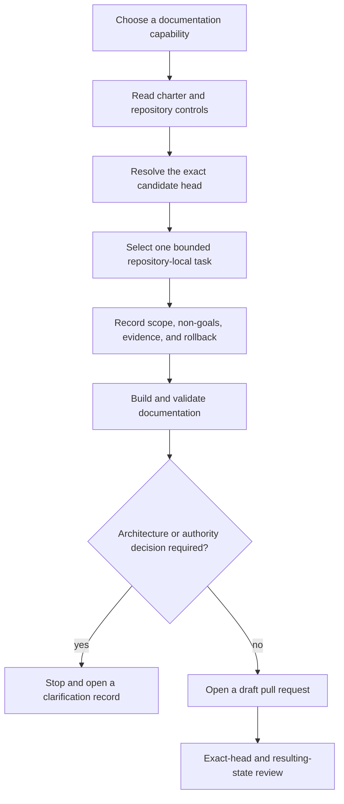

# Portfolio contributor paths

## Status

`PORTFOLIO_CONTRIBUTOR_PATHS_DOCUMENTED_OWNERSHIP_UNASSIGNED`

This guide gives contributors a safe, documentation-first route into every owned A.L.I.S.T.A.I.R.E. repository. It does not appoint maintainers, select canonical repositories, accept contracts, authorize implementation, or permit releases, publication, credentials, deployment, payments, device control, or self-modification.

## Contribution flow

**Diagram alternative:** choose a documentation skill, read the charter and repository-local controls, bind the work to an exact candidate head, select one bounded task, state non-goals and rollback, validate the documentation, and stop for clarification whenever ownership, architecture, authority, security, privacy, release, or deployment decisions are required. Otherwise open a draft pull request and retain exact-head and resulting-state evidence.

## Capability paths

| Path | Typical deliverables | FYSA-120 capabilities | Stop when |
|---|---|---|---|
| Technical writing | Project overview, design rationale, decision summary, release notes | `CAT-012`, `CAT-019` | The text would select ownership, authority, or an unverified capability |
| Information architecture | Pages navigation, source-of-truth map, archive and lifecycle structure | `CAT-012`, `CAT-018` | Competing candidate lineages require precedence or retirement decisions |
| Diagramming | Context, component, sequence, trust-boundary, provenance, and rollback diagrams | `CAT-011`, `CAT-032` | A missing interface or role would need to be invented |
| Onboarding | Setup, review order, first-task paths, troubleshooting, contribution rules | `CAT-012`, `CAT-018`, `CAT-019` | A task requires privileges or implementation approval |
| API and contract documentation | Schema boundaries, producer/consumer expectations, errors, versions, examples | `CAT-031`, `CAT-032` | Canonical bytes, namespace, owner, or compatibility policy is unaccepted |
| Accessibility | Heading structure, link meaning, diagram alternatives, keyboard and screen-reader guidance | `CAT-011`, `CAT-019`, `CAT-031` | Publication or certification authority is required |
| Provenance and technical editing | Exact sources, corrections, supersession, contradictions, terminology consistency | `CAT-013`, `CAT-017`, `CAT-040` | Currentness cannot be established without an architectural decision |
| Security and governance documentation | Trust boundaries, least privilege, evidence retention, rollback, incident and approval separation | `CAT-052`, `CAT-054`, `CAT-059`, `CAT-064` | Credentials, policy activation, incident command, or operational authority is required |

## Repository entry paths

The exact active source must be resolved from the portfolio currentness records before work begins. The tasks below are safe documentation candidates, not assignments or accepted backlogs.

| Repository | Documentation role | Bounded first task | Required skills | Primary stop condition |
|---|---|---|---|---|
| `ALISTAIRE-` | Constitutional charter, portfolio scope, governance, integration gates | Improve decision discoverability and cross-document status consistency | `CAT-012`, `CAT-018`, `CAT-019` | D1–D5 selection or authority appointment |
| `Alistaire-agi` | Compatibility landing and migration history | Clarify compatibility, redirect, archive, and rollback options | `CAT-012`, `CAT-017`, `CAT-040` | Canonical identity or package disposition |
| `0` | Portable bootstrap and bounded maintenance orchestration | Document proposal, execution, evidence, and non-approval boundaries | `CAT-012`, `CAT-032`, `CAT-054` | Device mutation or capability issuance |
| `1` | Quarantine, disposition, capability, revocation, checkpoint, and recovery candidate | Clarify authority, recovery, custody, and separation-of-duty diagrams | `CAT-011`, `CAT-018`, `CAT-054` | Approver, key-custody, or recovery appointment |
| `AionUi` | Optional review shell | Document UI state versus review, approval, and export authority | `CAT-011`, `CAT-012`, `CAT-019` | Accepted review contract or deployment scope |
| `Bridge` | Domain product and candidate transport/evidence profile | Separate product behavior from reusable transport and evidence contracts | `CAT-012`, `CAT-032`, `CAT-040` | Transport ownership or operational integration |
| `datarepo-temporal-invariants` | Temporal identity, freshness, replay, ordering, and supersession | Add worked examples and failure-state explanations for temporal claims | `CAT-012`, `CAT-013`, `CAT-031` | Canonical clock, source authority, or disposition selection |
| `grok-build-alistaire` | Optional engineering shell | Document execution-adapter boundaries, evidence, and rollback | `CAT-012`, `CAT-052`, `CAT-054` | Credentials, writes, merge, release, or deployment |
| `JusticeForMe` | Read-only host observation adapter | Improve privacy, retention, device identity, and report-contract onboarding | `CAT-012`, `CAT-019`, `CAT-052` | Collection expansion or remediation authority |
| `Misc` | PhantomBlock incubation and specialist observation provenance | Maintain migration, consolidation, retirement, and evidence-preservation guidance | `CAT-017`, `CAT-018`, `CAT-040` | Destination or retirement approval |
| `qsio-kernel` | Deterministic conformance and replay candidate | Explain reference implementation limits and fixture compatibility | `CAT-012`, `CAT-031`, `CAT-032` | Neutral format ownership or compatibility acceptance |
| `QSO-DIGITALIS` | Non-executing interpretation and policy projection | Clarify interpretation outputs, uncertainty, and non-capability boundaries | `CAT-012`, `CAT-019`, `CAT-032` | Policy activation or operational authority |
| `QSO-FABRIC` | Projection, collaboration, experiment, and aggregate evidence | Separate runtime-local records from Fabric-level records and document overlap tests | `CAT-011`, `CAT-031`, `CAT-032` | Namespace, schema custody, or live composition approval |
| `qso-field.github.io` | Public documentation and portfolio interpretation layer | Reconcile candidate documentation lineages and publication-readiness evidence | `CAT-012`, `CAT-017`, `CAT-040` | Candidate precedence, publication, or release approval |
| `QSO-GENOMES` | Declarative genome identity, lineage, policy data, and compatibility | Clarify generic envelope ownership versus genome-profile ownership | `CAT-012`, `CAT-017`, `CAT-032` | Namespace, canonical bytes, or admission authority |
| `QSO-PAYMENTS` | Economic intent, policy, simulation, and reconciliation | Separate simulation, test, approval, execution, and settlement claims | `CAT-012`, `CAT-019`, `CAT-054` | Financial approval, credentials, or transaction execution |
| `QSO-SEEKER` | Source acquisition, sanitization, attribution, and inert observation | Improve source-rights, privacy, replay, and handoff documentation | `CAT-012`, `CAT-017`, `CAT-052` | New collection authority or trust promotion |
| `QSO-STUDIO` | Domain-neutral review and evidence inspection | Clarify review interaction, annotation, export, and approval separation | `CAT-011`, `CAT-019`, `CAT-054` | Approval contract, identity, or deployment scope |
| `QuantumStateObjects` | Bounded local runtime semantics and evidence production | Document lifecycle, execution-report, failure, freeze, and recovery boundaries | `CAT-012`, `CAT-031`, `CAT-032` | Runtime admission or Fabric/Repository 1 authority |

## Contributor onboarding checklist

1. Resolve the exact repository candidate and read its `taskchain.md`, `release.md`, `punchlist.md`, and `changelog.md` where present.
2. Read the portfolio responsibility matrix and currentness review before changing cross-repository claims.
3. Select one capability path and list the FYSA category and subdivisions actually used.
4. State the intended audience, source of truth, evidence state, non-goals, owner or vacancy, correction route, and rollback.
5. Preserve implemented, tested, proposed, blocked, unsupported, superseded, and withdrawn states as distinct.
6. Provide prose alternatives for diagrams and meaningful link text for navigation.
7. Run repository-local documentation validation from an exact clean head.
8. Open a draft pull request and retain exact-head evidence before requesting integration.
9. Revalidate the resulting candidate after merge into any non-default integration branch.

## Cross-repository gluing checks

Before a documentation change claims that two repositories compose, confirm:

- producer and consumer identities are explicit;
- schema, namespace, canonical representation, and version expectations are not inferred from similar names;
- authority, correction, revocation, privacy, retention, replay, migration, and rollback effects remain visible;
- losses and unsupported fields are documented;
- local success is not represented as downstream acceptance;
- no owner vacancy is silently filled by the contributor or the documentation portal.

The currently documented route

`qsio-kernel → QuantumStateObjects → QSO-FABRIC → Repository 1`

remains unsupported until the charter’s contract, ownership, migration, rollback, and resulting-state gates are accepted.

## Change control

Update this guide when a repository role, active candidate, documentation surface, accepted contract, owner, skill-tree category, correction path, or stop condition changes. Preserve prior generations and record why a path was changed, superseded, or withdrawn.

## FYSA-120 mapping

Applied categories:

- `CAT-011` — accessible technical diagrams and prose equivalence;
- `CAT-012` — technical writing, information architecture, onboarding, API documentation, and editing;
- `CAT-013` — portfolio graphing, contradiction detection, and currentness;
- `CAT-017` — provenance, corrections, supersession, and source integrity;
- `CAT-018` — responsibility maps, institutional memory, and maintainer handoff;
- `CAT-019` — plain language, accessibility, and risk communication;
- `CAT-031` — specification, validation, examples, and regression prevention;
- `CAT-032` — interfaces, contracts, compatibility, and composition;
- `CAT-040` — migration, deprecation, rollback, and continuity;
- `CAT-052`, `CAT-054`, `CAT-059`, `CAT-064` — security boundaries, least privilege, evidence integrity, and accountable correction.

Proposed non-authoritative subdivisions:

- `012-T — Cross-repository contributor journey and documentation-first task routing`;
- `018-G — Maintainer-vacancy-aware onboarding and repository-local handoff continuity`;
- `011-G — Accessible portfolio corridor diagrams with authority and stop-condition semantics`.

Skill selection does not establish competence, appointment, repository ownership, merge authority, or permission to perform the listed work.
