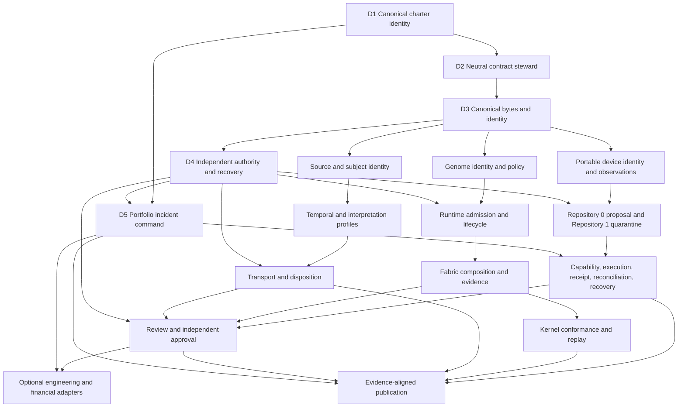

# Portfolio Integration and Contract Acceptance Roadmap

## Status

**Documentation-only sequencing candidate.** This roadmap converts the portfolio's repository-local contracts into a dependency-aware review order. It does not accept a contract, designate a live registry, activate Repository `1`, issue credentials, authorize device actions, approve payments, or publish a release.

## Why sequencing is required

The A.L.I.S.T.A.I.R.E. repositories now contain substantial local documentation, but several components depend on one another for identity, meaning, authority, evidence, compatibility, and recovery. If implementation proceeds before those dependencies are separated, a runtime, transport layer, interface, adapter, or authority service could be asked to define the contracts that legitimize its own behavior.

This roadmap treats each repository-local design as a **local section** and each cross-repository contract as an **overlap**. A deterministic compatibility fixture is a **gluing witness**. An unresolved owner, incompatible meaning, missing witness, or circular authority dependency is an **obstruction**.

The terminology is an engineering method, not a claim that the portfolio has completed a formal homology computation.

## Systemic cycles

### 1. Canonical identity and migration

`ALISTAIRE-` and `Alistaire-agi` cannot finalize package, compatibility, migration, redirect, or archival decisions until one canonical charter source is approved. The canonical identity cannot be approved safely while migration and rollback consequences remain undefined.

**Required cut:** one immutable decision selecting the charter repository, display/package direction, provenance rules, non-canonical disposition, compatibility period, and rollback.

### 2. Neutral contracts and Repository `1`

Repository `1` needs stable identifiers, canonical bytes, reason codes, compatibility rules, and fixture formats. A contract registry needs an accepted signing and review model. Allowing either to bootstrap the other would create self-authorization.

**Required cut:** appoint a neutral, non-operational contract steward before Repository `1` is accepted. The steward may allocate identifiers, schemas, canonicalization rules, reason codes, compatibility policy, and fixtures, but cannot issue operational capabilities or canonicalize device/runtime state.

### 3. Genome, runtime, Fabric, and kernel semantics

QSO-GENOMES, QuantumStateObjects, QSO-FABRIC, and `qsio-kernel` use overlapping concepts for identity, lifecycle, mutation, messages, ledgers, checkpoints, freeze, Quietus, replay, hashing, and correction.

**Required cut:** accept a minimal semantic profile and fixture vocabulary. QSO-GENOMES owns declarative identity and immutable policy; QuantumStateObjects owns bounded runtime semantics; QSO-FABRIC owns experiment composition and evidence; `qsio-kernel` is a reference conformance candidate unless another role is approved.

### 4. Source, temporal, interpretation, transport, and disposition

QSO-SEEKER, `datarepo-temporal-invariants`, QSO-DIGITALIS, Bridge, and Repository `1` can collapse distinct states into a generic `valid` or `accepted` result.

**Required cut:** preserve separate source, subject, temporal, interpretation, transport, receipt, and disposition identities. Accept lineage and temporal profiles before Bridge receipts and Repository `1` disposition, correction, and revocation.

### 5. Review surfaces and approval

QSO-STUDIO and AionUi need authoritative records to display, while Repository `1` needs a usable review path. Without an independent approval record, a click, annotation, authenticated session, or rendered state could be mistaken for authorization.

**Required cut:** define approval as a separate authenticated record. QSO-STUDIO may own the domain-neutral review contract; AionUi may host it; Repository `1` consumes the independent approval record.

### 6. Portable device trust and recovery

Host observations feed Repository `0` proposals, Repository `1` capabilities, bounded execution, resulting-state receipts, and baseline reconciliation. The loop is useful but unsafe until identity, freshness, replay, scope, partial failure, rollback, correction, revocation, and recovery are distinguishable.

**Required cut:** accept device and observation envelopes before proposal admission; accept proposal/quarantine semantics before capability issuance; accept receipt and resulting-state semantics before baseline reconciliation.

### 7. Financial intent and technical authority

QSO-PAYMENTS intent, financial approval, Repository `1` capability, adapter execution, finality, correction, dispute, and revocation are separate authorities.

**Required cut:** designate an independent financial approver and revoker before Repository `1` may narrow technical execution scope. Generic device or tool capabilities cannot substitute for financial authority.

## Minimal constitutional decision set

| Decision | Scope | Why it precedes implementation |
|---|---|---|
| **D1 — Canonical charter and repository identity** | Canonical source, display/package direction, migration, provenance, compatibility, non-canonical disposition, rollback | Every namespace and ownership decision needs one recognized constitutional source |
| **D2 — Neutral contract steward** | Common identifiers, envelopes, canonicalization, reason codes, compatibility, migration, deprecation, fixtures | Prevents an operational component from defining the contracts granting its own authority |
| **D3 — Canonical bytes and identity primitives** | Serialization, Unicode, numbers, timestamps, digests, signature references, namespaces, extensions, replay domains | Every capability, receipt, correction, and compatibility claim depends on stable bytes and identities |
| **D4 — Independent authority and recovery roots** | Repository `1` or successor, issuers, revokers, approval sources, key custody, emergency stop, recovery quorum, evidence preservation | Proposals cannot be evaluated safely without authority independent from proposer and executor |
| **D5 — Portfolio incident command** | Incident, freeze, evidence preservation, bounded restart, rollback, cache invalidation, claim withdrawal | A distributed system must have an independent mechanism to stop, unwind, and correct it |

These are governance and contract decisions. They require no production credential, online service, enrolled device, autonomous execution, or deployment.

## Acceptance DAG

## Sequenced phases

### Phase 0 — Constitutional identity

**Required decisions**

- canonical charter repository and immutable decision record;
- final display name and package direction;
- migration, provenance, license, compatibility, and redirect/archive manifest;
- non-canonical repository disposition;
- authority to amend the charter;
- rollback to the prior documented state.

**Exit witness:** every repository cites one immutable constitutional source and one responsibility manifest without relying on a competing identity.

### Phase 1 — Neutral contract substrate

**Required decisions**

- neutral contract steward and package/repository location;
- identifier and namespace allocation;
- canonical encoding status;
- Unicode, number, timestamp, digest, signature-reference, and extension rules;
- reason-code, compatibility, migration, deprecation, and fixture registries;
- explicit non-authority statement.

**Exit witness:** two independent implementations produce identical canonical bytes and digests for positive and adversarial fixtures, while unsupported versions and lossy mappings fail closed.

### Phase 2 — Independent authority, revocation, and recovery

**Required decisions**

- Repository `1` or successor scope;
- private/offline authority-store topology;
- issuer, approver, verifier, revoker, incident, and recovery roles;
- key custody, rotation, loss, compromise, and recovery quorum;
- quarantine, capability, disposition, correction, revocation, and checkpoint state machines;
- emergency stop and bounded restart.

**Exit witness:** deterministic offline fixtures prove that proposer and executor cannot issue or broaden their own authority, stale/replayed/revoked records fail closed, and recovery does not depend on the component being stopped.

### Phase 3 — Portable device trust

**Required decisions**

- device and environment identity, ownership scope, enrollment generation, replacement, retirement, and loss lifecycle;
- platform and baseline-policy identity;
- JusticeForMe/PhantomBlock disposition and shared observation vocabulary;
- completion, privacy, retention, freshness, artifact binding, conflict, and `UNKNOWN` semantics;
- Repository `0` proposal and Repository `1` quarantine contract;
- executor capability, receipt, resulting-state, reconciliation, rollback, and recovery.

**Exit witness:** wrong-device, incomplete, unsupported, duplicate, conflicting, stale, replayed, expired, revoked, partial-execution, rollback, lost-device, and replacement-device fixtures pass across approved adapters and Repositories `0` and `1`.

### Phase 4 — Declarative and runtime semantics

**Required decisions**

- QSO-GENOMES identity, lineage, immutable policy, projection, correction, and compatibility scope;
- QuantumStateObjects admission, lifecycle, message, resource, freeze, receipt, and rollback scope;
- QSO-FABRIC participant, composition, contradiction, ledger/evidence, checkpoint, and experiment scope;
- `qsio-kernel` conformance role or alternative disposition;
- explicit mappings among genome, runtime, Fabric, and QSIO records.

**Exit witness:** triple-overlap fixtures prove identity, policy, lifecycle, mutation, resource, freeze, contradiction, checkpoint, correction, revocation, replay, and rollback coherence without collapsing local, experiment, conformance, and canonical state.

### Phase 5 — Source evidence and transport

**Required decisions**

- QSO-SEEKER source and provenance identity;
- temporal subject, clock, freshness, replay, and supersession semantics;
- QSO-DIGITALIS interpretation and projection scope;
- Bridge domain and reusable transport-profile disposition;
- Repository `1` disposition, correction, revocation, and downstream invalidation;
- privacy, retention, source-license, transformation, and redaction rules.

**Exit witness:** source → temporal → interpretation → transport → disposition fixtures preserve identity and lineage across positive, stale, corrected, revoked, partial, privacy-restricted, and rollback cases.

### Phase 6 — Review and independent approval

**Required decisions**

- QSO-STUDIO review contract;
- AionUi host-shell and runtime-mode policies;
- independent approval record and authentication source;
- annotation, dissent, correction, revocation, export, and privacy semantics;
- publication and cache-invalidation boundaries.

**Exit witness:** rendering or interaction cannot create approval, and approved, rejected, corrected, revoked, expired, and frozen records are displayed consistently across two independent clients.

### Phase 7 — Optional high-consequence adapters

**Required decisions**

- engineering-shell delegation and evidence profile;
- independent financial approval and revocation;
- payment intent, quote, precision, finality, dispute, and reconciliation;
- provider, credential, key-custody, data-governance, and incident ownership;
- disabled-by-default activation, monitoring, emergency stop, and rollback.

**Exit witness:** generic capabilities cannot authorize payment, execution success cannot authorize merge/release/deployment, and each adapter can be revoked independently without corrupting canonical evidence.

### Phase 8 — Publication

**Required decisions**

- evidence-qualified capability vocabulary;
- exact accepted repository and contract versions;
- public/private data boundary;
- source and license notices;
- accessibility and link review;
- artifact provenance, checksums, Pages settings, rollback, and explicit publication approval.

**Exit witness:** the published snapshot can be reconstructed from immutable sources, contains no secret or private operational material, and can be withdrawn without altering canonical evidence.

## Invalidation and rollback

A downstream success cannot retroactively satisfy an upstream gate. If an upstream decision, contract, key, approval, or fixture is withdrawn or invalidated:

1. freeze dependent promotions;
2. identify affected repositories, versions, artifacts, caches, and claims;
3. preserve evidence and correction lineage;
4. revoke or narrow affected capabilities;
5. restore the last accepted compatible state;
6. invalidate derived publication claims where necessary;
7. require fresh gluing witnesses before bounded restart.

## Current architectural clarification required

The immediate constitutional work is D1–D5. Until those decisions are accepted, repository-local documentation remains valuable evidence and design input, but no component should be promoted as a live authority merely because another repository references it.
