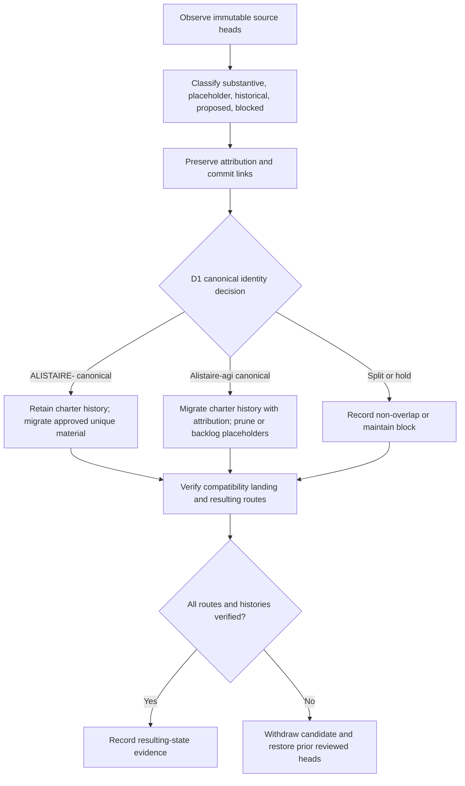

# Repository provenance and migration guide

Status: **documentation-only review artifact**

This guide records the exact observed generations of the two overlapping Alistaire repositories and translates them into a reversible migration inventory. It does not select canonical authority, approve a package, migrate files, activate redirects, archive a repository, publish Pages, or authorize implementation.

The machine-readable companion is [`repository-provenance-manifest-v1.json`](repository-provenance-manifest-v1.json).

## Exact observed generations

| Repository | Default-branch head | Active documentation candidate | Candidate head | Current role observation |
|---|---|---|---|---|
| `aevespers2/ALISTAIRE-` | `7adbbf963616d09b4ebafea7c0963a2fac5688a9` | PR #1, `docs/consolidation-charter-20260720` | `32c3684381b85b071adbb7dca15604a1a0c9ed99` | Established charter history, governance, architecture, contract, recovery, validation, and release-control candidate |
| `aevespers2/Alistaire-agi` | `504222dbecb1e1e49c01d74e536de5b6fa93c39a` | PR #2, `docs/portfolio-consolidation-20260720` | `c745403f7cf7532abd30076301ce2020dbd1e732` | Compatibility landing, migration/gluing guide, package-name proposal, and historical topic taxonomy candidate |

Both pull requests are open drafts. Their successful documentation checks are exact-head evidence for their own candidates only; they do not jointly decide D1 or establish a canonical repository.

## History inventory

### `ALISTAIRE-`

The observed main history contains eight commits, beginning with the QSO charter directive and progressing through the duplicate-repository hold, canonical-repository release gate, punch list, and evidence reconciliation. PR #1 adds a substantive Pages-ready charter candidate with governance, architecture, portable security, portfolio contracts, lifecycle/recovery fixtures, onboarding, and strict documentation validation.

### `Alistaire-agi`

The observed main history contains five commits: repository initialization, creation of approximately 140 empty documentation paths, the consolidation gate, scope/evidence classification, and a blocked release plan. PR #2 replaces the empty landing surface with substantive compatibility, migration, obstruction, onboarding, security, provenance, and rollback documentation.

The empty topic tree remains useful as a **taxonomy proposal**, not as evidence that the named modules, APIs, protocols, tutorials, or research programs exist.

## Substance and destination classes

| Source material | Classification | Proposed handling before D1 | Required evidence |
|---|---|---|---|
| `ALISTAIRE-/taskchain.md`, `release.md`, `punchlist.md`, `changelog.md` | substantive coordination history | retain in source and cite by commit | exact source SHA, attribution, resulting-state check |
| PR #1 charter and governance documents | proposed substantive candidate | retain for review; accept, revise, split, hold, or reject explicitly | exact candidate head, workflow artifact, review disposition |
| `Alistaire-agi/README.md` package name `alistaire-qso` | proposed identifier | preserve as a proposal; do not treat as registered package authority | package owner, registry, license, support, security, signing, release decision |
| `Alistaire-agi` coordination files | substantive duplicate-era history | summarize with commit links and preserve in source | source head, attribution, supersession record |
| Empty `Alistaire-agi/docs/**` paths | placeholder taxonomy | convert selected topics into backlog records; do not bulk-publish as completed pages | named owner, scope, dependency, evidence and completion criteria |
| PR #2 compatibility and migration guide | proposed substantive candidate | retain as the non-canonical-transition candidate pending D1 | exact candidate head, workflow artifact, joint migration review |
| Non-canonical repository | unresolved | redirect, archive, or assign a narrow non-overlapping role only after approval | public notice, compatibility period, support/security routes, monitoring, rollback drill |

## Migration and rollback flow

**Equivalent prose:** First bind both repositories to immutable observed heads. Classify each record as substantive, placeholder, historical, proposed, or blocked, and preserve source attribution. A separately approved D1 decision then chooses a canonical repository, an explicitly non-overlapping split, or a continued hold. Only approved unique content is migrated. The compatibility landing, repository notices, support and security routes, history links, and final documentation routes must then be verified. Any missing attribution, competing current authority, broken route, unsupported claim, or non-reproducible result requires withdrawal and restoration of the previous reviewed heads.

## License and sensitive-data status

Neither repository exposes a `LICENSE` file at the observed generations. No reuse, redistribution, package publication, or migration license is inferred.

Sensitive-review disposition: **`LIMITED_PASS_WITH_RESIDUAL_RISK`**.

Repository code searches for private-key markers and common secret-assignment terms returned no matches. This is a limited review, not a complete history-aware secret scan. Binary content, deleted objects, unindexed branches, inaccessible artifacts, and false negatives remain residual risks. A dedicated history-aware scan and human privacy review are required before migration, publication, or archive conversion.

## Current obstructions

- D1 canonical repository and display/package identity remain unapproved.
- Both repositories lack an explicit license.
- PR #1 and PR #2 are independently coherent but not jointly reconciled or accepted.
- No approved path-by-path migration manifest exists.
- Support, security-reporting, compatibility-window, redirect/archive, monitoring, and rollback ownership remain vacant.
- The placeholder taxonomy cannot be presented as implemented architecture or complete documentation.

## FYSA-120 capability map

This milestone uses:

- **CAT-011** for claim-evidence narrative, accessible diagrams, and prose equivalents;
- **CAT-012** for document architecture, technical exposition, documentation testing, and lifecycle synchronization;
- **CAT-013** for duplicate consolidation, canonical identifier design, and provenance-aware graph integrity;
- **CAT-017** for source resolution, lineage, version-substitution detection, and correction propagation;
- **CAT-018** for institutional memory, classification, preservation, and onboarding transfer;
- **CAT-019** for plain-language status and accessible public explanation;
- **CAT-031** for threat-aware acceptance criteria and assurance-case maintenance; and
- **CAT-040** for repository archaeology, migration risk, cutover planning, and rollback continuity.

Proposed non-authoritative subdivision **`040-F — Repository-identity consolidation and provenance-preserving retirement`** covers cross-repository history reconciliation, placeholder-taxonomy disposition, package-authority migration, redirect/archive verification, and dual-authority rollback testing.

## Authority boundary

This inventory is evidence for review. It creates no canonical authority, license, package ownership, migration approval, redirect, archive, repository rename, merge, publication, release, deployment, appointment, credential, runtime, or operational permission.
