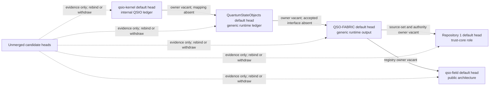

# Runtime/Fabric Default-Head and Semantic-Owner Inventory

Status: **default heads verified; owner vacancies recorded; `DEFAULT_HEADS_VERIFIED_OWNER_VACANCIES_RECORDED_BINDINGS_UNACCEPTED`; no implementation or authority effect**

This packet extends the [candidate producer-consumer inventory](runtime-fabric-producer-consumer-inventory.md) to the current default heads of the six repositories most directly involved in the runtime/Fabric collision. It also records explicit semantic-owner and route-owner vacancies instead of allowing repository names, draft pull requests, generic ledger terminology, or successful validation to imply ownership.

The machine-readable companion is [`runtime-fabric-default-head-owner-inventory-v1.json`](runtime-fabric-default-head-owner-inventory-v1.json).

## Bounded conclusion

The reviewed default heads do **not** establish either legacy interface label as an accepted live binding:

- `qso-event-ledger`
- `qso-runtime-report`

The default branches contain generic event-ledger, transition-receipt, internal-QSIO-ledger, and state-network concepts, but the exact declaration, namespace-partition, synthetic-consumer, and portfolio-registry material remains on unmerged draft branches. Therefore:

```text
current default heads
+ generic related concepts
+ unmerged exact-head candidates
!= accepted semantic owner
!= accepted namespace or schema
!= live producer or consumer registration
!= migration or rollback authority
```

## Current default-head observations

| Repository and exact default head | Reviewed default-head surface | Bounded observation | Default-head disposition |
|---|---|---|---|
| `aevespers2/ALISTAIRE-@7adbbf963616d09b4ebafea7c0963a2fac5688a9` | The candidate README and runtime/Fabric packets are absent from `main` | Governance and partition material exists only on draft PR #1 | `DEFAULT_HEAD_HAS_NO_REVIEW_SURFACE` |
| `aevespers2/QSO-FABRIC@bd0ac7af3b34602082db03e71055b652707c9b18` | `README.md` exists; `qso.manifest.json` and `spec/QSO-INTERFACE-COMPATIBILITY-001.md` are absent | The README describes a generic append-only event ledger; exact producer declarations remain on draft PR #21 | `GENERIC_RUNTIME_LEDGER_ONLY_NO_LEGACY_BINDING` |
| `aevespers2/QuantumStateObjects@40efcbf8ce2bda7d6b05b3fb1f3ccf0384facc51` | `README.md` exists; design and ecosystem-interface documents are absent | The README describes bounded runtime behavior and a generic event ledger; interface interpretation remains on draft PR #12 | `GENERIC_RUNTIME_LEDGER_ONLY_NO_LEGACY_BINDING` |
| `aevespers2/1@6685872ceafdefa4961e261abb45202e664e3666` | `README.md` exists; interface-conformance guide and source tuple are absent | The README proposes conservative state and receipt roles but no runtime/Fabric registration | `TRUST_CORE_ROLE_ONLY_NO_LEGACY_BINDING` |
| `aevespers2/qsio-kernel@6468254d7703e5f771e610ed3f76bac1b7205ddb` | `README.md` and `src/qsio/qsio.py` exist | Internal QSIO records, outcomes, hashes, witnesses, and replay are present; no accepted mapping to legacy labels exists | `INTERNAL_LEDGER_ONLY_UNMAPPED` |
| `aevespers2/qso-field.github.io@2d7adf88ce84f01f0ff1067cef09388481f7e4ae` | `index.md` exists; namespace-partition boundary and contract are absent | The default branch is a documentation-first public architecture landing; governance and handoff records remain on draft PR #24 | `PUBLIC_ARCHITECTURE_ONLY_NO_LEGACY_BINDING` |

### Evidence qualification

A missing reviewed path is not proof of repository-wide or historical absence. This packet records only the exact default heads and paths listed above. Complete repository histories, generated artifacts, packages, releases, other branches, and external consumers remain outside this bounded pass.

## Candidate-to-default separation

The active candidate generations remain useful evidence but are not current default-branch state:

| Repository | Candidate | Exact candidate head | Relation to default head |
|---|---:|---|---|
| `ALISTAIRE-` | PR #1 | `84cdb1848449c40b54aab430a19c59e0167736dd` | Unmerged documentation and governance candidate |
| `QSO-FABRIC` | PR #21 | `25036a5cfcea79e204a4660ddd1af09c054935b1` | Unmerged declaration-producer candidate |
| `QuantumStateObjects` | PR #12 | `cc9b9c7b06a1a48bbc052b8d6bacd11782285288` | Unmerged runtime-documentation and synthetic-consumer candidate |
| Repository `1` | PR #2 | `47b58fa49c8dda7f44234dab68f78673bb02d269` | Unmerged independent synthetic consumer |
| `qso-field.github.io` | PR #24 | `a56b1fa93f151ee14f3cdd4183b89a10e268e352` | Unmerged registry and handoff-governance candidate |

A future integration must either rebind these exact candidates to accepted resulting default heads or explicitly withdraw and supersede them. Silent promotion, stale-head substitution, or inference from a mergeable state is prohibited.

## Explicit semantic-owner vacancies

No accepted semantic owner was found for any of the six classes defined by the namespace-partition packet:

| Semantic class | Candidate repository | Accepted owner | Current status |
|---|---|---|---|
| Runtime event record | `QuantumStateObjects` | None | `EXPLICIT_VACANCY` |
| Runtime execution report | `QuantumStateObjects` | None | `EXPLICIT_VACANCY` |
| Fabric projection receipt | `QSO-FABRIC` | None | `EXPLICIT_VACANCY` |
| Fabric collaboration event | `QSO-FABRIC` | None | `EXPLICIT_VACANCY` |
| Fabric aggregate report | `QSO-FABRIC` | None | `EXPLICIT_VACANCY` |
| Portfolio disposition | Repository `1` | None | `EXPLICIT_VACANCY` |

“Candidate repository” identifies the strongest documented role proposal, not an owner appointment. Ownership remains vacant until D1-D3, source precedence, canonical bytes, namespace and schema custody, independent review, human approval, and resulting-state verification are complete.

## Explicit route-owner vacancies

The following cross-repository responsibilities also remain vacant:

- kernel-to-runtime semantic mapping;
- namespace and schema registry custody;
- live producer and consumer registration;
- correction and revocation propagation;
- mixed-generation migration and rollback coordination.

These are distinct responsibilities. A single repository must not silently acquire all of them merely because it hosts a manifest, validator, fixture, runtime, review page, or registry proposal.

## Contract graph and gluing obstruction



**Prose equivalent:** The kernel default head has an internal QSIO ledger but no accepted mapping owner. The runtime and Fabric default heads contain generic ledger concepts but no accepted shared interface. Repository `1` has a proposed trust-core role but no accepted source-set or disposition contract. The public registry default head contains only broad architecture. Unmerged candidates provide evidence, not default-head or ownership state.

The route remains obstruction-like because individually meaningful components cannot be glued into one path-independent system while semantic owners, registry custody, canonical bytes, projection receipts, correction routes, migration, and rollback remain vacant.

## Planning alignment

This packet narrows existing work without changing implementation scope or marking the broader P2A decision complete:

| Existing control | Contribution of this packet | Remaining work |
|---|---|---|
| `taskchain.md` P2A | Binds the six current default heads and distinguishes default state from candidate state | Complete repository-local history/use inventories; accept or withdraw candidates; appoint owners; select a profile |
| `punchlist.md` P2A | Satisfies the bounded default-head review and records explicit vacancies for the reviewed classes and routes | Full use-set verification, dissent, ownership decisions, independent review, fixtures, approval, and resulting-state validation remain open |
| `release.md` | Supplies the default-head and vacancy evidence required before a namespace decision | Release remains blocked; no accepted interface, owner, registry, migration, or rollback exists |
| `changelog.md` | Provides a documentation-only evidence generation suitable for later integration | No release, publication, runtime, or authority claim is created |

## Review checklist

The packet remains non-authorizing until reviewers can answer yes to all of the following:

- Have every repository’s complete local uses and histories been inventoried?
- Have stale candidates been rebound, corrected, withdrawn, or superseded?
- Are semantic and route owners explicitly appointed through an accepted authority source?
- Are D1, D2, and D3 accepted at immutable generations?
- Are canonical payloads, identities, namespaces, schemas, ordering, replay, correction, revocation, privacy, and retention accepted?
- Are live registrations and supported-version rules independently governed?
- Do migration, mixed-generation, rollback, and restored-state fixtures pass?
- Have security, privacy, accessibility, licensing, and architecture reviews completed?
- Has explicit human approval been recorded?
- Have resulting default heads and restored state been independently verified?

## FYSA-120 capability map

Applied capabilities:

- **CAT-011-B/E** — accessible graph communication and text/diagram consistency;
- **CAT-012-A/B/D/E** — information architecture, technical exposition, documentation testing, terminology, and lifecycle synchronization;
- **CAT-013-A/C/D/E** — repository/contract graph modeling, identity resolution, path analysis, contradiction detection, and provenance-aware graph maintenance;
- **CAT-017-C/D/E** — exact-head lineage, version-substitution detection, audit packaging, and correction propagation;
- **CAT-018-B/D/E** — responsibility mapping, decision-rationale retrieval, contested-state preservation, and records governance;
- **CAT-019-B/C/D** — plain-language explanation, accessible alternatives, and uncertainty/risk communication;
- **CAT-031-A/D/E** — closed invariants, hostile validation, change-impact analysis, and regression prevention;
- **CAT-032-A/B/D** — distributed-state, event-ordering, idempotency, conflict, and recovery analysis;
- **CAT-040-A/B/C/D/E** — system archaeology, migration dependencies, interface documentation, compatibility, rollback, and post-migration verification;
- **CAT-052-A/B/E**, **CAT-059-A/B/E**, and **CAT-070-A/B/C/E** — authorization modeling, least privilege, evidence retention, authority mapping, procedure, oversight, and corrective governance.

Proposed non-authoritative subdivision:

**`013-H — Default-head semantic-owner vacancy and candidate-to-default reconciliation graph`**: bind current default heads; distinguish candidate, default, historical, and resulting generations; record semantic and route ownership as accepted, disputed, or explicitly vacant; prevent naming or documentation from becoming implicit authority; and preserve correction, withdrawal, migration, rollback, and audit lineage.

Taxonomy mapping does not establish competence, appointment, ownership, acceptance, or authority.

## Authority boundary

`DEFAULT_HEADS_VERIFIED_OWNER_VACANCIES_RECORDED_BINDINGS_UNACCEPTED` is documentation and governance evidence only. It creates no canonical namespace, schema, payload, registry, producer, consumer, semantic owner, route owner, runtime admission, Fabric activation, Repository `1` authority, release, Pages publication, deployment, credential, capability, infrastructure change, or destructive history operation.
