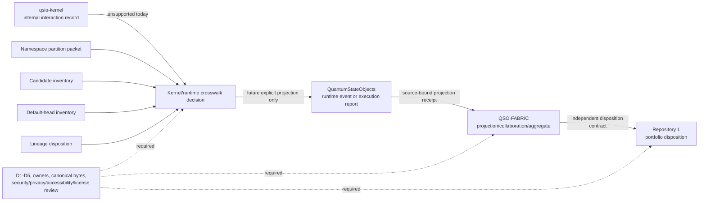

# Runtime/Fabric governance review index

Status: `REVIEW_INDEX_COMPLETE_BINDINGS_UNACCEPTED`

This page is the reviewer-facing index for the discontinuous portfolio route:

`qsio-kernel internal ledger → QuantumStateObjects runtime records → QSO-FABRIC projection and aggregate records → Repository 1 disposition`

It does not select an interface, namespace, schema, owner, producer, consumer, registry, adapter, canonical profile, migration, runtime admission, Fabric activation, Repository `1` authority, release, publication, deployment, credential, or infrastructure change. Its purpose is to keep the existing packets, inventories, and exact-head evidence understandable as one bounded review sequence.

## Why this index exists

The route is described by several independently validated documentation packets. Each packet answers a different question, and none may be substituted for another:

| Review surface | Controlled disposition | Question answered |
|---|---|---|
| [Runtime/Fabric namespace partition](runtime-fabric-namespace-partition.md) | `BLOCKED_ROLE_COLLISION` | Which semantic classes must remain distinct, and what partition models are available? |
| [Candidate producer-consumer inventory](runtime-fabric-producer-consumer-inventory.md) | `OBSERVED_CANDIDATE_INVENTORY_RECORDED_BLOCKED_UNACCEPTED_BINDINGS` | Which candidate generations declare, document, consume, or reference the legacy labels? |
| [Default-head and owner-vacancy inventory](runtime-fabric-default-head-owner-inventory.md) | `DEFAULT_HEADS_VERIFIED_OWNER_VACANCIES_RECORDED_BINDINGS_UNACCEPTED` | What is present at current default heads, and which semantic or route owners remain vacant? |
| [Candidate-lineage disposition](runtime-fabric-lineage-disposition.md) | `CANDIDATE_LINEAGES_CLASSIFIED_REBIND_WITHDRAW_OR_ACCEPT_REQUIRED` | Which candidate lineages should be preserved, rebound, corrected, withdrawn, or reviewed further? |
| [Kernel-to-runtime crosswalk options](kernel-runtime-crosswalk-options.md) | `KERNEL_RUNTIME_CROSSWALK_OPTIONS_DOCUMENTED_UNSELECTED` | Can a kernel record map into runtime semantics without loss, aliasing, or authority inflation? |

The index prevents a passing workflow, a matching fixture, a repository name, or a similar field label from being promoted into compatibility or authority.

## Current safe disposition

The kernel-to-runtime edge remains `UNSUPPORTED_KERNEL_RUNTIME_ROUTE`.

Direct identity aliasing is rejected as `REJECT_DIRECT_IDENTITY_ALIAS`. A read-only projection adapter or neutral qualified envelope remains unselected and unavailable until the constitutional, stewardship, canonicalization, ownership, validation, security, privacy, accessibility, licensing, migration, rollback, and human-approval gates are complete.

## Review graph

### Prose equivalent

The kernel produces an internal interaction record. That record is not currently accepted as a runtime event or execution report. The namespace-partition packet, candidate inventory, default-head inventory, and lineage-disposition packet all feed the crosswalk review. A future route would require an explicit projection into a separately identified runtime record, a source-bound projection receipt into Fabric, and an independently governed disposition contract into Repository `1`. D1 through D5, accepted ownership, canonical bytes, independent review, migration, rollback, and resulting-state evidence remain prerequisites at every consequential edge.

## Semantic classes that must not collapse

1. **Kernel interaction record** — request, pre-state hashes, proposed and accepted transitions, witnesses, outcome, reason codes, ancestry, time, and content hash.
2. **Runtime event** — a bounded local occurrence with explicit producer, local sequence, causality, lifecycle, and authority effect.
3. **Runtime execution report** — a bounded execution result with requested action, pre-state, post-state, receipt, rollback, and unresolved-state handling.
4. **Fabric projection receipt** — a transformation record binding source identity, selected fields, omitted fields, losses, policy, correction, revocation, and rollback.
5. **Fabric collaboration or aggregate record** — a multi-source record that preserves source sets and does not treat projection as independent corroboration.
6. **Portfolio disposition** — an independently authorized decision that cannot be inferred from runtime or Fabric success.

Similar names, hashes, timestamps, reason codes, or payload shapes do not establish semantic equivalence.

## Material gluing obstructions

| Obstruction | Present condition | Required closure |
|---|---|---|
| Kernel/runtime semantic mismatch | One kernel record combines information that maps to several runtime concepts | Field-level `EXACT`, `TRANSFORM`, `PROJECT`, `UNSUPPORTED`, or `LOSSY_REJECTED` disposition |
| Namespace and identity ambiguity | Legacy labels span runtime and Fabric levels | Accepted semantic classes, namespaces, identity domains, versions, and registry custody |
| Missing projection receipt | No accepted record binds source fields, transformations, omissions, loss, policy, and rollback | Versioned projection-receipt contract and hostile fixtures |
| Source-set and duplicate inflation | Aggregate evidence can accidentally count projected copies as independent evidence | Source-set identity, duplicate lineage, corroboration policy, and conflict rules |
| Ordering and replay ambiguity | Kernel, runtime, Fabric, and disposition clocks are not accepted as one model | Qualified clock domains, replay windows, idempotency, conflict, and causal-order rules |
| Correction and revocation discontinuity | No accepted end-to-end propagation route exists | Correction, revocation, withdrawal, cache invalidation, consumer acknowledgment, and residual-risk records |
| Owner vacancy | Semantic and route owners are not accepted | Named or explicitly accepted vacant ownership with separation of duties and appeal |
| Migration and rollback incompleteness | Candidate and default generations coexist without an accepted cutover | Mixed-generation fixtures, consumer reachability, rollback targets, failed-rollback freeze, and restored-state evidence |
| Authority inflation | Local success or passing CI could be mistaken for portfolio acceptance | Independent authorization record and explicit `authority_effect` at every edge |

These are engineering gluing failures. The homology analogy is useful for finding broken overlaps and path dependence, but this index does not claim a completed formal topological computation.

## Required review sequence

1. **Confirm exact sources.** Verify every repository, branch or pull request, commit SHA, observed path, and retained artifact.
2. **Resolve D1 and D2.** Select the constitutional source and neutral non-operational contract stewardship model.
3. **Resolve D3.** Accept canonical bytes, identities, namespaces, digest domains, reason codes, extensions, and replay domains with two independent implementations.
4. **Confirm semantic and route ownership.** Appoint owners or explicitly accept vacancies without allowing a producer to grant itself authority.
5. **Select or preserve unsupported routes.** Keep `UNSUPPORTED_KERNEL_RUNTIME_ROUTE` unless a reviewed projection or qualified-envelope model passes all gates.
6. **Build hostile fixtures.** Include malformed, lossy, duplicate, replayed, conflicting, partial-source, privacy-restricted, corrected, revoked, mixed-generation, and failed-rollback cases.
7. **Validate independent consumers.** Require at least two independently authored validators or consumers and compare exact dispositions, bytes, identities, reason codes, and losses.
8. **Review security and human impact.** Complete security, privacy, retention, licensing, accessibility, incident, appeal, and support review.
9. **Approve and verify resulting state.** Record explicit human approval, merge only the approved generation, verify default heads and registrations, and retain rollback and restored-state evidence.

A later step cannot retroactively satisfy an earlier one.

## Reviewer onboarding

A reviewer should begin with this index, then read the five linked surfaces in table order. For every claim, distinguish:

- **Observed** repository content from accepted architecture;
- **candidate** or **default-head** evidence from current authority;
- **declared** producers or consumers from admitted live participants;
- **matching fixtures** from compatible production interfaces;
- **passing validation** from truth, safety, accessibility certification, or approval;
- **preserved lineage** from accepted currentness;
- **unsupported** routes from failed routes—unsupported is the deliberate safe state until the acceptance gates pass.

Review comments should cite the exact source generation, semantic class, edge, affected consumers, authority effect, correction route, rollback target, and evidence limitation.

## Planning and release consistency

The controlled planning surfaces remain `taskchain.md`, `punchlist.md`, `release.md`, and `changelog.md`. They must preserve all five dispositions shown above, the `UNSUPPORTED_KERNEL_RUNTIME_ROUTE` safe default, the rejected direct alias, the owner vacancies, the lineage dispositions, and the absence of accepted bindings.

A planning surface is stale when it records candidate inventory as incomplete after a validated inventory exists, treats owner vacancies as resolved, omits a moved exact head, represents a preserved lineage as accepted, or describes a crosswalk option as selected. Stale planning state must be corrected or marked for rebinding before any release or default-branch disposition.

## Provenance, correction, and rollback

This index is bound to the charter candidate parent generation `215a0068999105bebe6aab81614ee1a95e3f47b1`. It is a descendant review aid, not a self-referential assertion that the parent contains this page.

Replace or correct this generation when any source packet, exact head, disposition, owner or vacancy, semantic class, graph edge, acceptance gate, controlled route, migration rule, correction/revocation route, rollback rule, or FYSA-120 mapping changes. Preserve the prior index and its evidence; do not rewrite the historical record.

Rollback restores the prior candidate generation and marks this index `SUPERSEDED` or `WITHDRAWN`. Rollback does not undo external use, so affected reviewers and consumers must receive an explicit correction or withdrawal notice.

## FYSA-120 capability map

This work uses the FYSA-120 files as a capability-selection map, not as proof of competence or authority:

- **CAT-011-B / 011-E** — accessible diagram design, prose equivalents, and cross-modal consistency;
- **CAT-012-A / 012-B / 012-D / 012-E** — information architecture, technical decision writing, documentation testing, terminology control, and lifecycle synchronization;
- **CAT-013-A / 013-C / 013-D / 013-E** — graph modeling, identity resolution, path analysis, contradiction detection, and provenance-aware graph maintenance;
- **CAT-017-C / 017-D / 017-E** — derivation chains, version-substitution detection, preservation, audit packages, and correction propagation;
- **CAT-018-B / 018-D / 018-E** — responsibility mapping, onboarding knowledge transfer, and contested-history preservation;
- **CAT-019-B / 019-C / 019-D** — plain-language, accessible, and uncertainty-aware risk explanation;
- **CAT-031-A / 031-D / 031-E** — invariant definition, hostile validation, regression prevention, and assurance maintenance;
- **CAT-032-A / 032-B / 032-D** — distributed state, ordering, idempotency, conflict, and recovery analysis;
- **CAT-040-A / 040-B / 040-D / 040-E** — system archaeology, migration dependency analysis, compatibility, rollback, and continuity assurance;
- **CAT-052-B / 052-E, CAT-059-E, and CAT-070-A / 070-B / 070-E** — least privilege, provenance assurance, retained attestation, authority mapping, procedure engineering, oversight, and corrective governance.

Proposed non-authoritative subdivision:

**`012-P — Cross-document governance status indexing and controlled-route coherence`**

This subdivision would cover multi-packet status indexes, disposition-preserving navigation, planning-route synchronization, stale-state detection, evidence-bound onboarding, and correction-linked documentation withdrawal. It grants no appointment, competence, ownership, review, merge, release, or operational authority.

## Authority boundary

No documentation artifact, diagram, repository name, workflow result, issue or pull-request state, fixture match, hash, signature, registry entry, skill-tree node, or successful command grants runtime, Fabric, Repository `1`, release, publication, deployment, payment, credential, infrastructure, or constitutional authority.