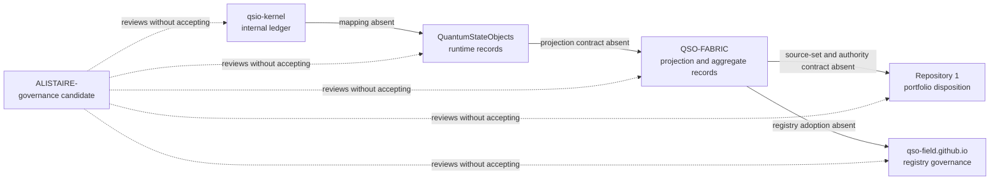

# Runtime/Fabric candidate-lineage disposition

Status: `CANDIDATE_LINEAGES_CLASSIFIED_REBIND_WITHDRAW_OR_ACCEPT_REQUIRED`

Authority effect: **none**.

This page classifies the current repository-local evidence generations that touch the legacy labels `qso-event-ledger` and `qso-runtime-report`. It does not select a namespace, schema, semantic owner, registry, producer, consumer, migration path, release, or operational authority.

The companion machine-readable profile is [`runtime-fabric-lineage-disposition-v1.json`](runtime-fabric-lineage-disposition-v1.json).

## Why this packet exists

The default-head inventory established that the accepted default branches do not contain an adopted runtime/Fabric interface. The candidate inventory established that several unmerged branches contain declaration, documentation, fixture-consumer, and registry-governance evidence. Those two facts leave a preservation problem:

- candidate evidence must not be mistaken for default-branch state;
- useful evidence must not be discarded merely because it is unmerged;
- moved candidates require fresh exact-head review;
- superseded candidates must be withdrawn or preserved as history rather than silently reused;
- default-branch integration must not promote a candidate role into semantic ownership.

This packet adds a disposition layer between observation and architecture acceptance.

## Current source generation

The immediate source generation is the non-default `ALISTAIRE-` charter candidate at:

`22b6c93ad48a0c3aeaa492b1ba97338bbcbddfd5`

That generation already records current default heads, explicit owner vacancies, and the material route obstruction. The SHA above is a historical input to this packet; it is not a self-reference to the commit that contains this page.

## Candidate and repository-use classification

| Repository surface | Exact generation | Observed use | Current disposition | Required next action |
|---|---|---|---|---|
| `ALISTAIRE-` PR #1 | `22b6c93ad48a0c3aeaa492b1ba97338bbcbddfd5` | Charter, namespace-partition review, inventories, and governance coordination | `PRESERVE_AND_REBIND` | Rebind this packet to the resulting non-default charter head after integration; do not infer acceptance |
| `QSO-FABRIC` PR #21 | `25036a5cfcea79e204a4660ddd1af09c054935b1` | Declaration producer and compatibility-fixture source | `PRESERVE_PENDING_ARCHITECTURE` | Retain exact producer evidence; rebind or withdraw if the head, fixture, role, or interface declaration moves |
| `QuantumStateObjects` PR #12 | `cc9b9c7b06a1a48bbc052b8d6bacd11782285288` | Runtime semantics documentation and independently implemented synthetic consumer | `PRESERVE_PENDING_ARCHITECTURE` | Retain runtime-local interpretation separately from Fabric semantics; rebind or withdraw on movement |
| Repository `1` PR #2 | `47b58fa49c8dda7f44234dab68f78673bb02d269` | Independent synthetic consumer and candidate portfolio-disposition authority | `PRESERVE_PENDING_ARCHITECTURE` | Preserve consumer evidence without activating authority; rebind or withdraw on movement |
| `qso-field.github.io` PR #24 | `a56b1fa93f151ee14f3cdd4183b89a10e268e352` | Registry-reference, namespace-partition, and repository-handoff governance candidate | `PRESERVE_PENDING_ARCHITECTURE` | Preserve as governance evidence; do not treat it as an adopted registry |
| `qsio-kernel` `main` | `6468254d7703e5f771e610ed3f76bac1b7205ddb` | Executable internal QSIO ledger, outcome, witness, hash, and replay records | `NO_CANDIDATE_MAPPING` | Produce a versioned kernel-to-runtime semantic crosswalk or record the route as intentionally unsupported |

No row establishes an accepted interface binding. “Preserve” means retain provenance and exact-head evidence; it does not mean merge, approve, activate, or publish.

## Disposition model

### `PRESERVE_AND_REBIND`

Use when a bounded packet is being integrated into a later non-default governance generation. The predecessor remains immutable evidence, while the resulting head receives fresh validation and a new source-generation binding.

### `PRESERVE_PENDING_ARCHITECTURE`

Use when the candidate contains useful exact-head evidence but depends on unresolved architecture, ownership, security, privacy, licensing, accessibility, migration, rollback, or human-approval gates.

### `WITHDRAW_IF_SUPERSEDED`

Use when a later generation replaces the candidate’s role, fixture, source tuple, or semantics. Withdrawal must preserve the old head and reason, invalidate currentness claims, identify the replacement, and propagate to every controlled route.

### `NO_CANDIDATE_MAPPING`

Use when an accepted or default-head implementation exists but no reviewed mapping connects it to the candidate interface graph. This is not evidence of incompatibility; it is evidence that compatibility has not been demonstrated.

## Architecture graph

### Prose equivalent

`qsio-kernel` has internal hash-bound records but no accepted semantic mapping into the runtime record classes documented by `QuantumStateObjects`. The runtime candidate has no accepted projection contract into the collaboration and aggregate classes declared by `QSO-FABRIC`. Fabric has no accepted source-set, correction, revocation, or authority contract with Repository `1`, and the public field repository has not been adopted as a registry. `ALISTAIRE-` may document and review these gaps, but it cannot fill them by declaration.

## Obstruction and gluing analysis

The candidate graph has locally useful edges but no path-independent composition:

1. **Kernel-to-runtime obstruction.** Internal kernel outcomes and witnesses lack a versioned crosswalk to runtime event and execution-report identities.
2. **Runtime-to-Fabric obstruction.** Shared legacy labels conceal different semantic levels and producer responsibilities.
3. **Fabric-to-disposition obstruction.** Aggregate outputs lack accepted source-set receipts, correction propagation, and authority boundaries.
4. **Registry obstruction.** A governance candidate cannot become the namespace or schema registry through documentation alone.
5. **Lineage obstruction.** Exact-head evidence becomes stale when a candidate moves; a later passing workflow cannot retroactively validate an earlier or different head.
6. **Rollback obstruction.** No complete mixed-generation fixture demonstrates consumer rebinding, correction, revocation, rollback, and independently verified restored state.

In homology-like terms, the pairwise overlaps contain observations and synthetic witnesses, but the triple overlaps do not close. A record can traverse local edges while changing semantic class, authority meaning, or correction state. Until the overlap witnesses commute, the portfolio cannot claim one coherent interface object.

## Preservation and invalidation rules

A lineage record becomes stale when any of the following changes:

- repository, pull request, branch, base, or exact head;
- observed path, role, semantic class, interface label, or fixture identity;
- producer or consumer implementation;
- reason-code order, result set, or evidence artifact;
- namespace, schema, canonical bytes, identity, ordering, replay, correction, revocation, retention, or rollback rule;
- security, privacy, licensing, accessibility, architecture, or human-review disposition.

A stale record must be rebound, corrected, superseded, or withdrawn. It must never remain labeled current merely because an older workflow passed.

## Review gates

Before any candidate can move to default-branch acceptance, reviewers must complete all of the following:

1. reconcile current candidate and default heads;
2. preserve predecessor provenance and identify rollback targets;
3. appoint or formally leave vacant every semantic and route owner;
4. accept D1, D2, and D3 or record why the candidate remains blocked;
5. define canonical payloads, bytes, identities, namespaces, source sets, ordering, replay, correction, revocation, retention, and rollback;
6. register live producers and consumers through an authenticated, revocable process;
7. pass pairwise and triple-overlap fixtures, including mixed-generation rollback and restored-state verification;
8. complete independent security, privacy, accessibility, licensing, and architecture review;
9. obtain explicit human approval;
10. verify the resulting default heads and retained evidence.

## Planning alignment

| Controlled planning surface | Alignment |
|---|---|
| `taskchain.md` | P2A remains review-blocked; candidate classification and rebinding are permitted documentation work |
| `release.md` | No candidate lineage may be described as current after its exact head moves; preservation is not release approval |
| `punchlist.md` | Candidate-to-default reconciliation, owner vacancies, kernel mapping, and rollback witnesses remain open |
| `changelog.md` | This packet records a documentation and governance milestone only |

The planning documents remain authoritative for their own task, release, punch-list, and history roles. This packet narrows their runtime/Fabric lineage obligation; it does not supersede them.

## FYSA-120 capability map

Applied categories and subdivisions:

- **CAT-011-B / 011-E** — accessible graph design, prose equivalence, and cross-modal consistency;
- **CAT-012-A / 012-B / 012-D / 012-E** — information architecture, decision-record writing, documentation testing, and lifecycle synchronization;
- **CAT-013-A / 013-C / 013-D / 013-E** — temporal graph modeling, identity resolution, path and contradiction analysis, and graph integrity;
- **CAT-017-C / 017-D / 017-E** — lineage recording, version-substitution detection, hashing, audit packaging, and correction propagation;
- **CAT-018-B / 018-C / 018-E** — responsibility mapping, authenticity-preserving records, and contested-history preservation;
- **CAT-019-B / 019-C / 019-D** — plain-language, accessible, uncertainty-aware risk explanation;
- **CAT-031-A / 031-D / 031-E** — invariant definition, hostile regression validation, and assurance maintenance;
- **CAT-032-A / 032-B / 032-D** — distributed state, ordering, idempotency, conflict, and recovery analysis;
- **CAT-040-A / 040-B / 040-C / 040-D / 040-E** — system archaeology, migration dependency mapping, interface preservation, rebinding, and rollback assurance;
- **CAT-052-B / 052-E**, **CAT-059-E**, and **CAT-070** — least privilege, provenance assurance, retained attestation, and non-self-authorizing governance.

Proposed non-authoritative subdivision:

**`040-M — Candidate-lineage disposition, exact-head rebinding, and withdrawal propagation`**

This subdivision covers preservation of useful candidate evidence while preventing stale branches, historical workflow results, fixtures, or repository names from being promoted into current compatibility or authority claims.

## Non-authority boundary

This packet does not merge any candidate into `main`, select a namespace or schema, appoint an owner, accept a producer or consumer, activate Repository `1`, publish Pages, issue credentials, change repository settings, release software, deploy infrastructure, or authorize runtime behavior. Passing validation proves only that this documentation generation is internally consistent at its exact head.