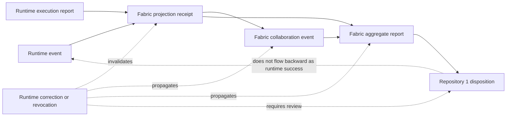

# Runtime/Fabric Namespace Partition Decision Packet

Status: **review-ready proposal; `BLOCKED_ROLE_COLLISION`; no implementation or authority effect**

This packet narrows the most concrete composition obstruction in the current portfolio graph: `QuantumStateObjects` needs runtime-local event and execution records, while `QSO-FABRIC` needs collaboration, experiment, projection, aggregation, and aggregate-evidence records. Both surfaces currently reuse or imply the labels `qso-event-ledger` and `qso-runtime-report` without an accepted semantic partition.

The packet defines the questions, invariants, candidate naming profiles, compatibility witnesses, migration requirements, and rollback conditions needed for a future human decision. It does **not** select a canonical namespace, change an implementation, approve a schema, register a consumer, admit a runtime, activate Fabric, authorize Repository `1`, publish Pages, release software, or deploy infrastructure.

The machine-readable companion is [`runtime-fabric-namespace-partition-v1.json`](runtime-fabric-namespace-partition-v1.json).

## Decision statement

A valid decision must make it impossible to confuse:

1. a runtime-local observation or execution result;
2. a Fabric projection of one or more runtime-local records;
3. a Fabric aggregate or experiment-level conclusion;
4. a Repository `1` disposition, approval, rejection, quarantine, correction, or revocation.

Transport, rendering, hashing, signing, fixture agreement, or successful processing must not collapse these semantic levels.

## Current obstruction

The collision is not merely cosmetic. A consumer can parse the same envelope and still misunderstand what succeeded, who produced it, which sources support it, whether it is local or aggregate, and whether it has any authority effect.

The principal failure modes are:

- **semantic aliasing** — the same label refers to runtime-local and Fabric-level records;
- **identity collapse** — different semantic classes can derive indistinguishable record identifiers;
- **authority promotion** — local execution success is misread as experiment success or canonical disposition;
- **source-set loss** — aggregation hides which runtime records, projections, adapters, or transformations contributed;
- **ordering ambiguity** — local sequence, Fabric causal order, and portfolio disposition order are conflated;
- **duplicate confidence** — replayed, mirrored, or projected evidence is counted as independent support;
- **correction divergence** — a local correction does not invalidate projections, aggregates, review views, or dispositions;
- **rollback asymmetry** — rollback restores a payload but not the consumer registrations, projection receipts, derived aggregates, or withdrawn claims tied to it.

## Required semantic classes

The partition must provide independent identities for at least these classes:

| Class | Candidate producer | Meaning | Explicit non-meaning |
|---|---|---|---|
| Runtime event | `QuantumStateObjects` runtime | A local lifecycle, message, resource, policy, or state-transition observation | Not Fabric participation, experiment success, approval, or disposition |
| Runtime execution report | `QuantumStateObjects` runtime or bounded executor | A local attempt and its pre-state, action, post-state, evidence, and rollback result | Not aggregate validation, release approval, or canonical acceptance |
| Fabric projection receipt | `QSO-FABRIC` projection boundary | A traceable transformation from one source record into a Fabric-consumable representation | Not independent evidence and not semantic equivalence unless proven |
| Fabric collaboration event | `QSO-FABRIC` | A participant-, composition-, contradiction-, or experiment-level event | Not proof that every contributing runtime succeeded |
| Fabric aggregate report | `QSO-FABRIC` | A result derived from an explicit source set and aggregation rule | Not a runtime report and not a Repository `1` disposition |
| Portfolio disposition | Repository `1` or approved successor | A separately authorized quarantine, acceptance, rejection, correction, revocation, or recovery record | Not created by runtime or Fabric processing alone |

## Candidate partition profiles

No profile is selected by this packet.

### Profile A — fully separate namespaces

Examples:

- `qso.runtime.event`
- `qso.runtime.execution-report`
- `qso.fabric.projection-receipt`
- `qso.fabric.collaboration-event`
- `qso.fabric.aggregate-report`
- `qso.portfolio.disposition`

**Strengths:** the semantic level is visible before payload inspection; accidental aliasing is easier to reject; access and retention policies can be scoped by class.

**Risks:** migration is explicit and potentially broad; existing consumers must reject or translate legacy labels; package and registry ownership must be decided.

### Profile B — common envelope with mandatory semantic qualifiers

A shared record envelope carries mandatory fields such as `producer_domain`, `semantic_class`, `profile_version`, and `authority_effect`, while legacy family labels remain as compatibility aliases.

**Strengths:** fewer top-level format families; a common validation toolchain may be possible.

**Risks:** consumers may continue routing by the ambiguous legacy family; qualifiers can be ignored; aliases can silently become permanent; incorrect defaults can recreate the collision.

### Profile C — separate canonical classes with bounded compatibility views

Canonical records use distinct classes and namespaces. Legacy `qso-event-ledger` and `qso-runtime-report` views may be generated only through explicit, versioned, read-only compatibility projections with receipts and loss declarations.

**Strengths:** clear canonical separation with a controlled transition path; compatibility views can be withdrawn independently.

**Risks:** projection machinery and consumer-registration state become additional governed surfaces; the compatibility view must never be mistaken for canonical identity or independent evidence.

## Mandatory envelope fields

Whatever profile is chosen, every accepted record must bind:

- `profile_id` and `profile_version`;
- `semantic_namespace` and `semantic_class`;
- `producer_id`, `producer_role`, and producer software/configuration generation;
- `record_id` and the domain-separated identity inputs used to derive it;
- `subject_id` and subject generation where applicable;
- `source_record_ids` and source-set digest for projections or aggregates;
- `event_time`, `observation_time`, and trusted-time status;
- local sequence, causal parents, and ordering scope;
- duplicate, replay, idempotency, and conflict disposition;
- transformation or aggregation rule identity;
- projection or aggregation receipt identity;
- privacy, retention, and disclosure classification;
- correction, revocation, supersession, and withdrawal references;
- consumer-profile and unsupported-version behavior;
- authority effect, which must default to `NONE` unless a separate approved authority contract applies;
- rollback target and restored-state verification requirements.

Canonical-byte, digest, signature, and identifier rules remain dependent on D2 and D3. This packet defines semantic separation requirements only.

## Composition diagram

**Equivalent prose:** Runtime events and execution reports remain local records. Fabric may project them only through a receipt that identifies the exact sources and transformation. Collaboration events and aggregate reports remain Fabric-level records. Repository `1` disposition is a separate authority-bearing record, if and only if its own governance is approved. Runtime correction or revocation must invalidate dependent projections and aggregates and must trigger disposition review. A disposition never rewrites a runtime event into success.

## Pairwise and triple-overlap witnesses

### Runtime → Fabric projection

A passing witness must prove:

- the runtime record remains independently recoverable and identifiable;
- the projection names its source, transformation, losses, profile generation, and receipt;
- projection does not change authority, certainty, privacy, or success state;
- duplicate projections do not become independent corroboration;
- unsupported or ambiguous inputs fail closed.

### Fabric aggregate → Repository `1`

A passing witness must prove:

- the complete source set and aggregation rule are recoverable;
- missing, corrected, revoked, private, unsupported, or conflicting sources remain visible;
- the aggregate cannot create its own approval or disposition authority;
- Repository `1` can reject, quarantine, correct, revoke, or request more evidence without changing source history.

### Runtime → Fabric → Repository `1`

The triple-overlap witness must compare the direct source history with every projected and aggregate route. It must reject any path in which:

- a local `PASS` becomes aggregate or portfolio success without an accepted rule;
- two paths produce incompatible semantic classes, record identities, source sets, or authority effects;
- a correction, revocation, privacy restriction, or withdrawal fails to reach every dependent consumer;
- rollback restores a stale or withdrawn view;
- a component defines, approves, or recovers the authority governing itself.

## Migration and compatibility

A future migration must include:

1. an inventory of legacy producers and consumers using `qso-event-ledger` or `qso-runtime-report`;
2. classification of each use as runtime-local, projection, collaboration, aggregate, disposition, ambiguous, or unsupported;
3. an immutable mapping from legacy labels to the selected canonical classes;
4. explicit treatment of records that cannot be mapped without information loss;
5. a compatibility period, deprecation schedule, and consumer registration process;
6. positive, hostile, mixed-generation, replay, correction, revocation, privacy, and rollback fixtures;
7. resulting-state verification for each consumer route;
8. withdrawal of stale documentation and public claims without deleting historical evidence.

No migration may infer authority or success from a legacy label. Ambiguous records remain `UNKNOWN` or quarantined until independently resolved.

## Rollback and failed rollback

Rollback must restore more than payload files. It must restore or explicitly invalidate:

- namespace and profile registrations;
- producer and consumer bindings;
- compatibility aliases and projections;
- source-set and receipt indexes;
- derived aggregates and review views;
- correction, revocation, and withdrawal propagation state;
- retained evidence showing what failed and why.

A failed rollback must freeze further promotion, preserve both attempted states, mark affected consumers, and require independent review. It must not silently fall back to the ambiguous legacy labels.

## Review gates

This packet remains blocked until all of the following exist:

- D1 canonical repository and identity decision;
- D2 neutral contract stewardship and accepted namespace ownership;
- D3 canonical-byte and identity profile evidence;
- exact current repository-local inventories for `QuantumStateObjects`, `QSO-FABRIC`, `qsio-kernel`, Repository `1`, and every known consumer;
- selected partition profile and immutable semantic-class definitions;
- independent security, privacy, accessibility, license, and architecture review;
- two independently implemented validators or consumers for the accepted fixtures;
- correction, revocation, migration, compatibility, rollback, and failed-rollback evidence;
- explicit human approval and resulting-state verification.

## FYSA-120 capability map

The work is mapped to:

- **CAT-011-B/E** — accessible architecture diagrams, prose equivalents, and cross-modal consistency;
- **CAT-012-A/B/D/E** — information architecture, decision-record writing, terminology control, documentation testing, and lifecycle synchronization;
- **CAT-013-A/C/D/E** — semantic graph modeling, canonical identifier separation, contradiction detection, and graph integrity;
- **CAT-017-C/D/E** — derivation lineage, version-substitution detection, audit packaging, and correction propagation;
- **CAT-019-B/C/D** — plain-language explanation, accessible alternatives, and uncertainty/risk communication;
- **CAT-031-A/D/E** — invariants, integration and hostile testing, change-impact analysis, and assurance maintenance;
- **CAT-032-A/B/D** — distributed state, causal ordering, idempotency, conflict handling, and disaster recovery;
- **CAT-040-B/D/E** — migration dependency mapping, compatibility layers, parallel validation, rollback, and post-migration monitoring;
- **CAT-052-A/B/E** — trust modeling, identity and authorization separation, least privilege, and audit evidence;
- **CAT-070-A/B/C/E** — authority mapping, dispute analysis, procedure design, oversight, and corrective repair.

Proposed non-authoritative subdivision:

**`032-F — Semantic-level partition and projection integrity`**: distinguish local, projected, aggregate, and authority-bearing distributed records; bind source sets and transformation receipts; prevent duplicate-confidence and authority promotion; validate correction, revocation, mixed-generation migration, rollback, and restored-state closure across pairwise and triple-overlap routes.

Taxonomy mapping does not demonstrate implementation competence, appoint an owner, accept a contract, grant authority, or authorize scope expansion.

## Authority boundary

This is a documentation and governance decision packet only. It creates no canonical namespace, schema, registry, producer, consumer, runtime admission, Fabric activation, Repository `1` authority, credential, capability, release, Pages publication, deployment, infrastructure change, or operational state.
