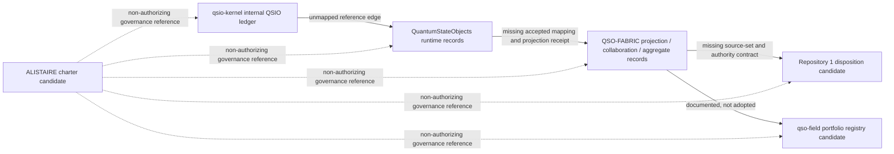

# Runtime/Fabric Producer and Consumer Inventory

Status: **candidate observation inventory recorded; `OBSERVED_CANDIDATE_INVENTORY_RECORDED_BLOCKED_UNACCEPTED_BINDINGS`; no implementation or authority effect**

This document completes the next bounded evidence step for the [runtime/Fabric namespace-partition packet](runtime-fabric-namespace-partition.md): it records exact candidate generations, observed uses of the legacy labels `qso-event-ledger` and `qso-runtime-report`, synthetic consumers, internal ledger surfaces, and unresolved graph edges. It does **not** accept any observation as a canonical producer or consumer registration.

The machine-readable companion is [`runtime-fabric-producer-consumer-inventory-v1.json`](runtime-fabric-producer-consumer-inventory-v1.json).

## What this inventory proves

The inventory proves only that the listed paths and candidate generations were reviewed and classified under a closed documentation vocabulary. It preserves four distinctions:

1. **declaration is not acceptance** — QSO-FABRIC declares two producer interfaces, but no final payload schema, semantic owner, or live registration is accepted;
2. **synthetic consumption is not live compatibility** — QuantumStateObjects and Repository `1` independently reproduce a fixture generation, but neither is an accepted live consumer;
3. **internal records are not interface bindings** — `qsio-kernel` implements an internal QSIO ledger and outcome records, but the reviewed paths do not bind them to either legacy label;
4. **portfolio documentation is not registry authority** — ALISTAIRE- and qso-field.github.io document the obstruction but cannot create producer, consumer, namespace, or disposition authority.

## Exact candidate observations

| Repository and exact generation | Observed candidate role | Legacy-label observation | Current disposition |
|---|---|---|---|
| `aevespers2/ALISTAIRE-` PR #1 at `174f8b32af4b20f7d197942fda7347c501a16a8e` | Governance decision packet | Both labels appear only as the documented collision | `NO_ACCEPTED_BINDING` |
| `aevespers2/QSO-FABRIC` PR #21 at `25036a5cfcea79e204a4660ddd1af09c054935b1` | Declaration producer | Manifest declares `qso-event-ledger` as `append-only-json` and `qso-runtime-report` as `json-file`, generation `1.0.0` | `DECLARED_NOT_ACCEPTED` |
| `aevespers2/QuantumStateObjects` PR #12 at `cc9b9c7b06a1a48bbc052b8d6bacd11782285288` | Runtime documentation and synthetic consumer | Documents runtime-local ledger and execution-report meanings and consumes the synthetic Fabric corpus | `DOCUMENTED_NOT_ACCEPTED` |
| `aevespers2/1` PR #2 at `47b58fa49c8dda7f44234dab68f78673bb02d269` | Independent conformance consumer | Consumes both declarations only through the bound synthetic fixture | `CONSUMER_EVIDENCE_NOT_INTERFACE_ACCEPTANCE` |
| `aevespers2/qsio-kernel` `main` at `6468254d7703e5f771e610ed3f76bac1b7205ddb` | Executable reference-kernel candidate | Exact legacy labels were not observed in `README.md` or `src/qsio/qsio.py`; an internal hash-bound QSIO ledger is present | `NO_ACCEPTED_BINDING` |
| `aevespers2/qso-field.github.io` PR #24 at `a56b1fa93f151ee14f3cdd4183b89a10e268e352` | Portfolio registry and governance reference | Records the collision and declaration-level evidence without adoption | `NO_ACCEPTED_BINDING` |

### Evidence qualification

“Not observed” is not proof of repository-wide absence. It means the exact reviewed paths did not establish the binding. Complete code, history, generated artifacts, branches, releases, packages, and resulting-default-branch states still require repository-local verification before any migration decision.

## Producer declaration and consumer closure

QSO-FABRIC PR #21 is the only reviewed generation that explicitly declares the two legacy interface names as producer interfaces. Its compatibility profile remains synthetic and does not define final payload schemas.

Two independently authored consumers are recorded for that immutable fixture generation:

- QuantumStateObjects PR #12;
- Repository `1` PR #2.

Their bounded evidence disposition is:

`TWO_INDEPENDENT_SYNTHETIC_CONSUMERS_RECORDED_NOT_LIVE_COMPATIBILITY`

```text
matching fixture bytes
+ two independent evaluators
+ current candidate-head evidence
!= accepted semantic ownership
!= accepted payload compatibility
!= live producer registration
!= live consumer registration
!= ecosystem admission
!= authority
```

## Contract graph and obstruction classes



**Prose equivalent:** The kernel’s internal QSIO ledger has no accepted mapping into the runtime contract. Runtime records have no accepted projection contract into Fabric. Fabric aggregates have no accepted source-set and authority contract into Repository `1`. The public portfolio registry documents these candidate routes but does not adopt them. The charter coordinates review only and grants no operational authority.

The principal gluing failures are:

- **unmapped internal ledger** — kernel records may be structurally useful but have no accepted semantic crosswalk;
- **declaration/runtime role collision** — shared labels conceal runtime-local versus Fabric-level meaning;
- **projection receipt absence** — no accepted record proves source identity, transformation, losses, or duplicate treatment;
- **consumer-registration absence** — fixture evaluation does not establish live routing or supported-version behavior;
- **authority-path discontinuity** — Fabric output cannot become a Repository `1` disposition without a separately approved authority contract;
- **correction and revocation discontinuity** — no accepted route invalidates every projection, aggregate, review view, and disposition;
- **rollback non-closure** — payload restoration alone would not restore registrations, aliases, receipts, derived state, or withdrawn claims.

These failures are obstruction-like because local compatibility evidence exists on individual edges while the whole route still cannot be glued into one path-independent, authority-preserving composition.

## Migration consequences

The inventory narrows but does not close migration work. A future accepted migration must:

1. verify the observations against exact resulting default heads and complete repository-local inventories;
2. obtain repository-local semantic-owner confirmation or record vacancies and dissent;
3. select one partition profile only after D1–D3;
4. map every legacy use to one canonical class, or classify it as lossy, ambiguous, unsupported, or withdrawn;
5. bind canonical payload bytes, record identities, source-set digests, projection receipts, ordering, replay, correction, revocation, privacy, retention, and authority effect;
6. register producers and consumers through an accepted neutral governance route;
7. test positive, hostile, mixed-generation, duplicate, replay, correction, revocation, privacy, rollback, and failed-rollback fixtures;
8. verify resulting routes and withdraw stale claims without deleting historical evidence.

Ambiguous records remain `UNKNOWN` or quarantined. No migration may infer success or authority from a filename, label, matching fixture, internal class, passing validator, or repository role description.

## Review checklist

The inventory remains blocked until reviewers can answer yes to all of the following:

- Are D1, D2, and D3 accepted at immutable generations?
- Has every repository-local owner confirmed the observed meaning and complete use set?
- Have exact default-head inventories replaced candidate-only observations?
- Is one partition profile approved with immutable semantic classes?
- Are final payload schemas and canonical bytes accepted?
- Are live producer and consumer registrations independently governed?
- Do migration, correction, revocation, and rollback fixtures pass?
- Have security, privacy, accessibility, licensing, and architecture reviews completed?
- Has explicit human approval been recorded?
- Has the resulting state been independently verified?

## Planning-surface alignment

This inventory implements the existing planning intent without changing its authority or implementation scope:

| Existing surface | Existing requirement | Inventory contribution | Remaining state |
|---|---|---|---|
| `taskchain.md` P2A | Inventory exact-head producers and consumers before selecting shared identifiers | Records six exact candidate generations, two synthetic consumers, one internal unmapped ledger, and five blocked graph edges | P2A remains `REVIEW / BLOCKED` |
| `release.md` | Require a legacy-use inventory before a runtime/Fabric partition decision | Supplies a versioned candidate inventory and explicit evidence qualifications | Release remains blocked |
| `punchlist.md` P2A | Inventory every exact-head producer and consumer | Completes the bounded candidate-head observation pass, but not full history, artifact, package, or resulting-default-head verification | The item is narrowed, not accepted as fully complete |
| `changelog.md` | Record architecture and evidence changes without overstating authority | Provides the review-ready inventory generation and non-authority vocabulary for a later synchronized changelog update | No release or publication claim is created |

A later integration generation should update those four planning files together after this focused candidate passes exact-head validation. This separation avoids representing an unvalidated focused branch as the accepted charter state.

## FYSA-120 capability map

This bounded inventory applies:

- **CAT-011-B/E** — accessible graph communication and text/diagram consistency;
- **CAT-012-A/B/D/E** — information architecture, contract exposition, terminology and link controls, and lifecycle synchronization;
- **CAT-013-A/C/D/E** — contract-graph modeling, canonical identity separation, path and contradiction analysis, and provenance-aware graph operations;
- **CAT-017-C/D/E** — exact derivation lineage, version-substitution detection, audit packaging, and correction propagation;
- **CAT-019-B/C/D** — plain-language explanation, accessible alternatives, and uncertainty/risk communication;
- **CAT-031-A/D/E** — closed specifications, hostile validation, change-impact analysis, and assurance maintenance;
- **CAT-032-A/B/D** — distributed state, ordering, idempotency, conflict handling, and recovery;
- **CAT-040-A/B/C/D/E** — system archaeology, migration dependency analysis, interface preservation, compatibility design, rollback, and post-migration verification;
- **CAT-052-A/B/E** — trust and authorization modeling, least privilege, and audit evidence;
- **CAT-059-A/B/E** — attestation boundaries, secure evidence transport, and assurance governance;
- **CAT-070-A/B/C/E** — authority mapping, evidence review, procedure design, oversight, and corrective repair.

Proposed non-authoritative subdivision:

**`040-L — Exact-head legacy-interface archaeology and consumer-rebinding inventory`**: identify legacy interface labels across immutable repository generations; distinguish declared, internal, synthetic-consumer, registry, and accepted uses; record absent or ambiguous bindings without overclaiming absence; map migration dependencies and consumer rebinding; and preserve rollback, correction, revocation, and resulting-state evidence.

This complements `032-F — Semantic-level partition and projection integrity`. Taxonomy mapping does not establish competence, appointment, ownership, acceptance, or authority.

## Authority boundary

This runtime/Fabric inventory is documentation and governance evidence only. `OBSERVED_CANDIDATE_INVENTORY_RECORDED_BLOCKED_UNACCEPTED_BINDINGS` creates no canonical namespace, payload schema, mapping, producer, consumer, registry, runtime admission, Fabric activation, Repository `1` authority, credential, capability, release, Pages publication, deployment, infrastructure change, or operational state.
