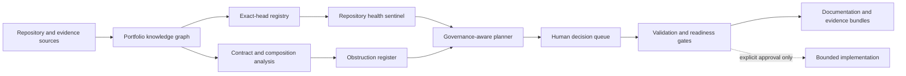

# Systematic feature program

## Status

`FEATURE_PROGRAM_SPECIFIED_IMPLEMENTATION_UNAUTHORIZED`

This program translates forty proposed A.L.I.S.T.A.I.R.E. capabilities into bounded, reviewable work packages. It specifies interfaces, evidence, sequencing, and safety gates; it does **not** activate autonomous operation, credentials, production integrations, publication, deployment, payment, device control, or self-modification.

## Program principles

1. **Evidence before authority.** A successful test, workflow, model, diagram, or generated report is evidence only.
2. **Exact-head provenance.** Every reviewable result binds repository, commit, workflow run, artifact digest, inputs, and disposition.
3. **Fail closed.** Unknown ownership, incompatible contracts, missing evidence, or failed rollback blocks promotion.
4. **Reversible progression.** Every implementation increment requires migration, rollback, and restored-state verification.
5. **Human decision separation.** Architectural, legal, security, financial, credential, release, and deployment decisions remain explicitly approved human actions.

## Capability architecture

The dashed transition is intentionally non-automatic. No planning or validation component can grant implementation authority.

## Workstreams

### W1 — Portfolio truth and provenance

Features: portfolio knowledge graph, exact-head registry, provenance explorer, repository-role classifier, uncertainty ledger, systemic obstruction register, portable evidence bundles, and release truth reconciler.

**Minimum contracts:** immutable source tuple, lineage relation, supersession relation, observation timestamp, confidence class, owner or vacancy, correction status, and authority effect.

**Acceptance evidence:** deterministic graph build, stale-head substitution tests, correction propagation tests, duplicate-lineage tests, and independently reproduced evidence bundle digests.

### W2 — Contracts, composition, and migration

Features: cross-repository contract validator, gluing analyzer, interface compatibility matrix, semantic diff engine, migration/deprecation planner, architecture simulation sandbox, integration readiness gate, and correction/revocation protocol.

**Minimum contracts:** producer, consumer, schema identity, canonical representation, version range, loss model, replay/idempotency rules, correction/revocation reachability, migration state, rollback witness, and unsupported-route disposition.

**Acceptance evidence:** pairwise and triple-overlap fixtures, intentionally incompatible fixtures, mixed-generation replay, failed-rollback tests, and restored-state verification.

### W3 — Governance and bounded autonomy

Features: authority-boundary engine, governance-aware planning, human decision queue, decision/ADR ledger, ownership matrix, constitutional core, evidence-based self-improvement, multi-agent review council, and invariant/policy language.

**Minimum contracts:** action class, requested authority, approver class, separation-of-duty rule, expiration, revocation, dissent, appeal, correction, and incident disposition.

**Acceptance evidence:** denied-authority tests, privilege-escalation tests, conflicting-review preservation, recusal tests, approval-expiry tests, and emergency-stop tabletop evidence.

### W4 — Documentation and developer experience

Features: documentation autopilot, living architecture atlas, accessibility assurance, onboarding generator, public project narrative, contribution-path recommender, and capability maturity model.

**Minimum contracts:** source-of-truth declaration, generated/manual boundary, freshness marker, audience, accessibility alternative, owner or vacancy, review status, and correction route.

**Acceptance evidence:** strict documentation build, broken-link scan, diagram prose equivalence, keyboard/screen-reader review, stale-source tests, and onboarding reproduction from a clean environment.

### W5 — Operations, security, and recovery evidence

Features: repository health sentinel, failure-signature deduplication, rollback-readiness scoring, security-boundary mapper, artifact-completeness checker, portfolio dashboard, and architecture simulation.

**Minimum contracts:** exact failure signature, deduplication key, workflow identity, permission inventory, artifact manifest, risk class, recovery point, rollback procedure, and restored-state witness.

**Acceptance evidence:** synthetic failure corpus, duplicate-notification suppression, unsafe-permission fixtures, missing-artifact fixtures, rollback drills, and dashboard source reconciliation.

## Delivery phases

| Phase | Deliverable | Permitted scope | Exit gate |
|---|---|---|---|
| F0 | Specifications and machine-readable registry | Documentation and validation only | Every feature has owner/vacancy, inputs, outputs, risks, dependencies, tests, rollback, and FYSA mapping |
| F1 | Read-only inventory prototypes | Public repository metadata and local fixtures only | Exact-head provenance, deduplication, and fail-closed behavior demonstrated |
| F2 | Offline analyzers | No credentials or external mutation | Contract, gluing, semantic-diff, release-truth, and simulation fixtures pass |
| F3 | Proposal generators | Branches and drafts only where separately authorized | Human decision queue and authority boundaries prevent promotion |
| F4 | Bounded repository integrations | Reversible, repository-specific approval required | Exact-head CI, artifacts, rollback, and resulting-state review pass |
| F5 | Operational candidates | Separate explicit authorization required | Independent security, privacy, accessibility, recovery, and governance approval |

## Cross-feature invariants

- No feature may treat generated text, model confidence, majority vote, workflow success, or cryptographic form as truth or authority.
- Every automated finding must be deduplicated by repository, object identity, exact head, workflow run, failure signature, and prior disposition.
- Every state-changing proposal must expose the source evidence, intended change, affected contracts, privileges, rollback, and unresolved uncertainty.
- Corrections and revocations must propagate to every derived dashboard, evidence bundle, readiness score, decision record, and public claim.
- Unsupported composition remains explicit; missing adapters may not be synthesized silently.

## FYSA-120 capability map

Primary categories used by this program:

- `CAT-011` visual communication and accessible diagrams;
- `CAT-012` technical writing, information architecture, onboarding, and lifecycle synchronization;
- `CAT-013` knowledge graphs, entity resolution, contradiction detection, and incremental updates;
- `CAT-017` provenance, canonical sources, derivation, preservation, correction, and revocation;
- `CAT-018` records, responsibility mapping, decision continuity, and contested history;
- `CAT-019` plain language, accessibility, and risk communication;
- `CAT-022` CI/CD evidence, reproducibility, and artifact retention;
- `CAT-031` invariants, testing, hostile fixtures, and regression prevention;
- `CAT-032` interfaces, protocols, compatibility, and composition;
- `CAT-040` migration, deprecation, rollback, restoration, and continuity;
- `CAT-052` security architecture and trust boundaries;
- `CAT-054` least privilege, authorization, and continuous assurance;
- `CAT-059` evidence integrity and attestations;
- `CAT-064` accountability, incident review, and corrective action;
- `CAT-070` systems analysis, dependency reasoning, and obstruction discovery.

Proposed non-authoritative subdivisions:

- `013-L — Portfolio capability graph with exact-head, correction, and authority-effect semantics`;
- `032-J — Pairwise and triple-overlap contract gluing with explicit loss and unsupported-route witnesses`;
- `040-Q — Restored-state verification and failed-rollback evidence across mixed generations`;
- `054-L — Machine-enforced separation between recommendation, approval, credential binding, and execution`;
- `012-Q — Source-aware documentation generation with accessibility alternatives and stale-claim withdrawal`.

Taxonomy mapping records required capabilities only. It does not establish competence, appointment, ownership, approval, or execution authority.

## Next bounded implementation slice

The first implementation slice is F0/F1 for four mutually supporting foundations: the portfolio knowledge graph, exact-head registry, obstruction register, and failure-signature deduplication schema. The slice must remain read-only, fixture-driven, and non-authorizing until the constitutional D1–D5 decisions and repository-specific approvals are complete.
